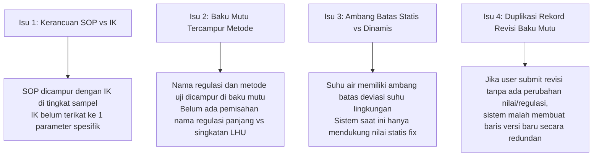
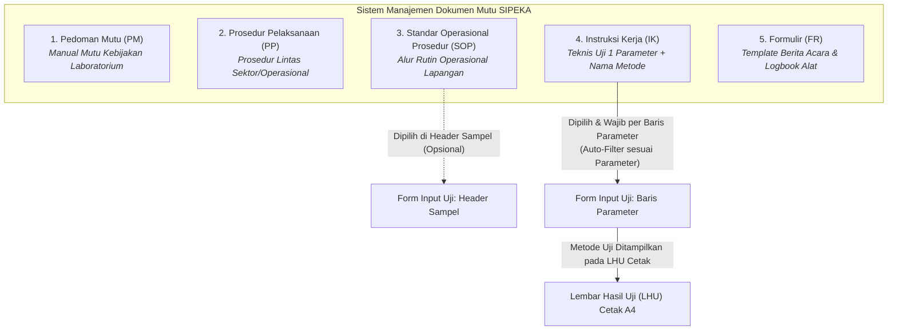
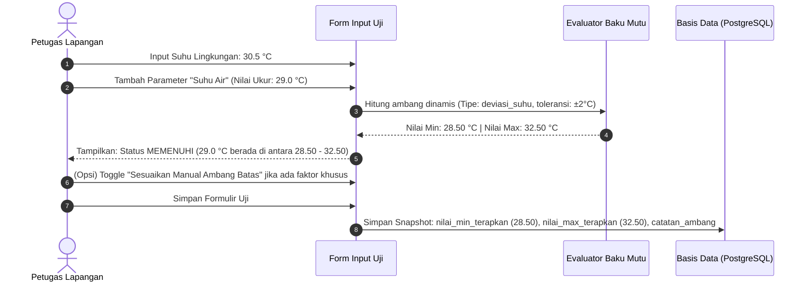
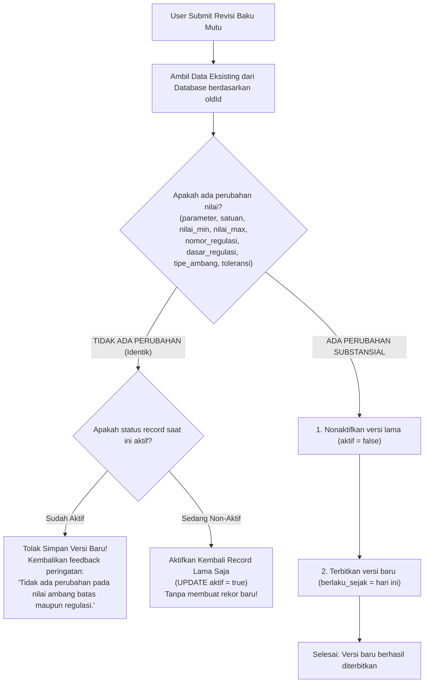
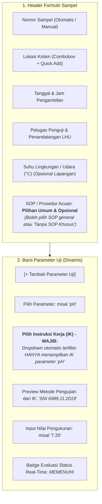
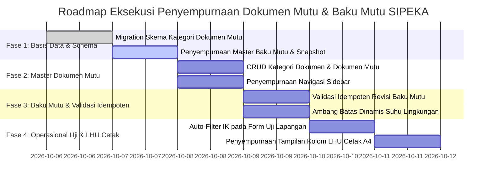

# 📋 Perencanaan Perbaikan Sistem SIPEKA / MINAMUTU
**Dokumen Mutu (SOP vs IK), Spesifikasi 1 IK 1 Parameter, Pemisahan Regulasi Baku Mutu, Ambang Batas Dinamis, dan Validasi Revisi Idempoten**

*Dokumen Perencanaan Teknis & Arsitektur Fitur Lanjutan (Versi 2.2)*  
*Lokasi File: `./implementation-plan/06-perencanaan-perbaikan-dokumen-mutu-dan-baku-mutu.md`*  
*Unit Kerja: Dinas Perikanan Kabupaten Lembata — Inovasi Latsar CPNS 2026*  
*Target Stack: Next.js 16 (App Router), Bun, Shadcn UI, Drizzle ORM, PostgreSQL, Zod, Tailwind CSS v4*

---

## 📑 Daftar Isi

1. [Ringkasan Eksekutif & Latar Belakang Masalah](#1-ringkasan-eksekutif--latar-belakang-masalah)
2. [Matriks Perbedaan Konsep: SOP vs Instruksi Kerja (IK)](#2-matriks-perbedaan-konsep-sop-vs-instruksi-kerja-ik)
3. [Arsitektur Transformasi: Dari Instruksi Kerja Menjadi Dokumen Mutu](#3-arsitektur-transformasi-dari-instruksi-kerja-menjadi-dokumen-mutu)
4. [Rancangan Skema Basis Data (Database Schema) & Drizzle ORM](#4-rancangan-skema-basis-data-database-schema--drizzle-orm)
5. [Analisis & Rekomendasi Penamaan Field Regulasi Baku Mutu](#5-analisis--rekomendasi-penamaan-field-regulasi-baku-mutu)
6. [Mekanisme Ambang Batas Dinamis (Suhu Air vs Suhu Lingkungan)](#6-mekanisme-ambang-batas-dinamis-suhu-air-vs-suhu-lingkungan)
7. [Validasi Idempoten Revisi Baku Mutu (Pencegahan Duplikasi Rekord)](#7-validasi-idempoten-revisi-baku-mutu-pencegahan-duplikasi-rekord)
8. [Perubahan Alur & Komponen Form Input Uji Kualitas Air Lapangan](#8-perubahan-alur--komponen-form-input-uji-kualitas-air-lapangan)
9. [Desain Tata Letak Laporan Hasil Uji (LHU) Cetak Standar Kedinasan A4](#9-desain-tata-letak-laporan-hasil-uji-lhu-cetak-standar-kedinasan-a4)
10. [Rancangan Server Actions & Validasi Skema Zod](#10-rancangan-server-actions--validasi-skema-zod)
11. [Blueprint Antarmuka Pengguna (UI/UX) & Navigasi Sidebar](#11-blueprint-antarmuka-pengguna-uiux--navigasi-sidebar)
12. [Tahapan Implementasi & Roadmap Eksekusi](#12-tahapan-implementasi--roadmap-eksekusi)
13. [Kriteria Penerimaan & Definisi Selesai (Definition of Done)](#13-kriteria-penerimaan--definisi-selesai-definition-of-done)

---

## 1. 🔍 Ringkasan Eksekutif & Latar Belakang Masalah

Dalam operasional laboratorium pengujian mutu air dan pengawasan budidaya perikanan di Kabupaten Lembata, tata kelola dokumen standarisasi mutu dan parameter pengujian memerlukan penyelarasan tata kelola administrasi laboratorium yang baku (mengacu pada prinsip ISO/IEC 17025 dan regulasi nasional budidaya).

Berdasarkan evaluasi terhadap alur kerja aplikasi **SIPEKA / MINAMUTU** saat ini, diidentifikasi sejumlah isu operasional yang mendesak untuk disempurnakan:



### Sasaran Perbaikan:
1. **Membedakan secara tegas antara SOP (makro/general) dan Instruksi Kerja (mikro/spesifik)**:
   - SOP bersifat opsional di tingkat sampel pengujian air.
   - IK bersifat wajib di tingkat masing-masing parameter yang diuji, di mana **1 IK hanya untuk 1 parameter** dan wajib mencantumkan **nama metode pengujian** resmi (misal: SNI, APHA, dll.).
2. **Transformasi Menu Navigasi**:
   - Menu `Instruksi Kerja (IK)` ditingkatkan menjadi menu komprehensif **`Dokumen Mutu`** dengan manajemen kategori: *Pedoman Mutu, Prosedur Pelaksanaan, SOP, Instruksi Kerja, dan Formulir*.
3. **Penyempurnaan Master Baku Mutu**:
   - Menghapus teks metode pengujian dari master baku mutu (karena metode adalah yurisdiksi IK).
   - Menambahkan field nomor regulasi singkat (untuk tampilan tabel LHU) dan nama regulasi lengkap.
   - Mendukung ambang batas dinamis/kondisional (misal deviasi suhu air terhadap suhu lingkungan).
   - Mencegah pembuatan versi baru jika nilai acuan, nilai min, dan nilai max tidak mengalami perubahan sama sekali.
4. **Penyempurnaan LHU Cetak**:
   - Setiap baris parameter pada LHU memuat nama metode pengujian yang bersumber dari IK terkait.
   - Tampilan kolom regulasi baku mutu menggunakan singkatan resmi yang rapi.

---

## 2. 📑 Matriks Perbedaan Konsep: SOP vs Instruksi Kerja (IK)

Untuk menghilangkan kerancuan penamaan dan peran dokumen dalam sistem, ditetapkan standardisasi tata kelola dokumen sebagai berikut:

| Dimensi Evaluasi | Prosedur Pelaksanaan / SOP | Instruksi Kerja (IK) |
|---|---|---|
| **Cakupan (Scope)** | **Makro / General** — Mengatur alur kerja menyeluruh suatu rangkaian kegiatan (tahap persiapan, koordinasi lapangan, keselamatan kerja, pengemasan sampel, hingga pelaporan). | **Mikro / Spesifik** — Mengatur panduan teknis langkah demi langkah pengujian atau pengoperasian alat untuk **1 parameter kualitas air tertentu**. |
| **Relasi Parameter** | Tidak terikat pada parameter tunggal (berlaku untuk 1 kegiatan pemantauan kualitas air kolam). | **Ketat: 1 IK = 1 Parameter Kualitas Air** (misal: IK Pengujian Suhu, IK Pengujian pH, IK Pengujian DO). |
| **Metode Pengujian** | Tidak mencantumkan metode analisis per parameter secara rinci. | **Wajib mencantumkan Nama Metode Resmi** (contoh: `SNI 06-6989.23-2005`, `SNI 6989.11:2019`, `In-situ DO Meter YSI`). |
| **Peran pada Form Uji** | **Opsional (Pilihan Umum)**: Dipilih di header formulir sampel jika monitoring mengacu pada suatu SOP induk. Boleh dikosongkan. | **Wajib per Baris Parameter**: Setiap parameter yang diinput wajib memilih IK yang digunakannya. |
| **Penyaringan (Filter)** | Menampilkan seluruh daftar SOP pemantauan air kolam. | **Auto-Filter Otomatis**: Dropdown IK hanya menampilkan IK yang terdaftar untuk parameter yang dipilih pada baris tersebut. |
| **Contoh Dokumen** | `SOP-LK-01: Prosedur Pelaksanaan Monitoring Kualitas Air Kolam Budidaya Lembata` | `IK-AIR-02: Pengujian Derajat Keasaman (pH) Air Kolam Menggunakan pH Meter Digital Portabel (SNI 6989.11:2019)` |

---

## 3. 🏗️ Arsitektur Transformasi: Dari Instruksi Kerja Menjadi Dokumen Mutu

Menu `Instruksi Kerja` diubah menjadi **`Dokumen Mutu`** untuk memfasilitasi kebutuhan penataan dokumen sistem manajemen mutu secara utuh.



### Kategori Dokumen Mutu Baku:
1. **Pedoman Mutu (`PM`)**: Dokumen payung yang memuat kebijakan mutu dinas dalam pengawasan mutu air budidaya.
2. **Prosedur Pelaksanaan (`PP`)**: Prosedur pelaksanaan teknis pengawasan kolam dan koordinasi dengan kelompok pembudidaya (Pokdakan).
3. **Standar Operasional Prosedur (`SOP`)**: SOP pengambilan sampel, SOP kalibrasi alat portabel, SOP penanganan limbah reagen.
4. **Instruksi Kerja (`IK`)**: Instruksi kerja teknis pengujian parameter (Suhu, pH, DO, Amonia, Nitrit, Alkalinitas, Turbiditas).
5. **Formulir (`FR`)**: Formulir berita acara serah terima sampel, formulir pemeliharaan probe sensor, formulir survei kolam.

Disediakan tabel dan antarmuka **Manajemen Kategori Dokumen Mutu** sehingga administrator dinas dapat menambah, mengedit urutan, atau menonaktifkan kategori sesuai dinamika organisasi.

---

## 4. 💾 Rancangan Skema Basis Data (Database Schema) & Drizzle ORM

Berikut rancangan skema tabel baru dan pembaruan tabel eksisting pada file [`db/schema.ts`](file:///e:/LATSAR%20ELLEN/SISTEM/minamutu/db/schema.ts):

### A. Tabel Baru: `kategori_dokumen_mutu`
Tabel master untuk mengelola kategori dokumen mutu secara dinamis.

```typescript
// ==========================================
// 1. MASTER KATEGORI DOKUMEN MUTU
// ==========================================
export const kategoriDokumenMutu = pgTable('kategori_dokumen_mutu', {
  id: uuid('id').defaultRandom().primaryKey(),
  kode_kategori: varchar('kode_kategori', { length: 20 }).notNull().unique(), // 'PM', 'PP', 'SOP', 'IK', 'FR'
  nama_kategori: varchar('nama_kategori', { length: 100 }).notNull(), // 'Pedoman Mutu', 'Prosedur Pelaksanaan', 'Standar Operasional Prosedur', 'Instruksi Kerja', 'Formulir'
  deskripsi: text('deskripsi'),
  urutan: integer('urutan').notNull().default(0),
  aktif: boolean('aktif').notNull().default(true),
  createdAt: timestamp('created_at', { mode: 'date' }).defaultNow().notNull(),
});
```

### B. Transformasi Tabel `instruksi_kerja` Menjadi `dokumen_mutu`
Tabel dokumen mutu menampung seluruh jenis dokumen, dengan kolom spesifik untuk Instruksi Kerja pengujian parameter (`parameter_uji` dan `metode_pengujian`).

> *Catatan Kompatibilitas*: Nama tabel fisik database dapat menggunakan alias atau migrasi tabel `dokumen_mutu` dengan mempertahankan backward compatibility untuk data eksisting.

```typescript
// ==========================================
// 2. MASTER DOKUMEN MUTU (SOP, IK, PM, dll.)
// ==========================================
export const dokumenMutu = pgTable('dokumen_mutu', {
  id: uuid('id').defaultRandom().primaryKey(),
  kategori_id: uuid('kategori_id')
    .notNull()
    .references(() => kategoriDokumenMutu.id, { onDelete: 'restrict' }),
  kode_dokumen: varchar('kode_dokumen', { length: 50 }).notNull().unique(), // contoh: 'SOP-001', 'IK-AIR-PH-01'
  judul: varchar('judul', { length: 255 }).notNull(),
  
  // Khusus Kategori Instruksi Kerja (IK) Pengujian Parameter:
  // Setiap IK pengujian wajib terhubung ke 1 parameter dan mencantumkan metode uji
  parameter_uji: varchar('parameter_uji', { length: 50 }), // contoh: 'Suhu', 'pH', 'DO (Oksigen Terlarut)', 'Amonia (NH3-N)'
  metode_pengujian: varchar('metode_pengujian', { length: 150 }), // contoh: 'SNI 6989.11:2019 (Elektrometri pH Meter)', 'SNI 06-6989.23-2005'
  
  file_path: varchar('file_path', { length: 255 }).notNull(),
  qr_code_hash: varchar('qr_code_hash', { length: 255 }).notNull().unique(),
  versi: integer('versi').notNull().default(1),
  deskripsi: text('deskripsi'),
  aktif: boolean('aktif').notNull().default(true),
  createdAt: timestamp('created_at', { mode: 'date' }).defaultNow().notNull(),
});
```

### C. Pembaruan Tabel `master_baku_mutu`
Pemisahan nomor regulasi singkat vs nama regulasi lengkap, penghapusan kolom metode pengujian, serta penambahan dukungan ambang batas dinamis.

```typescript
// ==========================================
// 3. MASTER BAKU MUTU (Versioned & Dynamic Threshold Support)
// ==========================================
export const masterBakuMutu = pgTable('master_baku_mutu', {
  id: uuid('id').defaultRandom().primaryKey(),
  parameter: varchar('parameter', { length: 50 }).notNull(),
  satuan: varchar('satuan', { length: 20 }).notNull(),
  
  // Nilai batas dasar (statis)
  nilai_min: numeric('nilai_min', { precision: 8, scale: 2 }),
  nilai_max: numeric('nilai_max', { precision: 8, scale: 2 }),
  
  // Penamaan Regulasi Bersih:
  // nomor_regulasi: singkatan resmi untuk tabel LHU / badge (contoh: 'PP No. 22/2021', 'SNI Budidaya')
  // dasar_regulasi: nama lengkap resmi peraturan perundang-undangan
  nomor_regulasi: varchar('nomor_regulasi', { length: 50 }).notNull(), 
  dasar_regulasi: text('dasar_regulasi'), 

  // Fitur Ambang Batas Dinamis / Tergantung Parameter Lain:
  // 'tetap' | 'deviasi_suhu_lingkungan' | 'manual_lapangan'
  tipe_ambang_batas: varchar('tipe_ambang_batas', { length: 30 }).notNull().default('tetap'),
  deviasi_toleransi: numeric('deviasi_toleransi', { precision: 5, scale: 2 }), // contoh: 2.00 untuk ± 2°C
  
  aktif: boolean('aktif').notNull().default(true),
  berlaku_sejak: date('berlaku_sejak').notNull().defaultNow(),
});
```

### D. Pembaruan Tabel Transaksi: `uji_kualitas_air` & `detail_uji_parameter`

```typescript
// ==========================================
// 5. PENGUJIAN KUALITAS AIR (Header Sampel)
// ==========================================
export const ujiKualitasAir = pgTable('uji_kualitas_air', {
  id: uuid('id').defaultRandom().primaryKey(),
  nomor_sampel: varchar('nomor_sampel', { length: 50 }).notNull().unique(),
  lokasi_id: uuid('lokasi_id').references(() => lokasiKolam.id, { onDelete: 'restrict' }),
  
  // SOP Acuan Umum: Sekarang Bersifat Nullable / Opsional
  sop_id: uuid('sop_id').references(() => dokumenMutu.id, { onDelete: 'set null' }),
  
  // Pengukuran Lingkungan Lapangan (jika dicatat, untuk basis deviasi suhu air)
  suhu_lingkungan: numeric('suhu_lingkungan', { precision: 5, scale: 2 }), // misal 31.00 °C

  tanggal_pengambilan: timestamp('tanggal_pengambilan', { mode: 'date' }).notNull(),
  petugas_uji: varchar('petugas_uji', { length: 100 }).notNull(),
  penguji_pegawai_id: uuid('penguji_pegawai_id').references(() => masterPegawai.id, { onDelete: 'set null' }),
  penandatangan_pegawai_id: uuid('penandatangan_pegawai_id').references(() => masterPegawai.id, { onDelete: 'set null' }),
  catatan_lapangan: text('catatan_lapangan'),
  kesimpulan: varchar('kesimpulan', { length: 20 }), // 'NORMAL', 'PERINGATAN', 'KRITIS'
  kesimpulan_umum: text('kesimpulan_umum'),
  saran_rekomendasi_lapangan: text('saran_rekomendasi_lapangan'),
  status: varchar('status', { length: 20 }).notNull().default('draft'),
  createdAt: timestamp('created_at', { mode: 'date' }).defaultNow().notNull(),
});

// ==========================================
// 6. DETAIL PARAMETER PER PENGUJIAN
// ==========================================
export const detailUjiParameter = pgTable('detail_uji_parameter', {
  id: uuid('id').defaultRandom().primaryKey(),
  uji_id: uuid('uji_id')
    .notNull()
    .references(() => ujiKualitasAir.id, { onDelete: 'cascade' }),
  baku_mutu_id: uuid('baku_mutu_id').references(() => masterBakuMutu.id, { onDelete: 'restrict' }),
  
  // IK WAJIB per parameter uji:
  ik_id: uuid('ik_id')
    .notNull()
    .references(() => dokumenMutu.id, { onDelete: 'restrict' }),
  
  // Snapshot Data (Integritas Data Riwayat Pengujian):
  metode_pengujian_snapshot: varchar('metode_pengujian_snapshot', { length: 150 }).notNull(),
  nomor_regulasi_snapshot: varchar('nomor_regulasi_snapshot', { length: 50 }).notNull(),
  
  nilai_hasil: numeric('nilai_hasil', { precision: 8, scale: 2 }).notNull(),
  
  // Snapshot Ambang Batas yang Benar-benar Diterapkan Saat Uji:
  nilai_min_terapkan: numeric('nilai_min_terapkan', { precision: 8, scale: 2 }),
  nilai_max_terapkan: numeric('nilai_max_terapkan', { precision: 8, scale: 2 }),
  is_ambang_dinamis: boolean('is_ambang_dinamis').notNull().default(false),
  catatan_ambang: varchar('catatan_ambang', { length: 150 }), // misal: "Dihitung dari Suhu Udara 31.0°C ± 2°C"
  
  status_kelayakan: varchar('status_kelayakan', { length: 20 }), // 'MEMENUHI', 'MELEBIHI', 'DIBAWAH'
});
```

---

## 5. 🏷️ Analisis & Rekomendasi Penamaan Field Regulasi Baku Mutu

Pada implementasi eksisting:
```typescript
// Eksisting:
dasar_regulasi: varchar('dasar_regulasi', { length: 100 })
// Data eksisting: 'PP No. 22/2021 Lampiran VI (In-situ Thermometer)'
```
Terdapat dua kelemahan mendasar:
1. **Pencampuran Informasi**: Metode pengujian (misal *"In-situ Thermometer"* atau *"Spektrofotometri"*) dicampurkan di dalam field regulasi. Padahal metode pengujian adalah atribut operasional milik **Instruksi Kerja (IK)**.
2. **Keterbatasan Format Tampilan**: Ketika hendak mencetak tabel LHU resmi kedinasan, judul regulasi yang terlalu panjang merusak lebar kolom cetak kertas A4. Sebaliknya, jika hanya disimpan singkatan, dokumen rujukan hukum menjadi tidak lengkap.

### Perbandingan Opsi Penamaan Field

| Alternatif Opsi | Nama Field Singkatan | Nama Field Lengkap | Analisis & Kompatibilitas |
|---|---|---|---|
| **Opsi 1 (Direkomendasikan)** | **`nomor_regulasi`**<br>`varchar(50)` | **`dasar_regulasi`**<br>`text` | ✅ **Sangat Ideal**: Mempertahankan field eksisting `dasar_regulasi` untuk nama lengkap peraturan perundang-undangan, dan menambah `nomor_regulasi` khusus untuk nomor singkat/akronim yang dicetak di kolom tabel LHU (contoh: `PP No. 22/2021`). |
| **Opsi 2** | `regulasi_singkat`<br>`varchar(50)` | `dasar_regulasi_lengkap`<br>`text` | ⚠️ Kurang ideal: Mengubah nama field eksisting dan memicu banyak breaking changes pada query dan tipe yang sudah berjalan. |
| **Opsi 3** | `kode_dasar_hukum`<br>`varchar(50)` | `uraian_dasar_hukum`<br>`text` | ⚠️ Kurang intuitif: Frasa "dasar hukum" lebih umum digunakan pada perizinan, sedangkan standar kualitas air menggunakan terminologi baku "Nomor Regulasi / Baku Mutu". |

### Rekomendasi Struktur & Contoh Data Master Baku Mutu:

```json
{
  "parameter": "Suhu",
  "satuan": "°C",
  "nomor_regulasi": "PP No. 22/2021",
  "dasar_regulasi": "Peraturan Pemerintah Republik Indonesia No. 22 Tahun 2021 tentang Penyelenggaraan Perlindungan dan Pengelolaan Lingkungan Hidup, Lampiran VI (Baku Mutu Air Nasional)",
  "tipe_ambang_batas": "deviasi_suhu_lingkungan",
  "deviasi_toleransi": 2.00,
  "nilai_min": null,
  "nilai_max": null
}
```
```json
{
  "parameter": "pH",
  "satuan": "-",
  "nomor_regulasi": "PP No. 22/2021",
  "dasar_regulasi": "Peraturan Pemerintah Republik Indonesia No. 22 Tahun 2021 tentang Penyelenggaraan Perlindungan dan Pengelolaan Lingkungan Hidup, Lampiran VI",
  "tipe_ambang_batas": "tetap",
  "deviasi_toleransi": null,
  "nilai_min": 6.50,
  "nilai_max": 8.50
}
```

> **Keuntungan**:
> - Di tabel Master Baku Mutu: Administrator melihat nama lengkap peraturan beserta nomor singkatnya.
> - Di Form Input & Tabel LHU Cetak: Sistem otomatis menampilkan singkatan elegan `PP No. 22/2021` di kolom baku mutu, tanpa metode pengujian yang berulang-ulang.

---

## 6. 🌡️ Mekanisme Ambang Batas Dinamis (Suhu Air vs Suhu Lingkungan)

Dalam standar baku mutu air nasional (PP No. 22/2021 Lampiran VI), ambang batas suhu air kolam budidaya didefinisikan sebagai:
$$\text{Ambang Batas Suhu Air} = \text{Suhu Udara Alami (Lingkungan)} \pm 2^\circ\text{C}$$

Artinya:
- Jika suhu udara saat pengukuran di kolam adalah **$30.0^\circ\text{C}$**, maka ambang batas yang berlaku adalah:
  $$\text{Nilai Min} = 30.0 - 2.0 = 28.00^\circ\text{C}$$
  $$\text{Nilai Max} = 30.0 + 2.0 = 32.00^\circ\text{C}$$
- Jika suhu udara di pesisir Ile Ape tercatat **$32.5^\circ\text{C}$**, maka ambang batas menjadi **$30.50^\circ\text{C} - 34.50^\circ\text{C}$**.



### Aturan Penerapan di Sistem:
1. **Otomatisasi Cerdas**: Ketika form uji mendeteksi input `suhu_lingkungan`, baris parameter yang memiliki `tipe_ambang_batas === 'deviasi_suhu_lingkungan'` otomatis menghitung `nilai_min` dan `nilai_max`.
2. **Fleksibilitas Manual Override**: Petugas diberikan tombol interaktif kecil `[⚙️ Sesuaikan Ambang]` pada baris parameter tersebut untuk mengubah nilai min atau max secara manual jika kondisi lapangan membutuhkan penyesuaian khusus (misal kolam tertutup terpal dengan mikroklimat buatan).
3. **Penyimpanan Snapshot Permanen**: Nilai batas hasil kalkulasi atau penyesuaian manual disimpan ke tabel `detail_uji_parameter` (`nilai_min_terapkan` dan `nilai_max_terapkan`) bersama string `catatan_ambang` (contoh: *"Baku mutu deviasi ±2°C dari suhu lingkungan 30.5°C"*). Dokumen LHU yang dicetak 5 tahun kemudian tidak akan terdistorsi meskipun di masa depan standar berubah.

---

## 7. 🛡️ Validasi Idempoten Revisi Baku Mutu (Pencegahan Duplikasi Rekord)

### Masalah pada Sistem Saat Ini
Pada file [`lib/actions/baku-mutu.ts`](file:///e:/LATSAR%20ELLEN/SISTEM/minamutu/lib/actions/baku-mutu.ts#L57-L110), fungsi `updateBakuMutuVersionedAction` saat ini langsung:
1. Mengubah `aktif = false` pada rekor lama.
2. Membuat rekor baru dengan `INSERT` dan `berlaku_sejak = today`.

Hal ini menimbulkan masalah serius: jika pengguna membuka dialog edit lalu menekan tombol "Simpan" tanpa melakukan perubahan apapun (atau salah klik), sistem tetap membuat baris baru di database. Akibatnya riwayat data menjadi kotor dan membingungkan petugas.

### Algoritma Validasi Idempoten & Deteksi Perubahan



### Logika Pemeriksaan pada Server Action:

```typescript
// Periksa kesamaan nilai eksisting vs nilai baru
const isParameterSame = existing.parameter.trim().toLowerCase() === data.parameter.trim().toLowerCase();
const isSatuanSame = existing.satuan.trim().toLowerCase() === data.satuan.trim().toLowerCase();
const isMinSame = Number(existing.nilai_min ?? null) === Number(data.nilai_min ?? null);
const isMaxSame = Number(existing.nilai_max ?? null) === Number(data.nilai_max ?? null);
const isNomorRegulasiSame = (existing.nomor_regulasi || '').trim() === (data.nomor_regulasi || '').trim();
const isDasarRegulasiSame = (existing.dasar_regulasi || '').trim() === (data.dasar_regulasi || '').trim();
const isTipeAmbangSame = (existing.tipe_ambang_batas || 'tetap') === (data.tipe_ambang_batas || 'tetap');
const isDeviasiSame = Number(existing.deviasi_toleransi ?? 0) === Number(data.deviasi_toleransi ?? 0);

const isUnchanged =
  isParameterSame &&
  isSatuanSame &&
  isMinSame &&
  isMaxSame &&
  isNomorRegulasiSame &&
  isDasarRegulasiSame &&
  isTipeAmbangSame &&
  isDeviasiSame;

if (isUnchanged) {
  // Jika record lama nonaktif, user mungkin bermaksud mengaktifkannya kembali
  if (!existing.aktif) {
    await db
      .update(schema.masterBakuMutu)
      .set({ aktif: true })
      .where(eq(schema.masterBakuMutu.id, oldId));
      
    revalidatePath('/baku-mutu');
    return {
      success: true,
      message: `Parameter ${existing.parameter} berhasil diaktifkan kembali tanpa membuat duplikat versi.`,
    };
  }

  // Jika record sudah aktif dan tidak ada perubahan sama sekali, cegah insert baru
  return {
    success: false,
    message: 'Tidak ada perubahan pada nilai ambang batas, satuan, maupun regulasi acuan. Pembuatan versi baru dibatalkan untuk menghindari duplikasi data.',
  };
}
```

---

## 8. 📝 Perubahan Alur & Komponen Form Input Uji Kualitas Air Lapangan

Pada file [`components/form-uji-lapangan.tsx`](file:///e:/LATSAR%20ELLEN/SISTEM/minamutu/components/form-uji-lapangan.tsx):



### Detail Perubahan Komponen UI:

1. **Header Formulir (Level Sampel)**:
   - **Field SOP**:
     - Menggunakan Combobox dokumen mutu kategori `SOP` atau `Prosedur Pelaksanaan`.
     - Ditambahkan opsi eksplisit: `[— Tanpa SOP Acuan Khusus / Standar Umum Dinas —]` dengan nilai `null`.
     - Validasi Zod: Tidak mewajibkan `sop_id`.
   - **Input Suhu Udara / Lingkungan (°C)**:
     - Diletakkan di samping tanggal/jam pengambilan.
     - Nilai ini menjadi basis otomatis bagi evaluasi ambang batas dinamis parameter Suhu Air kolam.

2. **Tabel Parameter (Level Rincian)**:
   - Setiap baris memiliki:
     - **Pilihan Parameter Baku Mutu**: Menampilkan parameter aktif (contoh: *pH*, *Suhu*, *DO*, dll.).
     - **Pilihan Instruksi Kerja (IK) Terkait (WAJIB)**:
       - Dropdown / Combobox yang **terfilter otomatis** berdasarkan parameter yang dipilih pada baris tersebut.
       - Menampilkan format label: `[Kode IK] Judul IK — Metode: [Nama Metode]`.
       - Contoh: `[IK-PH-01] Uji pH Air Kolam Menggunakan Pen Tester Digital (SNI 6989.11:2019)`.
     - **Ambang Batas Dinamis (Jika Parameter Suhu)**:
       - Menampilkan kalkulasi deviasi suhu udara otomatis.
       - Terdapat tombol popover kecil untuk menyesuaikan manual jika diperlukan.
     - **Input Hasil Ukur**: Angka desimal.
     - **Status Kelayakan Real-Time**: `<BadgeStatus status={status} />`.
     - **Tombol Hapus Baris**: Ikon tempat sampah merah (`Trash2`).

---

## 9. 🖨️ Desain Tata Letak Laporan Hasil Uji (LHU) Cetak Standar Kedinasan A4

File cetak resmi LHU [`app/(dashboard)/laporan/[uji_id]/cetak/page.tsx`](file:///e:/LATSAR%20ELLEN/SISTEM/minamutu/app/%28dashboard%29/laporan/%5Buji_id%5D/cetak/page.tsx) diperbarui agar:
1. **Header Metadata**:
   - Jika SOP diisi: menampilkan `SOP Acuan: [SOP-01] Prosedur Pelaksanaan Pengujian Mutu Air`.
   - Jika SOP tidak diisi: menampilkan `SOP Acuan: Standar Operasional Dinas Perikanan`.
   - Menampilkan catatan `Suhu Udara / Lingkungan: 31.0 °C` (jika dicatat).
2. **Tabel Hasil Evaluasi Parameter**:
   - Menambahkan kolom **Metode Pengujian** resmi.
   - Kolom Baku Mutu menampilkan nomor regulasi singkat yang rapi (`nomor_regulasi`, misal: `PP No. 22/2021`).

### Struktur Kolom Tabel LHU Kedinasan:

| No | Parameter Uji | Satuan | Baku Mutu (Regulasi) | Metode Pengujian (IK) | Hasil Uji | Status Kelayakan |
|:--:|:---|:---:|:---:|:---|:---:|:---:|
| 1 | Suhu Air | °C | Deviasi ±2°C *(PP 22/2021)*<br><small className="text-slate-500">Batas: 29.00 – 33.00 °C</small> | SNI 06-6989.23-2005 *(In-situ Thermometer)* | **30.50** | <span className="text-emerald-700 font-bold">MEMENUHI</span> |
| 2 | Derajat Keasaman (pH) | - | 6.50 – 8.50 *(PP 22/2021)* | SNI 6989.11:2019 *(In-situ pH Meter)* | **7.80** | <span className="text-emerald-700 font-bold">MEMENUHI</span> |
| 3 | Oksigen Terlarut (DO) | mg/L | ≥ 3.00 *(PP 22/2021)* | In-situ DO Meter Digital *(IK-AIR-DO-01)* | **4.20** | <span className="text-emerald-700 font-bold">MEMENUHI</span> |
| 4 | Amonia ($NH_3\text{-}N$) | mg/L | ≤ 0.02 *(PP 22/2021)* | Spektrofotometri Fenat *(SNI 06-6989.30)* | **0.01** | <span className="text-emerald-700 font-bold">MEMENUHI</span> |

---

## 10. ⚙️ Rancangan Server Actions & Validasi Skema Zod

### A. Validasi Zod Baru: [`lib/validations/dokumen-mutu.ts`](file:///e:/LATSAR%20ELLEN/SISTEM/minamutu/lib/validations/)

```typescript
import { z } from 'zod';
import { uuidSchema } from './shared';

export const dokumenMutuSchema = z.object({
  kategori_id: uuidSchema,
  kode_dokumen: z.string().min(2, 'Kode dokumen minimal 2 karakter').max(50),
  judul: z.string().min(3, 'Judul dokumen minimal 3 karakter').max(255),
  parameter_uji: z.string().max(50).optional().nullable(),
  metode_pengujian: z.string().max(150).optional().nullable(),
  file_path: z.string().min(1, 'Tautan atau file dokumen wajib diisi'),
  deskripsi: z.string().max(1000).optional().nullable(),
  versi: z.coerce.number().int().positive().default(1),
  aktif: z.boolean().default(true),
}).refine(
  (data) => {
    // Jika dokumen berjenis IK pengujian kualitas air, maka parameter dan metode uji wajib diisi!
    return true; // Logika validasi kondisional disesuaikan dengan kode kategori yang dipilih
  }
);

export const kategoriDokumenSchema = z.object({
  kode_kategori: z.string().min(2).max(20),
  nama_kategori: z.string().min(3).max(100),
  deskripsi: z.string().max(500).optional().nullable(),
  urutan: z.coerce.number().int().default(0),
  aktif: z.boolean().default(true),
});
```

### B. Validasi Zod Baku Mutu: [`lib/validations/baku-mutu.ts`](file:///e:/LATSAR%20ELLEN/SISTEM/minamutu/lib/validations/baku-mutu.ts)

```typescript
export const bakuMutuSchema = z
  .object({
    parameter: z.string().min(1, 'Nama parameter wajib diisi').max(50),
    satuan: z.string().min(1, 'Satuan pengukuran wajib diisi').max(20),
    nilai_min: z.preprocess(
      (val) => (val === '' || val === null || val === undefined ? null : Number(val)),
      z.number({ message: 'Nilai minimum harus berupa angka' }).nullable().optional()
    ),
    nilai_max: z.preprocess(
      (val) => (val === '' || val === null || val === undefined ? null : Number(val)),
      z.number({ message: 'Nilai maksimum harus berupa angka' }).nullable().optional()
    ),
    nomor_regulasi: z.string().min(2, 'Nomor / singkatan regulasi wajib diisi').max(50),
    dasar_regulasi: z.string().max(500).optional().or(z.literal('')),
    tipe_ambang_batas: z.enum(['tetap', 'deviasi_suhu_lingkungan', 'manual_lapangan']).default('tetap'),
    deviasi_toleransi: z.preprocess(
      (val) => (val === '' || val === null || val === undefined ? null : Number(val)),
      z.number().nullable().optional()
    ),
    aktif: z.boolean().default(true),
    berlaku_sejak: z.string().optional().default(() => new Date().toISOString().split('T')[0]),
  })
  .refine(
    (data) => {
      if (data.tipe_ambang_batas === 'tetap' && data.nilai_min !== null && data.nilai_max !== null) {
        return data.nilai_min <= data.nilai_max;
      }
      return true;
    },
    {
      message: 'Nilai minimum tidak boleh lebih besar dari nilai maksimum',
      path: ['nilai_min'],
    }
  );
```

### C. Validasi Zod Form Uji: [`lib/validations/uji-kualitas.ts`](file:///e:/LATSAR%20ELLEN/SISTEM/minamutu/lib/validations/uji-kualitas.ts)

```typescript
export const detailParameterInputSchema = z.object({
  baku_mutu_id: uuidSchema,
  ik_id: uuidSchema, // Wajib diisi per parameter
  nilai_hasil: z.coerce.number({ message: 'Nilai hasil uji harus berupa angka' }),
  nilai_min_terapkan: z.number().nullable().optional(),
  nilai_max_terapkan: z.number().nullable().optional(),
  catatan_ambang: z.string().max(150).optional().nullable(),
});

export const inputUjiKualitasSchema = z.object({
  nomor_sampel: z.string().min(1).max(50),
  lokasi_id: uuidSchema,
  sop_id: z.string().uuid().optional().nullable(), // Opsional
  suhu_lingkungan: z.coerce.number().optional().nullable(),
  tanggal_pengambilan: z.coerce.date(),
  petugas_uji: z.string().min(1).max(100),
  penguji_pegawai_id: z.string().uuid().optional().nullable(),
  penandatangan_pegawai_id: z.string().uuid().optional().nullable(),
  catatan_lapangan: z.string().max(1000).optional().or(z.literal('')),
  kesimpulan_umum: z.string().max(2000).optional().or(z.literal('')),
  saran_rekomendasi_lapangan: z.string().max(2000).optional().or(z.literal('')),
  detail_parameter: z.array(detailParameterInputSchema).min(1, 'Minimal 1 parameter harus diuji'),
});
```

---

## 11. 🎨 Blueprint Antarmuka Pengguna (UI/UX) & Navigasi Sidebar

### A. Pembaruan Sidebar Navigasi ([`components/app-sidebar.tsx`](file:///e:/LATSAR%20ELLEN/SISTEM/minamutu/components/app-sidebar.tsx))

Grup menu navigasi operasional diperbarui:

```typescript
// Perubahan Item Menu Sidebar:
{
  title: 'Operasional & Mutu',
  items: [
    {
      title: 'Uji Kualitas Air',
      icon: TestTube2,
      isActive: pathname.startsWith('/uji-kualitas'),
      subItems: [
        { title: 'Daftar Hasil Uji', url: '/uji-kualitas', isActive: pathname === '/uji-kualitas' },
        { title: 'Input Uji Lapangan', url: '/uji-kualitas/input', isActive: pathname === '/uji-kualitas/input' },
      ],
    },
    {
      title: 'Dokumen Mutu', // Menggantikan "Instruksi Kerja (IK)"
      icon: FileCheck2,
      isActive: pathname.startsWith('/dokumen-mutu') || pathname.startsWith('/instruksi-kerja'),
      subItems: [
        { title: 'Katalog Dokumen Mutu', url: '/dokumen-mutu', isActive: pathname === '/dokumen-mutu' },
        { title: 'Kategori Dokumen', url: '/dokumen-mutu/kategori', isActive: pathname === '/dokumen-mutu/kategori' },
      ],
    },
  ],
}
```

### B. Tampilan Halaman Katalog Dokumen Mutu (`/dokumen-mutu`)
- **Tab Filter Cepat**: Filter berdasarkan kategori (*Semua*, *Instruksi Kerja*, *SOP*, *Pedoman Mutu*, *Prosedur Pelaksanaan*, *Formulir*).
- **Badge Indikator Parameter & Metode**: Khusus dokumen kategori Instruksi Kerja, ditampilkan badge parameter (misal: `Suhu Air`) dan metode uji (misal: `SNI 06-6989.23-2005`).
- **Aksi Cepat**: Unduh Dokumen, Cetak Label QR Stiker Botol Sampel, Edit Versi, dan Nonaktifkan.

---

## 12. 🗓️ Tahapan Implementasi & Roadmap Eksekusi

Perbaikan ini direncanakan secara modular dalam 4 fase terstruktur:



### Rincian Per Fase:
1. **Fase 1: Skema Basis Data & Migrasi Drizzle**:
   - Pembuatan tabel `kategori_dokumen_mutu`.
   - Modifikasi tabel dokumen mutu (`parameter_uji`, `metode_pengujian`, `kategori_id`).
   - Penambahan kolom `nomor_regulasi`, `tipe_ambang_batas`, `deviasi_toleransi` pada `master_baku_mutu`.
   - Penyesuaian `uji_kualitas_air` (`sop_id` nullable, `suhu_lingkungan`) dan `detail_uji_parameter` (`ik_id` mandatory, snapshot metode, snapshot ambang batas).
   - Eksekusi migrasi & penyemaian data awal (seed).

2. **Fase 2: Modul Dokumen Mutu**:
   - Transformasi rute `/instruksi-kerja` menjadi `/dokumen-mutu` (dengan redirect aman).
   - Implementasi manajemen Kategori Dokumen Mutu.
   - Form pembuatan/edit dokumen mutu dengan pemilihan parameter dan pengisian nama metode pengujian untuk kategori IK.

3. **Fase 3: Modul Baku Mutu**:
   - Implementasi logika pencegahan duplikasi versi berulang pada Server Action `updateBakuMutuVersionedAction`.
   - Form baku mutu dengan pengaturan tipe ambang batas (tetap vs deviasi suhu) dan input nomor regulasi singkat.

4. **Fase 4: Formulir Uji Lapangan & Laporan Hasil Uji (LHU)**:
   - Form uji lapangan: SOP umum opsional, penambahan input suhu lingkungan.
   - Tabel parameter form uji: Pilihan IK wajib per baris parameter dengan auto-filter sesuai parameter yang dipilih.
   - Kalkulasi otomatis ambang batas suhu air terhadap suhu lingkungan.
   - Pembaruan lembar cetak LHU A4: Penyertaan kolom nama metode pengujian dan singkatan regulasi baku mutu yang bersih.

---

## 13. ✅ Kriteria Penerimaan & Definisi Selesai (Definition of Done)

Fitur dinyatakan selesai dan siap dirilis ke lingkungan produksi apabila memenuhi seluruh kriteria berikut:

- [ ] **Kategori Dokumen Mutu**: Administrator dapat mengelola daftar kategori dokumen mutu (Pedoman Mutu, Prosedur Pelaksanaan, SOP, Instruksi Kerja, Formulir).
- [ ] **Spesifikasi 1 IK 1 Parameter**: Setiap dokumen bertipe Instruksi Kerja (IK) terhubung dengan tepat 1 parameter uji dan memuat nama metode pengujian resmi (misal: SNI).
- [ ] **SOP Opsional di Header**: Pada saat pengisian form uji kualitas air, field SOP bersifat opsional (tidak memblokir pengiriman jika dikosongkan).
- [ ] **IK Wajib & Auto-Filter per Parameter**: Pada setiap baris parameter yang diinput, pilihan IK wajib diisi dan dropdown IK hanya memunculkan IK yang sesuai dengan parameter pada baris tersebut.
- [ ] **Regulasi Baku Mutu Rapi**: Master baku mutu memiliki field `nomor_regulasi` (singkat untuk LHU) dan `dasar_regulasi` (nama lengkap). Tidak ada teks metode pengujian pada baku mutu.
- [ ] **Ambang Batas Dinamis Suhu**: Sistem secara akurat menghitung nilai batas min dan max suhu air berdasarkan deviasi suhu lingkungan, serta mendukung penyesuaian manual jika dibutuhkan.
- [ ] **Validasi Idempoten Revisi**: Mengirim form revisi baku mutu dengan data yang identik tidak menghasilkan rekord versi baru di database.
- [ ] **Kolom Metode pada LHU Cetak**: Lembar Hasil Uji (LHU) format cetak A4 memuat kolom Metode Pengujian yang terisi otomatis dari IK masing-masing parameter.
- [ ] **Integritas QR Code & Verifikasi**: Pemindaian QR Code pada dokumen atau botol sampel tetap mengarah ke halaman verifikasi publik yang valid.
- [ ] **Konsistensi Font Kedinasan**: Seluruh tampilan dashboard konsisten menggunakan Geist, dan format cetak LHU A4 menggunakan Arial dengan tata letak rapi tanpa teks terpotong.

---

*Dokumen Perencanaan ini disusun sebagai acuan resmi pengembang teknis sistem SIPEKA / MINAMUTU Dinas Perikanan Kabupaten Lembata.*
