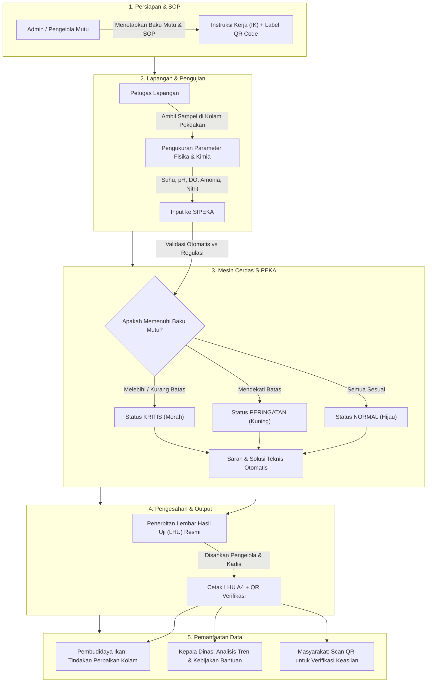
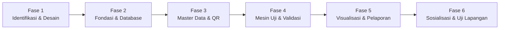

# 📘 MATERI PRESENTASI PROTOTYPE APLIKASI SIPEKA (MINAMUTU)
## Sistem Informasi Pemantauan Mutu Air Budidaya Perikanan Terpadu
**Dinas Perikanan Kabupaten Lembata — Nusa Tenggara Timur**

---

> **Petunjuk Penggunaan Dokumen:**  
> Dokumen ini dirancang khusus sebagai **bahan belajar komprehensif** bagi presenter (Ellen Veronika Maran, S.Pi) sebelum menyusun slide PowerPoint (PPT) dan mempresentasikannya di hadapan audiens awam, penguji Latsar CPNS, mentor, maupun pimpinan dinas.  
> Seluruh penjelasan teknis telah diterjemahkan ke dalam **bahasa yang komunikatif, analogis, dan mudah dipahami**, namun tetap berbobot ilmiah serta mencerminkan nilai-nilai akuntabilitas birokrasi dan inovasi digital.

---

## 📑 DAFTAR ISI
1. [Profil Inovasi & Identitas Proyek](#1-profil-inovasi--identitas-proyek)
2. [Latar Belakang Masalah: Kondisi Sebelum vs Sesudah](#2-latar-belakang-masalah-kondisi-sebelum-vs-sesudah)
3. [Proses Bisnis & Alur Kerja Sistem (End-to-End)](#3-proses-bisnis--alur-kerja-sistem-end-to-end)
4. [Eksplorasi Modul & Fitur Utama Aplikasi](#4-eksplorasi-modul--fitur-utama-aplikasi)
   - [Modul 1: Dashboard Eksekutif & Statistik](#modul-1-dashboard-eksekutif--statistik)
   - [Modul 2: SOP Instruksi Kerja & Label QR Code](#modul-2-sop-instruksi-kerja--label-qr-code)
   - [Modul 3: Master Data Lokasi Kolam & Pokdakan](#modul-3-master-data-lokasi-kolam--pokdakan)
   - [Modul 4: Standar Baku Mutu Air Berstandar Nasional](#modul-4-standar-baku-mutu-air-berstandar-nasional)
   - [Modul 5: Pengujian Kualitas Air & Validasi Cerdas Otomatis](#modul-5-pengujian-kualitas-air--validasi-cerdas-otomatis)
   - [Modul 6: Laporan Hasil Uji (LHU) Resmi & Rekap Tahunan](#modul-6-laporan-hasil-uji-lhu-resmi--rekap-tahunan)
   - [Modul 7: Analisis Tren Mutu & Peringatan Dini](#modul-7-analisis-tren-mutu--peringatan-dini)
   - [Modul 8: Portal Verifikasi Publik Berbasis QR Code](#modul-8-portal-verifikasi-publik-berbasis-qr-code)
   - [Modul 9: Manajemen Pegawai & Keamanan Akun (RBAC)](#modul-9-manajemen-pegawai--keamanan-akun-rbac)
5. [Perencanaan Proses Pembuatan Sistem (Roadmap)](#5-perencanaan-proses-pembuatan-sistem-roadmap)
6. [Manfaat & Dampak Nyata Inovasi](#6-manfaat--dampak-nyata-inovasi)
7. [Blueprint Slide Presentasi PowerPoint (Slide by Slide)](#7-blueprint-slide-presentasi-powerpoint-slide-by-slide)

---

## 1. PROFIL INOVASI & IDENTITAS PROYEK

| Elemen | Keterangan |
|---|---|
| **Nama Aplikasi** | **SIPEKA** *(Sistem Pemantauan Kualitas Air Budidaya)* / **MINAMUTU** |
| **Instansi Pembina** | Dinas Perikanan Kabupaten Lembata, Provinsi Nusa Tenggara Timur |
| **Inovator / Penggagas** | **Ellen Veronika Maran, S.Pi** (Pengelola Pengawasan Mutu Air) |
| **Pimpinan / Mentor** | **Ir. Hadi Mahmud, M.Si** (Kepala Dinas Perikanan Kabupaten Lembata) |
| **Sasaran Pengguna** | 1. Kelompok Pembudidaya Ikan (Pokdakan) di Kab. Lembata 2. Petugas Penguji & Penyuluh Lapangan 3. Pengelola Mutu Air Dinas Perikanan 4. Kepala Dinas & Pengambil Kebijakan 5. Masyarakat Umum (Verifikasi Transparansi) |
| **Dasar Ilmiah & Regulasi** | - PP No. 22 Tahun 2021 (Baku Mutu Air Nasional) - Standar Nasional Indonesia (SNI) Budidaya Ikan Air Tawar & Payau - Keputusan Menteri Kelautan dan Perikanan (Kepmen-KP) |

---

## 2. LATAR BELAKANG MASALAH: KONDISI SEBELUM VS SESUDAH

### A. Gambaran Masalah Riil di Kabupaten Lembata (Untuk Disampaikan ke Audiens)
> *"Air adalah nyawa bagi budidaya perikanan. Sebagus apapun benih ikan dan semahal apapun pakan yang diberikan, jika kualitas air kolam memburuk, maka ikan akan stres, terserang penyakit, bahkan mati massal secara mendadak."*

Di Kabupaten Lembata, potensi budidaya perikanan (seperti ikan Nila, Lele, Bandeng, dan komoditas lainnya) sangat menjanjikan untuk ketahanan pangan dan ekonomi masyarakat. Namun, selama ini terdapat beberapa kendala mendasar:

1. **Keterlambatan Deteksi Masalah Air**: Pembudidaya baru melapor ke Dinas ketika ikan sudah mati mengambang, padahal penurunan mutu air (seperti anjloknya oksigen atau melonjaknya racun amonia) sebenarnya sudah terjadi beberapa hari sebelumnya.
2. **Pencatatan Konvensional yang Rawan Hilang**: Data pengukuran lapangan dicatat manual pada buku tulis atau lembaran kertas yang mudah basah, sobek, tercecer, dan tidak terdokumentasi rapi.
3. **Analisis Manual yang Butuh Waktu**: Petugas lapangan harus membuka tabel buku tebal untuk membandingkan angka uji dengan standar regulasi, sehingga kesimpulan dan saran penanganan terlambat diberikan kepada pembudidaya.
4. **Penerbitan Laporan (LHU) yang Lambat**: Pembuatan Lembar Hasil Uji (LHU) resmi memakan waktu berhari-hari karena harus diketik ulang manual dan menunggu disposisi tanda tangan fisik.
5. **Belum Ada Riwayat Historis per Kolam**: Dinas sulit mengetahui apakah suatu kolam di desa tertentu memiliki masalah mutu air musiman (misal setiap musim kemarau atau musim hujan).

---

### B. Matriks Perbandingan Komparatif: Sebelum vs Sesudah SIPEKA

| Aspek Penilaian | Kondisi Sebelum Inovasi | Kondisi Sesudah Ada SIPEKA |
|---|---|---|
| **Metode Pencatatan** | Catat manual di buku catatan kertas / formulir fisik yang rawan hilang & rusak. | Digital langsung tersimpan aman di cloud database melalui ponsel atau laptop. |
| **Validasi Mutu Air** | Menghitung dan mencocokkan ambang batas secara manual satu per satu. | **Otomatis & Real-time**: Sistem langsung menghitung dan memberi label *Aman/Waspada/Bahaya*. |
| **Kecepatan Rekomendasi** | Petani baru menerima saran setelah berhari-hari (seringkali ikan sudah terlanjur mati). | Rekomendasi teknis langsung muncul detik itu juga (contoh: saran aerasi, penyiponan, atau pengapuran). |
| **Penerbitan Dokumen (LHU)** | Dibuat manual di Microsoft Word, proses tanda tangan lambat & rawan salah ketik. | **1 Kali Klik Cetak**: Format dinas baku standar A4, lengkap kop surat, grafik, dan e-pengesahan. |
| **Pelacakan Sampel (Traceability)** | Tidak ada kode unik; botol sampel di lapangan sering tertukar. | **QR Code Otomatis**: Setiap pengujian dan botol sampel memiliki barcode unik berstandar digital. |
| **Akses Pembudidaya / Publik** | Pembudidaya sulit melihat arsip riwayat mutu air kolam mereka. | **Portal Publik QR**: Cukup scan QR code lewat kamera HP tanpa perlu akun/login. |
| **Monitoring Pimpinan** | Kepala Dinas hanya mendapat laporan rekap akhir tahun yang tebal dan lambat dianalisis. | **Dashboard Interaktif**: Pimpinan dapat melihat grafik mutu air seluruh kecamatan secara real-time. |

---

## 3. PROSES BISNIS & ALUR KERJA SISTEM (END-TO-END)

Alur kerja aplikasi SIPEKA dirancang sangat runtut dan mencerminkan tata kelola laboratorium perikanan modern:

### Penjelasan Langkah demi Langkah untuk Presenter:
1. **Langkah 1 (Standarisasi Acuan)**: Pengelola Mutu memastikan acuan batas aman (Baku Mutu) dan Instruksi Kerja (IK) telah terdaftar di sistem.
2. **Langkah 2 (Pengujian Kolam)**: Petugas turun ke lokasi kolam budidaya pembudidaya (Pokdakan), melakukan pengukuran langsung (*in-situ*) menggunakan alat uji (pH meter, DO meter, termometer) serta sampel laboratorium.
3. **Langkah 3 (Input & Analisis Otomatis)**: Petugas membuka form SIPEKA dan memasukkan angka hasil uji. **Sistem SIPEKA langsung menganalisis detik itu juga**. Jika ada nilai berbahaya (misal amonia terlalu tinggi), sistem langsung memberi peringatan merah dan menerbitkan saran teknis.
4. **Langkah 4 (Penerbitan LHU)**: Sistem menerbitkan Lembar Hasil Uji (LHU) resmi siap cetak lengkap dengan nomor sampel unik, kop surat dinas, tabel baku mutu, serta tanda tangan pejabat yang berwenang.
5. **Langkah 5 (Tindak Lanjut & Transparansi)**: Pembudidaya segera menerima instruksi penanganan air, pimpinan memantau grafik tren, dan siapapun dapat memverifikasi keaslian dokumen cukup dengan memindai QR Code.

---

## 4. EKSPLORASI MODUL & FITUR UTAMA APLIKASI

Berikut adalah rincian lengkap 9 modul yang telah dibangun dalam prototype aplikasi SIPEKA:

---

### Modul 1: Dashboard Eksekutif & Statistik
*Pintu gerbang informasi bagi pimpinan dan pengelola sistem.*

- **Fungsi Utama**: Menyajikan ringkasan visual kesehatan air budidaya di seluruh Kabupaten Lembata dalam satu layar yang bersih dan modern.
- **Fitur-Fitur Kunci**:
  - **Kartu Indikator Utama (KPI Cards)**: Menampilkan total pengujian yang dilakukan, jumlah kolam dengan status **Normal (Aman)**, **Peringatan (Perlu Perhatian)**, dan **Kritis (Bahaya)**.
  - **Distribusi Mutu per Wilayah**: Menampilkan persentase kepatuhan mutu air berdasarkan kecamatan dan desa.
  - **Feed Aktivitas Pengujian Terkini**: Menampilkan daftar sampel air terbaru yang baru saja diinput oleh petugas lapangan.
- **Nilai untuk Audiens Awam**: *"Pimpinan tidak perlu lagi membaca puluhan lembar kertas laporan. Cukup buka dashboard selama 30 detik, Kepala Dinas langsung tahu berapa kolam yang aman dan berapa kolam yang butuh bantuan darurat."*

---

### Modul 2: SOP Instruksi Kerja & Label QR Code
*Jaminan mutu operasional berstandar laboratorium.*

- **Fungsi Utama**: Mendokumentasikan dan mendigitalisasi Standar Operasional Prosedur (SOP) pengujian mutu air.
- **Fitur-Fitur Kunci**:
  - **Katalog Instruksi Kerja**: Menyimpan dokumen SOP pengujian (seperti SOP Pengukuran Oksigen Terlarut, SOP Uji pH Kolam, SOP Pengambilan Sampel).
  - **Penomoran Versi & Pengarsipan Digital**: Mengelola dokumen PDF resmi agar petugas selalu memedomani versi terbaru.
  - **Generator QR Code Otomatis**: Setiap IK memiliki kode enkripsi hash dan QR Code unik.
  - **Fitur Cetak Label QR**: Memungkinkan pencetakan label stiker siap tempel pada botol sampel air di lapangan atau papan informasi kolam.
- **Nilai untuk Audiens Awam**: *"Menghilangkan risiko botol sampel tertukar di lapangan dan memastikan seluruh petugas bekerja dengan prosedur yang benar dan terstandarisasi."*

---

### Modul 3: Master Data Lokasi Kolam & Pokdakan
*Database geospasial pembudidaya ikan se-Kabupaten Lembata.*

- **Fungsi Utama**: Menginventarisasi seluruh kolam budidaya ikan dan kelompok pembudidaya ikan (Pokdakan).
- **Fitur-Fitur Kunci**:
  - **Profil Pokdakan Terpadu**: Mencatat Nama Kelompok (Pokdakan), Nama Pemilik/Ketua, Kontak, Desa, dan Kecamatan.
  - **Titik Koordinat GPS**: Menyimpan koordinat lokasi kolam untuk pemetaan lokasi yang presisi.
  - **Komoditas Ikan Budidaya**: Klasifikasi jenis ikan yang dibudidayakan (Nila, Lele, Bandeng, dll.) karena masing-masing komoditas memiliki toleransi air yang berbeda.
  - **Manajemen Status Kolam**: Status aktif/non-aktif kolam budidaya.
- **Nilai untuk Audiens Awam**: *"Dinas memiliki peta aset dan database pembudidaya yang valid, memudahkan distribusi bantuan dan monitoring rutin."*

---

### Modul 4: Standar Baku Mutu Air Berstandar Nasional
*Pondasi ilmiah penentu kelayakan air budidaya.*

- **Fungsi Utama**: Menyimpan dan mengelola ambang batas parameter kualitas air yang berlaku secara hukum dan ilmiah.
- **Fitur-Fitur Kunci**:
  - **Parameter Kunci Terintegrasi**:
    1. **Suhu (°C)**: Rentang ideal 28°C – 32°C.
    2. **Derajat Keasaman (pH)**: Rentang optimal 6.5 – 8.5.
    3. **Oksigen Terlarut (DO)**: Minimal ≥ 3.00 – 5.00 mg/L (kunci pernapasan ikan).
    4. **Amonia Bebas (NH₃-N)**: Maksimal ≤ 0.02 mg/L (racun pembunuh ikan).
    5. **Nitrit (NO₂-N)**: Maksimal ≤ 0.06 mg/L (penghambat transportasi oksigen darah).
    6. **Kecerahan / Kekeruhan**: Standar Secchi disk ≥ 30 cm atau turbiditas ≤ 25 NTU.
  - **Pencatatan Dasar Regulasi**: Setiap parameter tertaut pada dasar hukumnya (PP No. 22 Tahun 2021 Lampiran VI atau SNI).
  - **Sistem Versi Historis (Versioned)**: Jika regulasi pemerintah diperbarui di masa mendatang, riwayat data pengujian lama tidak akan rusak atau berubah nilai statusnya.
- **Nilai untuk Audiens Awam**: *"Sistem ini tidak mengira-ngira; keputusannya murni berdasarkan acuan baku mutu resmi pemerintah Republik Indonesia."*

---

### Modul 5: Pengujian Kualitas Air & Validasi Cerdas Otomatis
*Jantung operasional aplikasi tempat petugas bekerja.*

- **Fungsi Utama**: Formulir cerdas bagi petugas untuk menginput data hasil pengukuran dan menerima kesimpulan instan.
- **Fitur-Fitur Kunci**:
  - **Penomoran Sampel Otomatis**: Format nomor sampel unik dan terstruktur (anti duplikasi).
  - **Formulir Input Terbimbing**: Memilih lokasi kolam, tanggal, petugas penguji, dan metode IK yang digunakan.
  - **Smart Validation Engine (Validasi Otomatis)**:
    - Saat petugas memasukkan angka (misal pH = 9.2), sistem secara otomatis menandai: `MELEBIHI BAKU MUTU`.
    - Jika semua parameter aman, sistem otomatis menyimpulkan: `NORMAL`.
    - Jika ada parameter yang berbahaya bagi kelangsungan hidup ikan, sistem otomatis menetapkan: `KRITIS`.
  - **Rekomendasi Lapangan Otomatis**: Sistem memberikan rekomendasi solusi langsung, contoh:
    - *Jika DO Rendah*: Segera lakukan aerasi darurat atau pasang kincir air / pompa sirkulasi.
    - *Jika Amonia Tinggi*: Kurangi porsi pakan ikan dan lakukan penyiponan (pembersihan endapan kotoran di dasar kolam).
    - *Jika pH Terlalu Asam*: Lakukan pengapuran kolam bertahap dengan kapur pertanian (dolomit).
- **Nilai untuk Audiens Awam**: *"Petugas lapangan dibantu oleh 'asisten cerdas'. Tidak perlu takut salah hitung atau salah memberikan saran kepada masyarakat."*

---

### Modul 6: Laporan Hasil Uji (LHU) Resmi & Rekap Tahunan
*Output legal bernilai resmi untuk masyarakat dan arsip kedinasan.*

- **Fungsi Utama**: Menerbitkan Lembar Hasil Uji (LHU) resmi dan rekapitulasi data tahunan.
- **Fitur-Fitur Kunci**:
  - **Format Dokumen Kedinasan Resmi A4**: Standar surat resmi lengkap dengan Kop Dinas Perikanan Kabupaten Lembata, logo daerah, dan garis pemisah.
  - **Tabel Evaluasi Mutu Komparatif**: Membandingkan langsung antara *Nilai Hasil Uji*, *Satuan*, *Baku Mutu Rujukan*, dan *Status Kelayakan*.
  - **Blok Pengesahan Berjenjang**: Ruang tanda tangan resmi untuk:
    - Petugas Penguji Mutu Air (Ellen Veronika Maran, S.Pi)
    - Kepala Dinas Perikanan Kabupaten Lembata (Ir. Hadi Mahmud, M.Si)
  - **QR Code Keaslian Dokumen**: Tertanam di bagian bawah dokumen untuk mencegah pemalsuan sertifikat uji.
  - **Manajemen Siklus Dokumen**: Status dokumen bertingkat (`Draft` -> `Final` -> `Arsip`) untuk menjaga integritas data agar dokumen yang sudah disahkan tidak dapat diubah sembarangan.
  - **Fitur Rekap Tahunan**: Matriks evaluasi mutu air per Pokdakan per bulan untuk bahan evaluasi tahunan dinas.
- **Nilai untuk Audiens Awam**: *"Pembudidaya menerima sertifikat resmi yang sah dan terpercaya, yang juga berguna jika mereka ingin mengajukan sertifikasi Cara Budidaya Ikan yang Baik (CBIB)."*

---

### Modul 7: Analisis Tren Mutu & Peringatan Dini
*Instrumen analitik masa depan untuk deteksi anomali.*

- **Fungsi Utama**: Visualisasi grafik riwayat kualitas air dari waktu ke waktu per kolam budidaya.
- **Fitur-Fitur Kunci**:
  - **Grafik Interaktif Deret Waktu (Time Series Chart)**: Menampilkan kurva naik turunnya parameter (misal grafik pH atau DO selama 6 bulan terakhir).
  - **Garis Ambang Batas Aman**: Menampilkan garis batas minimum dan maksimum baku mutu pada grafik, sehingga jika grafik menembus batas, polanya langsung terlihat jelas.
  - **Filter Komparatif**: Memilih lokasi kolam dan parameter tertentu untuk analisis mendalam.
- **Nilai untuk Audiens Awam**: *"Kita bisa melihat pola musiman. Misalnya, setiap bulan Agustus suhu kolam selalu drop atau amonia naik. Dinas bisa melakukan sosialisasi pencegahan sebelum musibah ikan mati terjadi lagi."*

---

### Modul 8: Portal Verifikasi Publik Berbasis QR Code
*Transparansi layanan publik tanpa batasan birokrasi.*

- **Fungsi Utama**: Memungkinkan pembudidaya, pedagang ikan, atau masyarakat luas memeriksa keabsahan hasil uji secara mandiri.
- **Fitur-Fitur Kunci**:
  - **Akses Terbuka Tanpa Login**: Masyarakat tidak perlu mendaftar atau memiliki akun dinas.
  - **Cukup Pindai Kamera Smartphone**: Memindai stiker QR pada botol sampel atau dokumen LHU fisik langsung membuka halaman verifikasi resmi.
  - **Tampilan Ramah Ponsel (Mobile Responsive)**: Informasi disajikan ringkas, jelas, dan mudah dibaca di layar HP.
- **Nilai untuk Audiens Awam**: *"Transparansi total. Masyarakat bisa percaya 100% pada hasil uji dinas karena bisa diverifikasi kapan saja dan di mana saja."*

---

### Modul 9: Manajemen Pegawai & Keamanan Akun (RBAC)
*Tata kelola organisasi dan perlindungan keamanan data dinas.*

- **Fungsi Utama**: Mengatur hak akses pengguna dan mencatat identitas aparatur penguji yang sah.
- **Fitur-Fitur Kunci**:
  - **Hak Akses Berbasis Peran (Role-Based Access Control / RBAC)**:
    - **Administrator**: Hak penuh konfigurasi sistem dan manajemen akun.
    - **Pengelola Mutu**: Mengelola SOP, baku mutu, lokasi kolam, dan validasi uji.
    - **Petugas Lapangan**: Khusus input data pengujian kolam dan scan QR.
    - **Kepala Dinas**: Mengakses dashboard eksekutif, rekap tahunan, dan pengesahan LHU.
  - **Database Pegawai & NIP**: Integrasi data NIP, pangkat/golongan, dan jabatan untuk otomasi tanda tangan dokumen resmi.
- **Nilai untuk Audiens Awam**: *"Data dinas terjamin aman dari manipulasi karena setiap orang hanya memiliki wewenang sesuai tugas pokok dan fungsinya masing-masing."*

---

## 5. PERENCANAAN PROSES PEMBUATAN SISTEM (ROADMAP)

Proses pengembangan prototype SIPEKA disusun melalui tahapan yang terukur dan berorientasi pada kebutuhan pengguna:

| Tahapan / Fase | Kegiatan Utama | Hasil / Deliverable | Status |
|---|---|---|---|
| **Fase 1: Identifikasi Masalah & Desain** | - Wawancara kebutuhan pembudidaya ikan & petugas - Pengumpulan regulasi (PP 22/2021 & SNI) - Perancangan antarmuka ramah pengguna (UI/UX) | Dokumen Kebutuhan Sistem & Wireframe Desain | Selesai |
| **Fase 2: Arsitektur & Database** | - Setup Next.js, Tailwind CSS, & Drizzle ORM - Perancangan skema database relasional (PostgreSQL) - Konfigurasi keamanan akun & peran (RBAC) | Sistem Fondasi & Skema Data Teruji | Selesai |
| **Fase 3: Modul Master & QR Code** | - Pembangunan Modul Lokasi Kolam & Pokdakan - Pembangunan Modul Master Baku Mutu Terstandar - Generator kode QR & sistem label cetak | Master Data Siap Digunakan & Label QR Aktif | Selesai |
| **Fase 4: Modul Transaksi & Smart Engine** | - Formulir input hasil uji lapangan - Pembuatan algoritma validasi otomatis batas baku mutu - Integrasi rekomendasi tindakan teknis lapangan | Fitur Input Uji Cerdas & Penilaian Otomatis | Selesai |
| **Fase 5: Pelaporan LHU & Analitik** | - Desain print-out LHU standar dinas A4 - Modul grafik tren mutu air interaktif - Portal verifikasi publik tanpa login | LHU Siap Cetak & Grafik Tren Berfungsi Penuh | Selesai |
| **Fase 6: Evaluasi & Uji Coba Lapangan** | - Uji fungsi bersama petugas dinas dan Pokdakan - Pengumpulan masukan pengguna untuk penyempurnaan - Penyusunan SOP pemanfaatan aplikasi | Prototype Terverifikasi Siap Implementasi | Tahap Saat Ini |

---

## 6. MANFAAT & DAMPAK NYATA INOVASI

### 1. Bagi Kelompok Pembudidaya Ikan (Pokdakan)
- **Mencegah Kematian Massal Ikan**: Peringatan dini memungkinkan tindakan penyelamatan sebelum kondisi air menjadi fatal.
- **Meningkatkan Hasil Panen & Pendapatan**: Air yang selalu terjaga mutunya membuat ikan tumbuh lebih cepat, sehat, dan efisien dalam mengonsumsi pakan (FCR optimal).
- **Mendapatkan Kepastian Layanan**: Petani menerima bukti tertulis (LHU) resmi dan bimbingan teknis yang jelas dari pemerintah.

### 2. Bagi Petugas Penguji & Dinas Perikanan Kab. Lembata
- **Efisiensi Waktu & Tenaga**: Tidak ada lagi proses rekap manual berulang di buku; waktu kerja petugas menjadi 80% lebih cepat.
- **Standarisasi Pengawasan**: Seluruh staf menggunakan standar acuan nasional yang seragam dan transparan.
- **Database Terintegrasi**: Memiliki arsip data mutu air digital yang rapi, akurat, dan dapat diakses sewaktu-waktu.

### 3. Bagi Kepala Dinas & Pemerintah Daerah
- **Pengambilan Kebijakan Berbasis Data (Evidence-Based Policy)**: Mempermudah penentuan alokasi bantuan sarana budidaya bagi wilayah atau kolam yang paling membutuhkan.
- **Akuntabilitas & Pelayanan Publik Modern**: Mewujudkan birokrasi yang adaptif, responsif, dan berorientasi teknologi sesuai tuntutan Core Values ASN BerAKHLAK.
- **Mendukung Ketahanan Pangan Daerah**: Menjamin pasokan ikan konsumsi air tawar dan payau yang aman dan berkualitas bagi masyarakat Kabupaten Lembata.

---

## 7. BLUEPRINT SLIDE PRESENTASI POWERPOINT (SLIDE BY SLIDE)

Panduan praktis bagi presenter untuk menyusun materi slide PowerPoint beserta tips cara penyampaian di depan penguji / audiens:

---

### Slide 1: Judul Presentasi
- **Konten Slide**:
  - Judul: **SIPEKA (Sistem Pemantauan Kualitas Air Budidaya)**
  - Subjudul: *Digitalisasi Pengawasan Mutu Air Kolam Menuju Kemandirian Pembudidaya Ikan Kabupaten Lembata*
  - Identitas: **Ellen Veronika Maran, S.Pi** — Pengelola Pengawasan Mutu Air
  - Instansi: Dinas Perikanan Kabupaten Lembata — 2026
- **Tips Penyampaian (Script Bicara)**:
  > *"Selamat pagi/siang Bapak/Ibu Dewan Penguji, Mentor, dan hadirin sekalian. Pada hari ini saya dengan bangga mempresentasikan prototype inovasi digital kami bernama SIPEKA, sebuah sistem yang lahir dari dedikasi kami di Dinas Perikanan Kabupaten Lembata untuk melindungi dan meningkatkan kesejahteraan para pembudidaya ikan kita."*

---

### Slide 2: Latar Belakang & Masalah Utama
- **Konten Slide**:
  - Poin 1: Kematian ikan budidaya sering terjadi tanpa sempat diantisipasi.
  - Poin 2: Pencatatan manual di kertas lambat, mudah rusak, dan sulit ditelusuri.
  - Poin 3: Pembudidaya terlambat menerima saran perbaikan air dari dinas.
  - Elemen Visual: Foto kolam budidaya di Lembata berdampingan dengan ilustrasi kertas catatan yang basah/rusak vs ikon digital.
- **Tips Penyampaian**:
  > *"Bapak/Ibu, air adalah penentu utama keberhasilan budidaya ikan. Selama ini, kendala terbesar pembudidaya di Lembata adalah mereka baru tahu air kolamnya beracun saat ikan sudah mulai mati mengambang. Mengapa? Karena proses pengujian kita selama ini masih manual, dicatat di kertas, dan laporannya butuh berhari-hari untuk sampai ke tangan petani."*

---

### Slide 3: Solusi Inovasi — Lahirnya SIPEKA
- **Konten Slide**:
  - Definisi Singkat SIPEKA.
  - Tiga Pilar Utama:
    1. **Digital & Cepat**: Input data dari smartphone langsung tersimpan.
    2. **Cerdas & Akurat**: Validasi otomatis sesuai standar baku mutu nasional.
    3. **Transparan & Akuntabel**: Label QR Code dan penerbitan LHU resmi berstandar kedinasan.
- **Tips Penyampaian**:
  > *"Untuk mengatasi masalah tersebut, kami merancang SIPEKA. SIPEKA hadir sebagai jembatan cerdas yang mengubah seluruh proses pengawasan mutu air menjadi serba cepat, otomatis, dan akurat berdasarkan standar resmi Kementerian Kelautan dan Perikanan serta Kementerian Lingkungan Hidup."*

---

### Slide 4: Alur Kerja Sistem (Sederhana & Mudah Dipahami)
- **Konten Slide**:
  - Infografis 4 Langkah:
    1. Ambil Sampel & Tempel Label QR Code.
    2. Ukur Parameter & Input Nilai ke Sistem.
    3. Sistem Menganalisis Otomatis (Aman/Waspada/Bahaya).
    4. Terbit Lembar Hasil Uji (LHU) + Saran Penanganan Instan.
- **Tips Penyampaian**:
  > *"Bagaimana SIPEKA bekerja di lapangan? Sangat sederhana. Petugas mengambil sampel air, menginput hasil pengukuran di HP, dan detik itu juga sistem langsung memberi tahu: apakah air ini aman, waspada, atau bahaya, lengkap dengan petunjuk apa yang harus segera dilakukan oleh pemilik kolam."*

---

### Slide 5: Fitur Unggulan 1 — Validasi Otomatis & Rekomendasi Instan
- **Konten Slide**:
  - Tangkapan Layar (Screenshot) Form Input Hasil Uji.
  - Sorotan Visual: Badge Warna **Hijau (Normal)**, **Kuning (Peringatan)**, **Merah (Kritis)**.
  - Kotak Saran Lapangan Otomatis (contoh: rekomendasi penambahan aerasi atau penyiponan).
- **Tips Penyampaian**:
  > *"Inilah jantung dari SIPEKA. Petugas tidak perlu lagi menghafal atau menghitung ambang batas di kalkulator. Sistem secara otomatis mengevaluasi 6 parameter vital seperti oksigen dan amonia. Jika amonia tinggi, sistem langsung memunculkan saran teknis untuk penyiponan dasar kolam dan pengurangan pakan."*

---

### Slide 6: Fitur Unggulan 2 — LHU Resmi Berstandar A4 & Pengesahan Digital
- **Konten Slide**:
  - Tangkapan Layar Lembar Hasil Uji (LHU) siap cetak.
  - Elemen: Kop Resmi Dinas Perikanan Kab. Lembata, Nomor Sampel Unik, Tabel Baku Mutu, QR Code Keaslian, dan Blok Tanda Tangan Kadis & Penguji.
- **Tips Penyampaian**:
  > *"Hasil akhir yang diterima masyarakat adalah Lembar Hasil Uji yang sah, berwibawa, dan rapi sesuai format standar administrasi pemerintah. Dokumen ini dilengkapi tanda tangan pejabat dan QR code pengaman agar tidak dapat dipalsukan."*

---

### Slide 7: Fitur Unggulan 3 — Dashboard Pimpinan & Grafik Tren Masa Depan
- **Konten Slide**:
  - Tangkapan Layar Dashboard Utama & Halaman Analisis Tren.
  - Grafik garis deret waktu menunjukkan batas aman dan fluktuasi air kolam.
- **Tips Penyampaian**:
  > *"Bagi pimpinan, Bapak Kepala Dinas kini memiliki 'radar pemantau' kualitas air di seluruh wilayah Lembata. Beliau dapat melihat tren musiman: kolam mana yang sering mengalami penurunan mutu, sehingga dinas bisa mengalokasikan program pembinaan secara tepat sasaran."*

---

### Slide 8: Kemudahan Bagi Masyarakat — Verifikasi Publik Tanpa Login
- **Konten Slide**:
  - Ilustrasi seseorang memindai QR Code di botol sampel atau dokumen kertas menggunakan smartphone biasa.
  - Tangkapan Layar Halaman Verifikasi Publik yang bersih dan informatif.
- **Tips Penyampaian**:
  > *"SIPEKA sangat berpihak pada masyarakat. Pembudidaya tidak perlu repot membuat akun atau mengingat kata sandi. Cukup arahkan kamera smartphone ke QR Code di botol sampel atau lembar laporan, seluruh informasi keabsahan hasil uji langsung terbuka seketika."*

---

### Slide 9: Tahapan Pembangunan & Kesiapan Prototype
- **Konten Slide**:
  - Garis waktu (Roadmap) dari perencanaan, pembangunan database, pembuatan modul uji, hingga integrasi laporan.
  - Status saat ini: Prototype sistem telah selesai dibangun secara fungsional dan siap diuji coba secara luas di lapangan.
- **Tips Penyampaian**:
  > *"Prototype SIPEKA ini bukan sekadar konsep di atas kertas, melainkan sistem berbasis web yang sudah berfungsi penuh dan siap digunakan dalam operasional pengawasan mutu air budidaya di Dinas Perikanan Kabupaten Lembata."*

---

### Slide 10: Manfaat & Dampak Nyata
- **Konten Slide**:
  - Manfaat bagi Pembudidaya (Ikan sehat, panen melimpah, tidak ada kematian mendadak).
  - Manfaat bagi Dinas (Pencatatan akurat, efisiensi waktu 80%, laporan instan).
  - Manfaat bagi Pemda Lembata (Peningkatan produksi perikanan & pelayanan publik prima).
- **Tips Penyampaian**:
  > *"Dengan hadirnya SIPEKA, kita tidak hanya menyelamatkan ikan dari kematian, tetapi kita menjaga mata pencaharian dan harapan para pembudidaya kita di Lembata."*

---

### Slide 11: Penutup & Komitmen Keberlanjutan
- **Konten Slide**:
  - Kalimat Kunci: *"SIPEKA — Air Terjaga, Ikan Sehat, Pembudidaya Sejahtera."*
  - Ucapan Terima Kasih & Sesi Tanya Jawab.
- **Tips Penyampaian**:
  > *"Demikian paparan prototype aplikasi SIPEKA. Besar harapan kami inovasi ini dapat terus berkelanjutan dan memberikan manfaat nyata bagi kemajuan sektor perikanan budidaya di Kabupaten Lembata. Terima kasih atas perhatian Bapak/Ibu sekalian, waktu dan ruang kami persilakan untuk diskusi dan masukan."*

---

*(Dokumen disusun untuk mendukung Pelatihan Dasar CPNS — Inovasi Pengawasan Mutu Air Dinas Perikanan Kabupaten Lembata 2026)*
