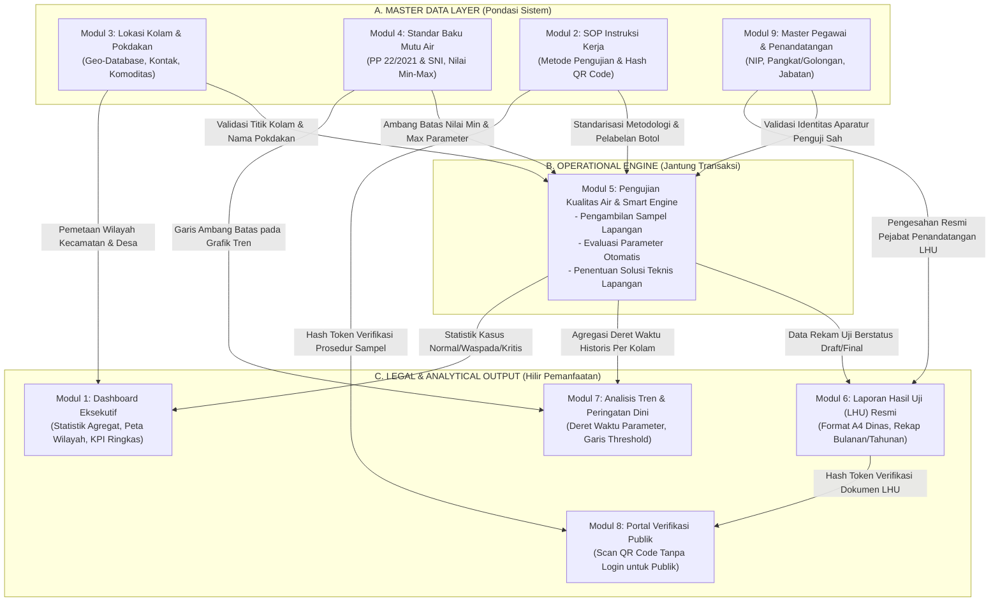
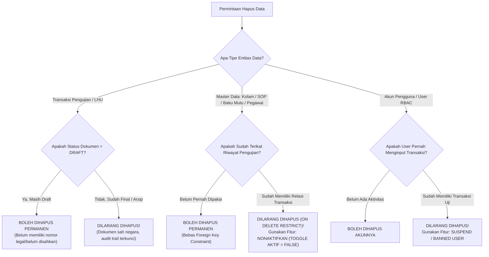
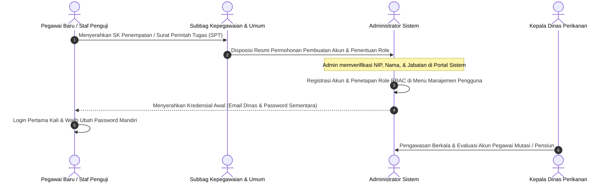

# 📘 MATERI PRESENTASI PROTOTYPE SISTEM INFORMASI PEMANTAUAN MUTU AIR BUDIDAYA PERIKANAN TERPADU
## Dinas Perikanan Kabupaten Lembata — Nusa Tenggara Timur
*(Catatan: Penamaan akronim/branding definitif belum ditetapkan — terbuka untuk saran dan masukan peserta Latsar)*

---

> **Petunjuk Penggunaan Dokumen:**  
> Dokumen ini dirancang khusus sebagai **bahan belajar komprehensif dan naskah rujukan utama** bagi presenter (**Melania Herlinda Lete Boro, S.Si**) sebelum menyusun slide presentasi (PowerPoint/Canva) dan mempresentasikannya di hadapan Penguji Latsar CPNS, Mentor (**Hadi Umar, S.Pd., MT**), Coach, maupun audiens kedinasan.  
> Seluruh penjelasan teknis sistem informasi telah diintegrasikan dengan **tata kelola birokrasi, prinsip integritas data, mitigasi risiko audit, dan kerangka kerja ASN BerAKHLAK**, sehingga mampu menjawab pertanyaan mendalam dari penguji terkait teknis, fungsionalitas, maupun keamanan sistem.

---

## 📑 DAFTAR ISI
1. [Profil Inovasi & Identitas Peserta Latsar](#1-profil-inovasi--identitas-peserta-latsar)
2. [Latar Belakang Masalah: Kondisi Sebelum vs Sesudah](#2-latar-belakang-masalah-kondisi-sebelum-vs-sesudah)
3. [Arsitektur Keterkaitan Antar-Modul (System Synergy & Data Flow)](#3-arsitektur-keterkaitan-antar-modul-system-synergy--data-flow)
4. [Eksplorasi Detail 9 Modul Utama Aplikasi](#4-eksplorasi-detail-9-modul-utama-aplikasi)
   - [Modul 1: Dashboard Eksekutif & Statistik](#modul-1-dashboard-eksekutif--statistik)
   - [Modul 2: SOP Instruksi Kerja & Label QR Code](#modul-2-sop-instruksi-kerja--label-qr-code)
   - [Modul 3: Master Data Lokasi Kolam & Pokdakan](#modul-3-master-data-lokasi-kolam--pokdakan)
   - [Modul 4: Standar Baku Mutu Air Berstandar Nasional](#modul-4-standar-baku-mutu-air-berstandar-nasional)
   - [Modul 5: Pengujian Kualitas Air & Validasi Cerdas Otomatis](#modul-5-pengujian-kualitas-air--validasi-cerdas-otomatis)
   - [Modul 6: Laporan Hasil Uji (LHU) Resmi & Rekap Tahunan](#modul-6-laporan-hasil-uji-lhu-resmi--rekap-tahunan)
   - [Modul 7: Analisis Tren Mutu & Peringatan Dini](#modul-7-analisis-tren-mutu--peringatan-dini)
   - [Modul 8: Portal Verifikasi Publik Berbasis QR Code](#modul-8-portal-verifikasi-publik-berbasis-qr-code)
   - [Modul 9: Manajemen Pegawai & Pejabat Penandatangan LHU](#modul-9-manajemen-pegawai--pejabat-penandatangan-lhu)
5. [Aturan Integritas Data: Kebijakan Penghapusan (Boleh vs Dilarang Dihapus)](#5-aturan-integritas-data-kebijakan-penghapusan-boleh-vs-dilarang-dihapus)
6. [Tata Kelola Keamanan Akun & Hak Akses Pengguna (RBAC)](#6-tata-kelola-keamanan-akun--hak-akses-pengguna-rbac)
   - [Matriks Kewenangan Akses (RBAC Matrix)](#a-matriks-kewenangan-akses-rbac-matrix)
   - [Otoritas Pemberian & Pengubahan Wewenang Role](#b-otoritas-pemberian--pengubahan-wewenang-role)
   - [Prosedur Operasional Standar (SOP) Registrasi & Penugasan Akun](#c-prosedur-operasional-standar-sop-registrasi--penugasan-akun)
7. [Perencanaan Proses Pembuatan Sistem (Roadmap)](#7-perencanaan-proses-pembuatan-sistem-roadmap)
8. [Manfaat & Dampak Nyata Inovasi](#8-manfaat--dampak-nyata-inovasi)
9. [Blueprint Slide Presentasi PowerPoint (Slide by Slide)](#9-blueprint-slide-presentasi-powerpoint-slide-by-slide)
10. [Simulasi Tanya Jawab Penguji Latsar (Q&A Defense Guide)](#10-simulasi-tanya-jawab-penguji-latsar-qa-defense-guide)

---

## 1. PROFIL INOVASI & IDENTITAS PESERTA LATSAR

| Elemen | Keterangan Lengkap |
|---|---|
| **Nama Sistem / Inovasi** | **Sistem Informasi Pemantauan Mutu Air Budidaya Perikanan Terpadu** *(Prototype)* |
| **Nama Branding / Akronim** | *(Belum ditentukan secara definitif — Masih terbuka untuk usulan, saran kreatif, dan masukan dari dewan penguji, mentor, serta rekan-rekan peserta Latsar)* |
| **Instansi Pembina** | Dinas Perikanan Kabupaten Lembata, Provinsi Nusa Tenggara Timur |
| **Nama Peserta / Inovator** | **MELANIA HERLINDA LETE BORO, S.Si** |
| **NIP** | **19940318 202506 2 005** |
| **Angkatan Latsar** | **353** |
| **Nomor Absen** | **8** |
| **Jabatan / Penugasan** | Pengelola Pengawasan Mutu Air |
| **Mentor** | **Hadi Umar, S.Pd., MT** |
| **Sasaran Pengguna** | 1. **Kelompok Pembudidaya Ikan (Pokdakan)** di seluruh wilayah Kabupaten Lembata 2. **Petugas Laboratorium & Penyuluh Lapangan** 3. **Pengelola Pengawasan Mutu Air Dinas Perikanan** 4. **Kepala Dinas & Pejabat Pengambil Kebijakan** 5. **Masyarakat Luar / Pembeli Ikan** (Verifikasi Transparansi Mutu) |
| **Landasan Regulasi** | 1. **PP No. 22 Tahun 2021** tentang Penyelenggaraan Perlindungan dan Pengelolaan Lingkungan Hidup (Lampiran VI: Baku Mutu Air Nasional Badan Air Kelas II/III Budidaya Perikanan) 2. **SNI Budidaya Perikanan Air Tawar & Payau** (SNI 01-6141 untuk Nila, SNI 7545.1 untuk Lele) 3. **Kepmen-KP No. 28/KEPMEN-KP/2019** tentang Standar Pelayanan Minimal Sektor Kelautan dan Perikanan |
| **Basis Teknologi** | Web Architecture Modern (Next.js App Router, PostgreSQL Relational Database, Drizzle ORM, Better-Auth Security, Responsive Mobile-Friendly Tailwind CSS) |

---

## 2. LATAR BELAKANG MASALAH: KONDISI SEBELUM VS SESUDAH

### A. Gambaran Masalah Riil di Kabupaten Lembata
> *"Air adalah ruang hidup sekaligus napas utama bagi budidaya perikanan. Sebaik apapun bibit ikan dan semahal apapun pakan yang ditebar, apabila kualitas air kolam memburuk, maka pertumbuhan ikan akan kerdil, terserang penyakit, hingga terjadi kematian massal secara mendadak."*

Potensi budidaya perikanan di Kabupaten Lembata (Nila, Lele, Bandeng, dll.) sangat potensial untuk memperkuat ketahanan pangan dan ekonomi keluarga pembudidaya. Namun sebelum adanya sistem pemantauan digital ini, pengawasan mutu air menghadapi 5 kelemahan mendasar:
1. **Deteksi Terlambat (*Late Detection*)**: Pembudidaya baru menghubungi Dinas saat ikan sudah mati mengapung. Padahal pergeseran kimia air (penurunan oksigen DO atau lonjakan amonia racun) sudah berlangsung 2–3 hari sebelumnya.
2. **Pencatatan Konvensional yang Rentan Musnah**: Data uji dicatat pada kertas bergaris yang mudah basah terkena cipratan air kolam, sobek, kotor, dan hilang saat pergantian petugas.
3. **Analisis Berlarut-larut**: Petugas harus mencocokkan angka pengukuran secara manual dengan tabel buku tebal, sehingga petani tidak langsung mendapatkan petunjuk tindakan penyelamatan darurat.
4. **Penerbitan Laporan Hasil Uji (LHU) Lambat**: Dokumen resmi harus diketik manual di komputer kantor, rentan salah salin (*human error*), dan antrean tanda tangan memakan waktu berhari-hari.
5. **Kehilangan Jejak Historis Kolam**: Dinas tidak memiliki basis data tren tahunan untuk memetakan kolam mana yang sering bermasalah saat pergantian musim kemarau ke musim hujan.

---

### B. Matriks Komparasi: Sebelum vs Sesudah Inovasi Sistem Digital

| Dimensi Penilaian | Sebelum Ada Inovasi Digital | Setelah Implementasi Prototype Sistem |
|---|---|---|
| **Media Pencatatan** | Kertas formulir manual / buku saku, rentan rusak di lapangan. | Digital Cloud Database melalui ponsel pintar / tablet petugas. |
| **Kecepatan Validasi** | Manual membandingkan dengan buku standar (1–3 hari). | **Otomatis Real-Time (<1 detik)** dengan badge Normal/Peringatan/Kritis. |
| **Rekomendasi Penanganan** | Lisan dan lambat, ikan seringkali sudah mati sebelum saran tiba. | **Instan dan Terstruktur**: Rekomendasi aerasi, penyiponan, atau pengapuran langsung terbit. |
| **Legitimasi Dokumen (LHU)** | Ketik ulang di MS Word, format tidak seragam, tanda tangan basah lambat. | **Sekali Klik Cetak A4 Standar Dinas**, lengkap kop resmi, grafik, dan e-verifikasi pejabat. |
| **Pelacakan Sampel Lapangan** | Wadah sampel rentan tertukar, kode sampel hanya spidol yang mudah luntur. | **Label Stiker QR Code Digital**, unik per instruksi kerja dan botol sampel. |
| **Aksesibilitas Pembudidaya** | Petani harus datang ke kantor dinas untuk menanyakan status air. | **Scan QR Mandiri**: Petani cukup menembak kamera HP pada barcode laporan atau botol sampel. |
| **Akuntabilitas Rekam Jejak** | Data lama dapat diubah/dihapus tanpa jejak (*no audit trail*). | **Strict Lifecycle Protection**: Data final terkunci permanen, penghapusan terproteksi database. |
| **Monitoring Pimpinan (Kadis)** | Menunggu laporan tebal akhir tahun yang bersifat statis. | **Dashboard Eksekutif Dinamis**: Tren mutu air seluruh kecamatan dapat dipantau dari meja kerja. |

---

## 3. ARSITEKTUR KETERKAITAN ANTAR-MODUL (SYSTEM SYNERGY & DATA FLOW)

Aplikasi ini dirancang **bukan sebagai kumpulan modul yang berdiri sendiri (*siloed*)**, melainkan sebagai ekosistem digital terpadu di mana keluaran (*output*) satu modul menjadi prasyarat mutlak (*input constraint*) bagi modul lainnya.

### Penjelasan Rantai Nilai (*Value Chain*) Antar-Modul untuk Presenter:
1. **Modul 3 (Kolam) & Modul 4 (Baku Mutu) adalah Fondasi Utama**: Petugas tidak dapat menginput hasil pengujian (Modul 5) tanpa memilih lokasi kolam yang sah dari Modul 3 dan mengaitkannya dengan batas aman nasional di Modul 4.
2. **Modul 2 (SOP/IK) Memberikan Sertifikasi Metodologi**: Setiap angka yang masuk ke Modul 5 harus dapat dipertanggungjawabkan metode pengukurannya (apakah menggunakan probe sensor in-situ atau uji titrasi lab).
3. **Modul 5 (Smart Engine) adalah Sentra Data**: Begitu data diinput di Modul 5, secara otomatis data tersebut menyuplai:
   - Dokumen hukum LHU di **Modul 6**.
   - Grafik historis deret waktu di **Modul 7**.
   - Kartu metrik dan statistik pimpinan di **Modul 1**.
4. **Modul 6 dan Modul 2 Menjamin Transparansi di Modul 8**: QR Code yang tertera pada LHU fisik maupun stiker botol sampel dapat langsung diverifikasi oleh pembudidaya atau masyarakat melalui Modul 8 tanpa perlu login akun.

---

## 4. EKSPLORASI DETAIL 9 MODUL UTAMA APLIKASI

Berikut adalah rincian mendalam 9 modul sistem, mencakup fungsi, keterkaitan sinergis, aturan hapus data, dan hak akses perannya:

---

### Modul 1: Dashboard Eksekutif & Statistik
*Pusat kendali informasi (*Control Tower*) pimpinan dinas dan penanggung jawab mutu.*

- **Fungsi Utama**: Menyajikan visualisasi status kesehatan air perikanan se-Kabupaten Lembata secara makro dan *real-time*.
- **Fitur Kunci**:
  - **KPI Status Card**: Angka total pengujian, jumlah kolam berkondisi **Normal (Hijau)**, **Peringatan (Kuning)**, dan **Kritis (Merah)**.
  - **Sebaran Wilayah Budidaya**: Rekapitulasi jumlah sampel dan tingkat kepatuhan mutu air per kecamatan (misal: Nubatukan, Ile Ape, Omesuri, Buyasuri).
  - **Feed Aktivitas Lapangan**: Daftar pengujian terkini yang baru saja diinput petugas penguji lapangan.
- **Keterkaitan Antar-Modul**:
  - *Menerima data dari*: **Modul 5 (Uji Air)** untuk statistik angka uji dan **Modul 3 (Lokasi Kolam)** untuk nama desa/kecamatan.
  - *Mendukung*: Pengambilan keputusan cepat Kepala Dinas saat memimpin rapat dinas atau menentukan lokasi bantuan sarana aerator.
- **Aturan Hapus Data**:
  - Modul ini **TIDAK MEMILIKI fungsi hapus langsung**, karena dashboard hanya berfungsi sebagai lapisan presentasi agregat (*read-only aggregate view*). Angka akan berubah secara otomatis mengikuti status data pengujian di Modul 5.
- **Hak Akses Role**:
  - **Kepala Dinas & Admin**: Akses penuh melihat seluruh ringkasan statistik dan detail pengujian tingkat kabupaten.
  - **Pengelola Mutu & Petugas**: Akses melihat statistik operasional lapangan.

---

### Modul 2: SOP Instruksi Kerja & Label QR Code
*Penjaminan mutu teknis pengujian berstandar laboratorium dan keterlacakan sampel (*traceability*).*

- **Fungsi Utama**: Mengarsipkan dokumen Standar Operasional Prosedur (SOP) pengujian air dan mencetak label QR Code untuk botol sampel serta papan kolam.
- **Fitur Kunci**:
  - **Katalog Instruksi Kerja Digital**: Mengarsipkan dokumen PDF resmi (contoh: *IK-01: Prosedur Pengukuran Oksigen Terlarut DO*, *IK-02: Prosedur Pengukuran pH Air Tawar*).
  - **Algoritma QR Code Hash**: Setiap IK dan wadah sampel memiliki kode unik (*hash*) yang tidak dapat diduplikasi.
  - **Fitur Cetak Stiker Label QR**: Menghasilkan tata letak label siap cetak yang dapat ditempel pada botol sampel sebelum dibawa ke lapangan.
- **Keterkaitan Antar-Modul**:
  - *Mendukung Modul 5*: Menyediakan metode uji baku yang dipilih petugas saat menginput hasil pengukuran.
  - *Mendukung Modul 8*: QR Code pada stiker botol dapat dipindai oleh siapapun untuk membuka SOP resmi pengujian tersebut di Portal Publik.
- **Aturan Hapus Data (Boleh vs Dilarang Hapus)**:
  - ❌ **DILARANG DIHAPUS PERMANEN** jika Instruksi Kerja tersebut sudah pernah dipilih dalam minimal satu riwayat pengujian air di Modul 5 (`uji_kualitas_air.ik_id` berstatus RESTRICT).
  - *Alasan*: Menghapus IK akan memutus rantai bukti legalitas (*broken audit chain*); sertifikat LHU yang sudah terbit di masa lalu akan kehilangan acuan metodologinya. Selain itu, stiker QR fisik yang sudah tertempel pada botol sampel lapangan akan menghasilkan error 404 jika di-scan!
  - 🔄 **Solusi Sistem (Versioning)**: Sistem menerapkan sistem versi dokumen (`versi + 1`). Jika ada revisi SOP, dokumen diperbarui ke versi baru tanpa mengubah `qr_code_hash`, sehingga label fisik lama tetap valid dan merujuk ke dokumen terupdate.
- **Hak Akses Role**:
  - **Pengelola Mutu**: Berwenang penuh mengunggah, memperbarui, dan mencetak label SOP.
  - **Petugas Lapangan**: Berwenang melihat/mengunduh SOP dan mencetak label stiker sampel.
  - **Admin**: Akses konfigurasi.
  - **Kepala Dinas**: Akses membaca (*view-only*).

---

### Modul 3: Master Data Lokasi Kolam & Pokdakan
*Basis data spasial dan inventarisasi pembudidaya ikan Kabupaten Lembata.*

- **Fungsi Utama**: Mendata seluruh Kelompok Pembudidaya Ikan (Pokdakan), titik koordinat kolam, dan jenis komoditas budidaya.
- **Fitur Kunci**:
  - **Registrasi Pokdakan & Pemilik**: Pencatatan nama kelompok, kontak ketua, desa, dan kecamatan.
  - **Titik Koordinat GPS Geospasial**: Pencatatan garis lintang dan bujur untuk pemetaan kolam budidaya.
  - **Karakteristik Komoditas Ikan**: Pendataan komoditas (Nila, Lele, Mas, Patin, Bandeng) karena kebutuhan batas mutu air tiap ikan memiliki ambang stres berbeda.
  - **Status Kolam Aktif/Nonaktif**: Penanda operasional apakah kolam sedang masa tebar atau sedang bera (kering).
- **Keterkaitan Antar-Modul**:
  - *Mendukung Modul 5*: Sebagai data induk wajib saat formulir pengujian air dibuka.
  - *Mendukung Modul 6*: Identitas Pokdakan, pemilik, dan desa dicetak langsung pada Kop Lembar Hasil Uji.
  - *Mendukung Modul 7 & Modul 1*: Pengelompokan grafik tren dan sebaran wilayah dashboard.
- **Aturan Hapus Data (Boleh vs Dilarang Hapus)**:
  - ✅ **Boleh Dihapus Permanen**: HANYA jika kolam baru saja didaftarkan dan **BELUM PERNAH memiliki riwayat pengujian air**.
  - ❌ **DILARANG DIHAPUS PERMANEN** jika kolam sudah memiliki minimal 1 riwayat pengujian air (`lokasi_kolam.id` dirujuk oleh `uji_kualitas_air.lokasi_id` dengan aturan database `ON DELETE RESTRICT`).
  - *Alasan*: Jika kolam dihapus, data pengujian masa lalu akan menjadi *yatim piatu (orphaned records)* tanpa lokasi yang jelas. LHU masa lalu kehilangan validitas hukum lokasi, dan grafik fluktuasi historis kolam tersebut akan rusak.
  - 🔄 **Solusi Sistem (Soft Toggle Nonaktif)**: Sistem menyediakan tombol **"Nonaktifkan Kolam"** (`aktif = false`). Kolam yang dinonaktifkan tidak akan muncul lagi di daftar pilihan input pengujian baru, namun seluruh arsip pengujian masa lalunya tetap utuh 100%.
- **Hak Akses Role**:
  - **Pengelola Mutu & Admin**: Berwenang menambah, menyunting, dan menonaktifkan lokasi kolam.
  - **Petugas Lapangan**: Berwenang melihat profil kolam dan rute koordinat GPS.
  - **Kepala Dinas**: Berwenang memantau inventarisasi aset pembudidaya.

---

### Modul 4: Standar Baku Mutu Air Berstandar Nasional
*Pondasi ilmiah dan payung hukum evaluasi kelayakan air perikanan.*

- **Fungsi Utama**: Mengelola ambang batas minimum dan maksimum untuk parameter fisika dan kimia kualitas air sesuai regulasi resmi Republik Indonesia.
- **Fitur Kunci**:
  - **6 Parameter Vital Terintegrasi**:
    1. **Suhu Air (°C)**: Baku mutu 28.00 – 32.00 °C (Metode Termometri in-situ).
    2. **Derajat Keasaman (pH)**: Baku mutu 6.50 – 8.50 (Metode pH Meter Elektroda).
    3. **Oksigen Terlarut (DO)**: Baku mutu ≥ 3.00 – 5.00 mg/L (Metode DO Meter Optik/Titrasi Winkler).
    4. **Amonia Bebas (NH₃-N)**: Baku mutu ≤ 0.02 mg/L (Metode Spektrofotometri Fenat).
    5. **Nitrit (NO₂-N)**: Baku mutu ≤ 0.06 mg/L (Metode Kolorimetri Asam Sulfanilat).
    6. **Kecerahan / Turbiditas**: Kecerahan Secchi disk ≥ 30 cm atau turbiditas ≤ 25 NTU.
  - **Pencatatan Rujukan Regulasi**: Setiap batas mencantumkan cantolan pasal (PP No. 22/2021 Lampiran VI atau SNI).
  - **Versioned Regulatory Scheme**: Mendukung pembaharuan regulasi masa depan tanpa merusak arsip pengujian terdahulu.
- **Keterkaitan Antar-Modul**:
  - *Mendukung Modul 5*: Mesin validasi cerdas mencocokkan angka input lapangan langsung dengan tabel parameter modul ini.
  - *Mendukung Modul 6*: Nilai rujukan baku mutu ditampilkan berdampingan dengan angka hasil uji pada lembar LHU resmi.
  - *Mendukung Modul 7*: Memberikan garis batas merah/kuning (*threshold limit line*) pada grafik tren waktu.
- **Aturan Hapus Data (Boleh vs Dilarang Hapus)**:
  - ✅ **Boleh Dihapus Permanen**: HANYA jika parameter tersebut adalah draf baru dan belum pernah terikat ke detail pengujian manapun.
  - ❌ **DILARANG DIHAPUS PERMANEN** jika parameter sudah tercatat pada tabel `detail_uji_parameter` (`ON DELETE RESTRICT`).
  - *Alasan*: Menghapus parameter aktif akan menggagalkan audit perbandingan di masa mendatang. Laporan hasil uji masa lalu tidak akan bisa membuktikan apakah saat itu air memenuhi standar atau tidak.
  - 🔄 **Solusi Sistem (Baku Mutu Nonaktif / Berlaku Sejak)**: Parameter ditandai `aktif = false` atau disesuaikan tanggal berlakunya (`berlaku_sejak`), sehingga regulasi lama tetap tersimpan abadi sebagai rekaman sejarah regulasi.
- **Hak Akses Role**:
  - **Pengelola Mutu**: Berwenang mengelola nilai ambang batas sesuai terbitan regulasi pemerintah terbaru.
  - **Admin**: Akses konfigurasi database.
  - **Petugas Lapangan & Kadis**: Akses membaca standar (*read-only*).

---

### Modul 5: Pengujian Kualitas Air & Validasi Cerdas Otomatis
*Sentra operasional aplikasi dan mesin kecerdasan evaluasi mutu air.*

- **Fungsi Utama**: Formulir digital bagi petugas penguji untuk merekam hasil pengukuran lapangan dan menerima kalkulasi status air secara instan.
- **Fitur Kunci**:
  - **Penomoran Sampel Terstandarisasi Otomatis**: Format `SPL-THN-BLN-XXXX` yang unik, mencegah duplikasi berkas.
  - **Smart Validation Engine (Validasi Cerdas Otomatis)**:
    - Petugas menginput angka hasil ukur, sistem otomatis membandingkan dengan Modul 4.
    - Menghasilkan status per parameter: `MEMENUHI`, `MELEBIHI`, atau `DIBAWAH`.
    - Menghasilkan kesimpulan akhir:
      * 🟢 **NORMAL**: Seluruh parameter berada di dalam rentang aman budidaya.
      * 🟡 **PERINGATAN**: Terdapat 1–2 parameter mendekati batas kritis (misal pH 8.4 atau DO 3.2 mg/L).
      * 🔴 **KRITIS**: Parameter toksik terlampaui (misal Amonia > 0.05 mg/L atau DO < 2.0 mg/L) yang berisiko memicu kematian mendadak ikan.
  - **Saran Penanganan Teknis Otomatis**:
    - Jika DO Rendah: Instruksi aerasi darurat, pemasangan venturi air, atau penyemprotan air ke udara.
    - Jika Amonia/Nitrit Tinggi: Instruksi segera kurangi pakan 50%, sipon kotoran dasar kolam, dan ganti air 20-30%.
    - Jika pH Asam (<6.5): Instruksi pengapuran bertahap dengan kapur pertanian (Dolomit/Kaptan).
- **Keterkaitan Antar-Modul**:
  - *Membutuhkan*: Modul 3 (Lokasi), Modul 2 (SOP), Modul 4 (Baku Mutu), dan Modul 9 (Penguji/Pegawai).
  - *Menghasilkan data untuk*: Modul 6 (Cetak LHU), Modul 7 (Grafik Tren), Modul 1 (Statistik Dashboard).
- **Aturan Hapus Data (Boleh vs Dilarang Hapus)**:
  - ✅ **Boleh Dihapus**: HANYA jika data pengujian masih berstatus **`draft`** (contoh: petugas salah menginput titik kolam saat di lapangan dan belum mengirimkan laporan resmi).
  - ❌ **DILARANG KERAS DIHAPUS**: Apabila data pengujian telah berstatus **`final`** atau **`arsip`**.
  - *Alasan*: Dokumen final sudah memiliki nomor sampel resmi, telah diverifikasi pengesahannya, dan mungkin sudah diserahkan ke pembudidaya. Jika dihapus, akan terjadi kekosongan nomor urut dokumen (*missing document gap*) yang melanggar standar audit inspektorat/BPK dan menghilangkan bukti pertanggungjawaban aparatur sipil negara.
- **Hak Akses Role**:
  - **Petugas Lapangan**: Berwenang membuat draf pengujian baru, mengedit data draf miliknya, dan menginput hasil ukur.
  - **Pengelola Mutu**: Berwenang mereview, mengedit draf, dan memverifikasi data sebelum difinalkan.
  - **Kepala Dinas**: Berwenang membaca hasil pengujian dan menyetujui status final.

---

### Modul 6: Laporan Hasil Uji (LHU) Resmi & Rekap Tahunan
*Dokumen hukum berkekuatan legal kedinasan dan instrumen pertanggungjawaban instansi.*

- **Fungsi Utama**: Menghasilkan cetak-fisik Lembar Hasil Uji (LHU) standar A4 kedinasan dan laporan rekapitulasi mutu tahunan.
- **Fitur Kunci**:
  - **Format Dokumen Kedinasan Standar A4**: Lengkap dengan Logo Kabupaten Lembata, Garuda Pancasila, Kop Resmi Dinas Perikanan, dan garis pembatas dinas.
  - **Tabel Matriks Uji Komparatif**: Menampilkan parameter, hasil uji, satuan, baku mutu acuan, dan status kelayakan secara jernih.
  - **Blok Pengesahan Ganda (*Dual Digital Verification*)**:
    - Penandatangan 1: Penguji Mutu Air (**Melania Herlinda Lete Boro, S.Si** — NIP. 19940318 202506 2 005).
    - Penandatangan 2: Kepala Dinas Perikanan / Mentor (**Hadi Umar, S.Pd., MT**).
  - **Embedded Security QR Code**: Tersemat pada kaki dokumen untuk memeriksa integritas dokumen via smartphone.
  - **Manajemen Siklus Dokumen (*Document Lifecycle*)**: Status dokumen (`Draft` ➔ `Final` ➔ `Arsip`).
  - **Rekapitulasi Tahunan Matriks Bulanan**: Tabel kompilasi mutu air 12 bulan per Pokdakan untuk bahan Laporan Akuntabilitas Kinerja Instansi Pemerintah (LAKIP).
- **Keterkaitan Antar-Modul**:
  - *Mengambil data dari*: Modul 5 (Hasil Pengujian), Modul 3 (Profil Pokdakan), Modul 9 (Data Pejabat TTD).
  - *Mendukung Modul 8*: Menjadi rujukan utama halaman verifikasi publik yang dibuka oleh pembudidaya.
- **Aturan Hapus Data**:
  - Dokumen LHU yang telah diterbitkan dalam status **`Final`** atau **`Arsip`** **TIDAK BOLEH DIHAPUS**. Jika terjadi kekeliruan analisis laboratorium pada dokumen final, prosedur yang berlaku adalah penerbitan dokumen revisi/adendum, bukan menghapus dokumen awal dari database.
- **Hak Akses Role**:
  - **Kepala Dinas**: Berwenang menyetujui perubahan status dari `Draft` menjadi `Final` serta mengesahkan LHU resmi.
  - **Pengelola Mutu**: Berwenang mencetak LHU resmi, menyusun draf laporan rekapitulasi tahunan.
  - **Petugas Lapangan**: Berwenang mencetak draf LHU untuk arsip sementara lapangan.
  - **Admin**: Akses pemeliharaan sistem laporan.

---

### Modul 7: Analisis Tren Mutu & Peringatan Dini
*Instrumen analitik prediktif untuk mendeteksi ancaman penurunan mutu air sebelum bencana terjadi.*

- **Fungsi Utama**: Memvisualisasikan kurva fluktuasi parameter kualitas air dalam rentang waktu mingguan, bulanan, hingga tahunan per kolam budidaya.
- **Fitur Kunci**:
  - **Interactive Time-Series Graph**: Menampilkan grafik naik-turunnya DO, pH, amonia, atau suhu dari waktu ke waktu.
  - **Dynamic Threshold Guide Lines**: Garis batas horizontal warna merah (batas bahaya) dan hijau (batas ideal).
  - **Penyaring Multi-Variabel**: Kemampuan memfilter berdasarkan Pokdakan tertentu, rentang bulan tertentu, atau parameter kimia tertentu.
- **Keterkaitan Antar-Modul**:
  - *Mengambil data dari*: Modul 5 (Nilai Uji Historis) dan Modul 4 (Garis Baku Mutu Acuan).
  - *Mendukung Modul 1*: Memberikan pola analisis musiman bagi pimpinan.
- **Aturan Hapus Data**:
  - Modul analitik murni (*data visualization layer*); **tidak memiliki fungsi delete**. Data grafik berakar dari transaksi Modul 5.
- **Hak Akses Role**:
  - **Semua Role Internal (Kadis, Pengelola Mutu, Petugas Lapangan, Admin)** memiliki hak akses membaca grafik tren ini guna mendukung pembinaan budidaya.

---

### Modul 8: Portal Verifikasi Publik Berbasis QR Code
*Pemberian transparansi layanan publik bagi masyarakat, pembeli hasil panen, dan pembudidaya.*

- **Fungsi Utama**: Menyediakan laman pemeriksaan keabsahan dokumen LHU dan identitas sampel air yang dapat dibuka oleh siapa saja tanpa akun.
- **Fitur Kunci**:
  - **Akses Bebas Tanpa Login (*Zero Login Requirement*)**: Masyarakat umum tidak perlu memasukkan email atau kata sandi.
  - **Pindai Cepat Kamera HP**: Cukup mengarahkan kamera ponsel ke QR Code pada dokumen fisik atau botol sampel.
  - **Tampilan Khusus Mobile Ringkas**: Menyajikan ringkasan sertifikat, nama kolam, tanggal pengujian, kesimpulan mutu air, dan verifikasi tanda tangan sah dinas.
- **Keterkaitan Antar-Modul**:
  - *Membaca data dari*: Modul 6 (LHU Terbit) dan Modul 2 (Label SOP).
- **Aturan Hapus Data**:
  - Halaman ini adalah gerbang luar (*public-facing portal*); tidak ada opsi manipulasi data.
- **Hak Akses Role**:
  - **Publik / Masyarakat Umum / Pembudidaya Ikan**: Hak akses terbuka (*Read-Only Public Access*).

---

### Modul 9: Manajemen Pegawai & Pejabat Penandatangan LHU
*Penataan identitas aparatur penanggung jawab teknis dan legalitas dokumen dinas.*

- **Fungsi Utama**: Mengelola data aparatur penguji laboratorium dan pejabat berwenang penandatangan LHU resmi.
- **Fitur Kunci**:
  - **Profil Aparatur Lengkap**: NIP, Nama Lengkap dengan Gelar, Jabatan Fungsional, dan Pangkat/Golongan Ruang.
  - **Klasifikasi Peran Penandatanganan**:
    * `penguji`: Menandatangani sebagai Penguji Mutu Air (contoh: Melania Herlinda Lete Boro, S.Si).
    * `kepala_dinas`: Menandatangani sebagai Pengesah Utama / Pimpinan Instansi (contoh: Hadi Umar, S.Pd., MT).
  - **Fitur Default Penanggung Jawab**: Menetapkan pejabat aktif yang otomatis tertera pada cetak LHU berikutnya.
- **Keterkaitan Antar-Modul**:
  - *Mendukung Modul 5 & Modul 6*: Menjamin nama, NIP, dan jabatan pada dokumen LHU selalu mutakhir dan sah secara hukum kepegawaian.
- **Aturan Hapus Data (Boleh vs Dilarang Hapus)**:
  - ✅ **Boleh Dihapus Permanen**: HANYA jika data pegawai baru diinput dan belum pernah tercatat pada riwayat dokumen uji air manapun.
  - ❌ **DILARANG DIHAPUS**: Jika pegawai sudah pernah menandatangani atau menguji sampel pada dokumen LHU manapun di tabel `uji_kualitas_air`.
  - *Alasan*: Menghapus pegawai akan mengakibatkan hilangnya figur penanggung jawab hukum pada arsip sertifikat uji dinas yang pernah dikeluarkan.
  - 🔄 **Solusi Sistem (Nonaktifkan Pegawai)**: Cukup ubah status menjadi `aktif = false`. Pegawai mutasi/pensiun tidak akan muncul lagi di daftar penandatangan LHU baru, tetapi tanda tangan pada dokumen masa lalunya tetap sah dan terlindungi.
- **Hak Akses Role**:
  - **Admin & Pengelola Mutu**: Berwenang mengelola data pegawai dan penanggung jawab dinas.
  - **Role Lain**: *Read-only* saat memilih petugas penguji.

---

## 5. ATURAN INTEGRITAS DATA: KEBIJAKAN PENGHAPUSAN (BOLEH VS DILARANG DIHAPUS)

Salah satu aspek krusial dalam tata kelola Sistem Informasi Pemerintahan adalah **Integritas Bukti Audit (*Audit Trail & Data Preservation*)**. Penguji Latsar sering menguji apakah sistem ini aman dari penghapusan data sewenang-wenang.

Berikut adalah landasan dan matriks aturan penghapusan data pada prototype sistem:

### Tabel Rangkuman Kebijakan Penghapusan Data Sistem

| Entitas Data | Boleh Dihapus? | Alasan Mengapa Boleh / Dilarang | Mekanisme Pengamanan Sistem |
|---|---|---|---|
| **Draf Hasil Uji Air** | ✅ **Boleh Dihapus** | Masih berupa catatan draf mentah petugas, belum disahkan pimpinan, dan belum memiliki nilai hukum ke luar dinas. | Tombol Hapus aktif hanya jika `status === 'draft'`. |
| **Laporan Hasil Uji (LHU) Final** | ❌ **DILARANG DIHAPUS** | Dokumen telah disahkan secara digital, memiliki nomor register resmi, dan menjadi sertifikat hukum pembudidaya. Jika dihapus terjadi manipulasi data dan *broken audit trail*. | Sistem backend menolak instruksi DELETE dan mengunci status dokumen secara permanen. |
| **Master Lokasi Kolam** | ❌ **Dilarang jika berelasi** ✅ Boleh jika belum dipakai | Jika kolam yang sudah pernah diuji dihapus, seluruh riwayat LHU dan grafik tren kolam tersebut menjadi korup (*orphaned data*). | Menggunakan database constraint `ON DELETE RESTRICT`. Jika kolam tutup/alih fungsi, gunakan fitur **Nonaktifkan Kolam**. |
| **Master Baku Mutu Air** | ❌ **Dilarang jika berelasi** ✅ Boleh jika belum dipakai | Menghapus baku mutu akan membuat riwayat pengujian masa lalu tidak dapat dievaluasi kesesuaiannya dengan hukum saat itu. | Pengecekan server-side: parameter yang telah terikat data uji ditolak penghapusannya. Gunakan fitur **Nonaktifkan Parameter**. |
| **Master Pegawai & Pejabat** | ❌ **Dilarang jika berelasi** ✅ Boleh jika belum dipakai | Menghapus aparatur pengesah akan menghilangkan identitas pejabat berwenang pada dokumen LHU yang sudah diterbitkan. | Sistem memblokir aksi hapus jika NIP terdaftar di LHU. Pegawai mutasi/pensiun cukup diubah statusnya menjadi **Tidak Aktif**. |
| **Instruksi Kerja (IK / SOP)** | ❌ **Dilarang jika berelasi** ✅ Boleh jika belum dipakai | Menghapus IK akan merusak label QR Code fisik yang sudah ditempel di kolam/botol sampel lapangan. | Diterapkan sistem pembaharuan versi bertingkat (`v1.0 -> v2.0`) dengan mempertahankan hash QR Code yang sama. |
| **Akun Pengguna (User RBAC)** | ❌ **Dilarang jika berelasi** ✅ Boleh jika belum dipakai | Menghapus akun petugas penginput akan menghilangkan jejak pertanggungjawaban aparatur (*who did what*). | Tersedia fitur **Blokir Akun (Banned/Suspend)**. Akun tidak dapat login, namun rekam jejak nama penguji di LHU masa lalu tetap tersimpan abadi. |

---

## 6. TATA KELOLA KEAMANAN AKUN & HAK AKSES PENGGUNA (RBAC)

Untuk menjamin bahwa data pengawasan mutu air tidak dimanipulasi dan mematuhi asas kepatutan birokrasi, sistem menerapkan arsitektur **Role-Based Access Control (RBAC)** berstandar enterprise.

### A. Matriks Kewenangan Akses (RBAC Matrix)

Sistem menetapkan 4 Role internal dan 1 Akses Publik dengan rincian kewenangan berikut:

| Modul / Fitur Aplikasi | Administrator (`admin`) | Pengelola Mutu (`pengelola_mutu`) | Petugas Lapangan (`petugas_lapangan`) | Kepala Dinas (`kepala_dinas`) | Publik / Pokdakan (Tanpa Login) |
|---|:---:|:---:|:---:|:---:|:---:|
| **Dashboard Eksekutif** | Penuh (CRUD) | Lihat Ringkasan | Lihat Operasional | Lihat Eksekutif | ❌ Tidak Ada |
| **Master Lokasi Kolam** | Penuh (CRUD) | Penuh (CRUD) | Lihat & Koordinat | Lihat Peta Aset | ❌ Tidak Ada |
| **Master Baku Mutu Air** | Penuh (CRUD) | Penuh (CRUD) | Lihat Standar | Lihat Standar | ❌ Tidak Ada |
| **Master SOP & Label QR** | Penuh (CRUD) | Penuh (CRUD) + Cetak | Lihat & Cetak Label | Lihat Dokumen | ❌ Tidak Ada |
| **Master Pegawai & Pejabat** | Penuh (CRUD) | Kelola Penugasan | Lihat Penguji | Lihat & Tetapkan Plt | ❌ Tidak Ada |
| **Input Pengujian Kualitas** | Penuh (CRUD) | Input, Edit, Review | Input & Edit Draf | Lihat Hasil Uji | ❌ Tidak Ada |
| **Validasi Status Draf ➔ Final** | Penuh | Verifikasi Teknis | ❌ Tidak Berhak | **Mengesahkan (Final)** | ❌ Tidak Ada |
| **Cetak LHU Resmi Dinas** | Ya | Ya | Cetak Draf | **Tanda Tangan & Cetak**| ❌ Tidak Ada |
| **Analisis Tren & Grafik** | Akses Penuh | Akses Penuh | Akses Lapangan | Akses Strategis | ❌ Tidak Ada |
| **Manajemen Akun & Role** | **Penuh (Hanya Admin)** | ❌ Tidak Berhak | ❌ Tidak Berhak | ❌ Tidak Berhak | ❌ Tidak Ada |
| **Portal Verifikasi Publik** | Akses Publik | Akses Publik | Akses Publik | Akses Publik | **Scan QR Bebas** |

*Keterangan Simbol:*
- **CRUD**: Create (Buat), Read (Baca), Update (Ubah), Delete (Hapus terkontrol).
- **Pengelola Mutu**: Merupakan jabatan fungsional yang diemban inovator (**Melania Herlinda Lete Boro, S.Si**).
- **Kepala Dinas**: Merupakan pimpinan tertinggi instansi / Mentor (**Hadi Umar, S.Pd., MT**).

---

### B. Otoritas Pemberian & Pengubahan Wewenang Role
Pertanyaan fundamental dalam seminar Latsar: *"Siapa yang berhak memberikan role akun kepada seseorang?"*

> **Prinsip Utama:**  
> **HANYA AKUN DENGAN PERAN ADMINISTRATOR (`admin`) YANG MEMILIKI OTORITAS MUTLAK UNTUK MENAMBAH PENGGUNA BARU, MENGUBAH ROLE, MAUPUN MENONAKTIFKAN AKUN.**

Alasan Ilmiah dan Tata Kelola:
1. **Pemisahan Wewenang (*Separation of Duties*)**: Petugas lapangan maupun pengelola teknis tidak boleh memiliki wewenang mengangkat dirinya sendiri atau orang lain menjadi admin/pimpinan. Ini mencegah benturan kepentingan (*conflict of interest*).
2. **Prinsip Hak Akses Terkecil (*Principle of Least Privilege*)**: Setiap pengguna hanya diberikan wewenang minimum yang dibutuhkan untuk menuntaskan uraian tugasnya (tupoksi).
3. **Akuntabilitas Kepegawaian**: Hak akses ke sistem pemerintahan melekat pada Surat Keputusan (SK) Jabatan atau Surat Perintah Tugas (SPT) kedinasan yang sah.

---

### C. Prosedur Operasional Standar (SOP) Registrasi & Penugasan Akun

Proses pemberian akun di lingkungan Dinas Perikanan Kabupaten Lembata mengikuti 5 tahapan formal:

1. **Tahap 1 (Dasar Penugasan)**: Pegawai penguji yang baru direkrut atau penyuluh lapangan membawa SPT resmi dari Subbag Kepegawaian Dinas Perikanan.
2. **Tahap 2 (Verifikasi Administratif)**: Administrator memeriksa kebenaran NIP, nama lengkap dengan gelar, pangkat/golongan, dan posisi penugasan.
3. **Tahap 3 (Provisioning Akun oleh Admin)**:
   - Admin membuka menu khusus `/pengguna` (terproteksi middleware, hanya role `admin`).
   - Admin mendaftarkan Nama, Email resmi, dan memilih salah satu dari 4 Role RBAC.
4. **Tahap 4 (Aktivasi & Edukasi Keamanan)**: Kredensial awal diserahkan secara tertutup kepada pegawai yang bersangkutan dengan kewajiban mengganti kata sandi pada profil pengguna.
5. **Tahap 5 (Pencabutan & Mutasi)**: Jika staf dipindahtugaskan ke dinas lain atau purna tugas (pensiun), Administrator melakukan *one-click suspend/banned*, sehingga akun nonaktif seketika tanpa menghilangkan riwayat uji masa lalu.

---

## 7. PERENCANAAN PROSES PEMBUATAN SISTEM (ROADMAP)

Pembangunan sistem dilaksanakan secara terstruktur mengikuti siklus pengembangan perangkat lunak (*Software Development Life Cycle - SDLC*):

| Fase | Durasi | Agenda Utama | Hasil / Deliverable | Status |
|---|---|---|---|:---:|
| **Fase 1: Analisis Kebutuhan & Regulasi** | Minggu 1 | - Observasi kendala lapangan pembudidaya di Lembata - Studi regulasi PP 22/2021 dan SNI Perikanan Air Tawar - Wawancara kebutuhan pimpinan dan penyuluh | Dokumen Kebutuhan Pengguna & Matriks Parameter Mutu | Selesai ✅ |
| **Fase 2: Perancangan Arsitektur & UI/UX** | Minggu 2 | - Perancangan skema database relasional (PostgreSQL) - Desain antarmuka modern yang nyaman bagi aparatur - Penyusunan rancangan alur RBAC & keamanan | Wireframe UI & Skema Database Drizzle ORM | Selesai ✅ |
| **Fase 3: Konstruksi Modul Master & QR** | Minggu 3 | - Pembuatan Modul Lokasi Kolam Pokdakan - Pembuatan Modul Baku Mutu Terstandar - Integrasi Generator QR Code & Label Stiker | Master Data Siap Pakai & Fitur Cetak Label Aktif | Selesai ✅ |
| **Fase 4: Pembangunan Mesin Uji & Validasi** | Minggu 4 | - Pembuatan formulir pengujian lapangan ramah ponsel - Penulisan algoritma validasi cerdas batas baku mutu - Integrasi sistem rekomendasi penanganan otomatis | Mesin Uji Cerdas Berfungsi Real-Time | Selesai ✅ |
| **Fase 5: Pelaporan LHU & Analitik Tren** | Minggu 5 | - Format layout cetak LHU standar dinas A4 - Pengembangan grafik tren kualitas air interaktif - Pembangunan portal publik verifikasi QR tanpa login | LHU Siap Cetak Kedinasan & Portal Publik Aktif | Selesai ✅ |
| **Fase 6: Uji Coba, Sosialisasi, & Evaluasi** | Minggu 6 | - Uji fungsi sistem (*user acceptance testing*) bersama petugas - Uji coba pemindaian QR di lokasi kolam pembudidaya - Penjaringan usulan nama branding definitif dari rekan Latsar | Prototype Terverifikasi Siap Implementasi Penuh | **Tahap Ini 🚀** |

---

## 8. MANFAAT & DAMPAK NYATA INOVASI

### 1. Bagi Kelompok Pembudidaya Ikan (Pokdakan) di Kabupaten Lembata
- **Mencegah Kematian Massal Ikan**: Deteksi dini pergeseran mutu air memberikan waktu bagi pembudidaya untuk menyelamatkan komoditasnya.
- **Peningkatan Produktivitas & Efisiensi Pakan**: Air dengan DO dan pH seimbang memaksimalkan penyerapan pakan (FCR optimal), mempercepat masa panen dari 4 bulan menjadi 3 bulan.
- **Mendukung Kelayakan Sertifikasi CBIB**: Memiliki rekaman Lembar Hasil Uji (LHU) resmi yang mempermudah Pokdakan mendapatkan sertifikat Cara Budidaya Ikan yang Baik (CBIB) dari KKP.

### 2. Bagi Petugas Penguji & Dinas Perikanan Kabupaten Lembata
- **Efisiensi Waktu Kerja Signifikan**: Memangkas waktu penerbitan laporan hasil uji dari 3–5 hari menjadi **kurang dari 2 menit**.
- **Standarisasi Pengawasan**: Menghilangkan subyektivitas penilaian; seluruh aparatur mengacu pada standar baku mutu nasional yang seragam.
- **Pengarsipan Digital Anti-Hilang**: Seluruh riwayat pengujian tersimpan rapi di cloud, tidak ada lagi arsip kertas yang rusak terkena air kolam.

### 3. Bagi Kepala Dinas & Pemerintah Daerah Kabupaten Lembata
- **Kebijakan Berbasis Bukti Nyata (*Evidence-Based Policy*)**: Pimpinan memiliki data akurat untuk menentukan wilayah prioritas bantuan sarana budidaya (pompa, kincir air, dolomit).
- **Perwujudan Nilai ASN BerAKHLAK**: Bukti nyata pelayanan prima yang **Adaptif** terhadap teknologi dan **Akuntabel** dalam pertanggungjawaban data kepada publik.
- **Ketahanan Pangan Daerah**: Menjamin pasokan ikan air tawar dan payau yang sehat, higienis, dan bermutu tinggi bagi masyarakat Kabupaten Lembata.

---

## 9. BLUEPRINT SLIDE PRESENTASI POWERPOINT (SLIDE BY SLIDE)

Panduan naskah bicara (*script*) dan tata letak visual untuk setiap slide saat ujian/seminar:

---

### Slide 1: Judul Presentasi & Identitas Peserta
- **Judul Slide**: PROTOTYPE SISTEM INFORMASI PEMANTAUAN MUTU AIR BUDIDAYA PERIKANAN TERPADU
- **Subjudul**: *Digitalisasi Pengawasan Mutu Air Menuju Ketahanan Pangan & Kesejahteraan Pembudidaya Ikan Kabupaten Lembata*
- **Identitas Presenter**:
  - **Nama**: **MELANIA HERLINDA LETE BORO, S.Si**
  - **NIP**: **19940318 202506 2 005**
  - **Angkatan**: **353** | **Nomor Absen**: **8**
  - **Jabatan**: Pengelola Pengawasan Mutu Air
- **Instansi**: Dinas Perikanan Kabupaten Lembata — 2026
- **Mentor**: **Hadi Umar, S.Pd., MT**
- **Tips Penyampaian (Script Bicara)**:
  > *"Selamat pagi/siang Yang Terhormat Bapak/Ibu Dewan Penguji, Bapak Mentor (Bapak Hadi Umar, S.Pd., MT), Coach, dan rekan-rekan peserta Pelatihan Dasar CPNS sekalian. Perkenalkan saya Melania Herlinda Lete Boro, S.Si, Pengelola Pengawasan Mutu Air Dinas Perikanan Kabupaten Lembata, peserta Latsar Angkatan 353 Nomor Absen 8. Pada hari ini saya merasa bangga dapat mempresentasikan rancang bangun prototype Sistem Informasi Pemantauan Mutu Air Budidaya Perikanan Terpadu. Sebagai catatan awal, untuk penamaan akronim atau branding resmi aplikasi ini sengaja belum kami patenkan, karena kami sangat membuka ruang bagi Bapak/Ibu Penguji, Mentor, dan rekan-rekan peserta untuk memberikan saran dan ide penamaan yang paling inspiratif."*

---

### Slide 2: Latar Belakang Masalah & Urgensi Inovasi
- **Konten Visual**: Foto kolam budidaya ikan di Lembata + Ilustrasi perbandingan kertas basah rusak vs lambatnya laporan manual.
- **Poin Kunci**: Kematian ikan massal, pencatatan manual di kertas, dan lambatnya saran penanganan dinas.
- **Tips Penyampaian**:
  > *"Bapak/Ibu Penguji, air adalah nyawa utama budidaya perikanan. Di Lembata, seringkali pembudidaya melapor ke dinas ketika ikan sudah terlanjur mati mengambang. Mengapa? Karena pengujian air selama ini dicatat manual pada buku tulis yang mudah basah dan rusak, serta butuh berhari-hari untuk menghitung ambang batas di kantor. Akibatnya, bantuan saran penyelamatan datang terlambat."*

---

### Slide 3: Gagasan Inovasi & Landasan Hukum Sistem
- **Konten Visual**: Diagram konsep sistem digital berdampingan dengan lambang PP No. 22/2021 dan SNI Perikanan.
- **Poin Kunci**: Platform digital terpadu, berbasis regulasi nasional, validasi instan otomatis.
- **Tips Penyampaian**:
  > *"Sebagai respon atas masalah tersebut, kami merancang prototype sistem informasi ini. Sistem ini bukan sekadar aplikasi pencatatan, melainkan instrumen digital cerdas berlandaskan PP No. 22 Tahun 2021 dan SNI yang mampu mengevaluasi kelayakan air secara otomatis dalam hitungan detik."*

---

### Slide 4: Alur Kerja & Keterkaitan Antar-Modul (System Flow)
- **Konten Visual**: Diagram alur sinergi Master Data ➔ Input Uji Cerdas ➔ Cetak LHU Resmi ➔ Portal Publik QR.
- **Tips Penyampaian**:
  > *"Bagaimana sistem ini bekerja? Seluruh modul saling menopang secara terpadu. Master data kolam dan baku mutu menjadi pondasi wajib. Saat petugas menginput angka di tepi kolam, mesin cerdas langsung mengolah status air, menerbitkan draf LHU, mengalirkan data ke grafik tren, dan menyajikan statistik ke dashboard pimpinan secara real-time."*

---

### Slide 5: Fitur Unggulan 1 — Validasi Cerdas & Solusi Otomatis
- **Konten Visual**: Screenshot form input pengujian + Tampilan badge Hijau/Kuning/Merah + Kotak Rekomendasi Lapangan.
- **Tips Penyampaian**:
  > *"Inilah jantung dari sistem kami. Petugas di lapangan tidak perlu lagi menghafal rentang angka atau membuka buku tebal. Saat angka dimasukkan, sistem langsung mendeteksi parameter mana yang kritis dan seketika menerbitkan petunjuk tindakan darurat, seperti anjuran aerasi kincir air atau penyiponan endapan kotoran kolam."*

---

### Slide 6: Fitur Unggulan 2 — LHU Standar Dinas A4 & Pengesahan Digital
- **Konten Visual**: Screenshot print-out resmi Lembar Hasil Uji (LHU) ber-kop dinas lengkap dengan QR Code dan blok TTD Kadis & Penguji.
- **Tips Penyampaian**:
  > *"Keluaran yang diterima masyarakat bukan secarik kertas biasa, melainkan Lembar Hasil Uji (LHU) resmi berstandar administrasi kedinasan A4 lengkap dengan kop surat Pemkab Lembata, tabel evaluasi mutu komparatif, tanda tangan penguji dan Kepala Dinas, serta kode QR antipemalsuan."*

---

### Slide 7: Tata Kelola Integritas Data & Aturan Hapus
- **Konten Visual**: Bagan proteksi data: Dokumen Final Tidak Boleh Dihapus vs Master Data Terproteksi `RESTRICT` + Soft Toggle.
- **Tips Penyampaian**:
  > *"Sistem kami dibangun dengan standar integritas audit yang sangat ketat. Dokumen LHU yang sudah final berstatus terkunci dan dilarang dihapus demi mencegah manipulasi laporan. Begitu pula master kolam dan baku mutu; jika sudah memiliki riwayat pengujian, sistem melarang penghapusan permanen dan menyediakannya dalam bentuk nonaktifkan kolam."*

---

### Slide 8: Keamanan & Hak Akses Pengguna (RBAC)
- **Konten Visual**: Tabel matriks 4 Role (Admin, Pengelola Mutu, Petugas Lapangan, Kepala Dinas) + Alur pemberian role oleh Admin.
- **Tips Penyampaian**:
  > *"Terkait keamanan, kami menerapkan Role-Based Access Control. Hanya akun Administrator yang berhak memberikan wewenang akun berdasarkan surat perintah tugas resmi. Pengelola mutu berfokus pada substansi ilmiah, petugas lapangan pada input lapangan, dan Kepala Dinas memegang wewenang pengesahan dokumen serta monitoring strategis."*

---

### Slide 9: Transparansi Publik — Scan QR Code Tanpa Login
- **Konten Visual**: Ilustrasi pembudidaya memindai botol sampel/lembar LHU via smartphone ➔ Halaman verifikasi publik terbuka.
- **Tips Penyampaian**:
  > *"Sistem ini sangat memuliakan asas pelayanan publik yang inklusif. Pembudidaya dan masyarakat luas tidak perlu dipusingkan dengan membuat akun atau login. Cukup arahkan kamera smartphone ke QR Code di botol sampel atau dokumen LHU, seluruh status keaslian pengujian terbuka secara transparan."*

---

### Slide 10: Analisis Tren & Dashboard Pimpinan
- **Konten Visual**: Screenshot grafik deret waktu (Time-Series) bergaris threshold aman + Ringkasan KPI wilayah.
- **Tips Penyampaian**:
  > *"Bagi Bapak Kepala Dinas dan pengambil kebijakan, sistem ini berfungsi sebagai 'radar pemantau kualitas lingkungan perikanan'. Dinas dapat melihat grafik tren fluktuasi air kolam selama satu tahun, mendeteksi bulan-bulan rawan krisis air, dan menyalurkan bantuan sarana secara tepat sasaran."*

---

### Slide 11: Manfaat Nyata & Keselarasan Nilai ASN BerAKHLAK
- **Konten Visual**: Rangkuman manfaat bagi Pembudidaya, Dinas Perikanan, dan Daerah + Pilar BerAKHLAK (Akuntabel & Adaptif).
- **Tips Penyampaian**:
  > *"Melalui inovasi ini, efisiensi kerja dinas meningkat hingga 80%, pembudidaya terhindar dari risiko gagal panen, dan tata kelola instansi semakin akuntabel. Ini adalah wujud konkret penerapan core values ASN BerAKHLAK di bumi Lembata."*

---

### Slide 12: Penutup, Saran Penamaan Branding, & Diskusi
- **Konten Visual**: Kalimat penutup: *"Air Terjaga, Ikan Sehat, Pembudidaya Sejahtera."* + Kotak Ajakan Ide Akronim Branding Aplikasi.
- **Tips Penyampaian**:
  > *"Demikian paparan prototype sistem pemantauan mutu air perikanan terpadu ini. Kami mengundang Bapak/Ibu Dewan Penguji, Bapak Mentor, dan rekan-rekan peserta untuk memberikan tanggapan, kritik membangun, serta usulan nama branding akronim terbaik untuk menyempurnakan aplikasi ini. Terima kasih atas perhatiannya, waktu dan ruang kami persilakan untuk sesi diskusi."*

---

## 10. SIMULASI TANYA JAWAB PENGUJI LATSAR (Q&A DEFENSE GUIDE)

Bagian ini memuat bocoran pertanyaan yang paling sering diajukan oleh penguji Latsar CPNS beserta panduan jawaban taktis berbobot:

#### ❓ Pertanyaan 1: "Mengapa Anda merancang banyak modul, apakah tidak terlalu rumit untuk skala Latsar?"
> **💡 Jawaban Taktis Presenter:**  
> *"Terima kasih Bapak/Ibu Penguji. Kesembilan modul dalam prototype ini sebenarnya merupakan cerminan satu siklus proses bisnis pengawasan mutu air yang utuh. Master data kolam dan baku mutu adalah syarat mutlak agar pengujian tidak salah sasaran. Modul input dan validasi adalah proses lapangannya, sedangkan LHU, dashboard, dan tren adalah instrumen akuntabilitas birokrasi bagi pimpinan dan masyarakat. Setiap modul memiliki fungsi spesifik yang saling mengunci sehingga data yang dihasilkan valid dan dapat dipertanggungjawabkan secara hukum."*

#### ❓ Pertanyaan 2: "Bagaimana sistem Anda mencegah penghapusan data secara curang oleh oknum petugas jika terjadi kasus kematian ikan?"
> **💡 Jawaban Taktis Presenter:**  
> *"Sistem mengadopsi prinsip Audit Trail dan Immutability pada dokumen negara. Dokumen pengujian hanya dapat dihapus jika masih berstatus draf di tangan petugas. Begitu dokumen diverifikasi dan disahkan menjadi status 'Final', sistem backend di tingkat database memblokir fungsi hapus secara permanen. Selain itu, master kolam dan baku mutu dilindungi foreign key constraint `RESTRICT`. Artinya, jika suatu kolam sudah pernah diperiksa, data kolam tersebut tidak akan pernah bisa dihapus dari database dinas, melainkan hanya bisa dinonaktifkan."*

#### ❓ Pertanyaan 3: "Siapa yang berhak memberikan akun dan mengubah role pengguna? Apakah petugas lapangan bisa menaikkan aksesnya sendiri?"
> **💡 Jawaban Taktis Presenter:**  
> *"Sama sekali tidak bisa, Bapak/Ibu. Dalam arsitektur RBAC sistem kami, pemegang otoritas tunggal manajemen akun adalah Administrator berdasarkan Surat Perintah Tugas resmi kedinasan dari Subbag Kepegawaian. Petugas lapangan hanya memiliki wewenang input dan pindai QR. Pengelola mutu berwenang pada substansi ilmiah laboratorium, sedangkan Kepala Dinas memegang otoritas pengesahan dokumen. Hal ini menjamin prinsip Separation of Duties dan Least Privilege berjalan secara murni."*

#### ❓ Pertanyaan 4: "Jika ada regulasi baru dari Kementerian Kelautan dan Perikanan yang mengubah batas baku mutu air, apakah data pengujian lama Anda akan berubah status kelayakannya?"
> **💡 Jawaban Taktis Presenter:**  
> *"Tidak akan berubah, Bapak/Ibu. Modul Master Baku Mutu dirancang dengan skema Versioned Regulation yang mencatat tanggal berlaku (`berlaku_sejak`). Setiap transaksi pengujian menyimpan snapshot relasi baku mutu saat pengujian dilakukan. Sehingga jika di tahun 2027 ada Kepmen baru, pengujian tahun 2026 tetap mengacu pada PP No. 22 Tahun 2021 yang berlaku saat itu, sehingga keabsahan historisnya terlindungi."*

#### ❓ Pertanyaan 5: "Bagaimana pembudidaya ikan di pedesaan yang awam teknologi dapat memanfaatkan sistem ini?"
> **💡 Jawaban Taktis Presenter:**  
> *"Itulah keunggulan utama Modul Portal Publik QR Code pada sistem ini. Pembudidaya tidak dituntut untuk mengunduh aplikasi, mendaftar akun, ataupun menghafal kata sandi. Cukup dengan mengarahkan kamera WhatsApp atau kamera bawaan HP ke stiker barcode pada botol sampel atau dokumen LHU fisik yang kami bagikan, ringkasan hasil uji air kolam mereka langsung muncul dalam bahasa yang sederhana dan mudah dipahami."*

---

*(Dokumen Bahan Belajar Presentasi Latsar CPNS — Golongan III — Inovasi Pengawasan Mutu Air Budidaya Perikanan Dinas Perikanan Kabupaten Lembata 2026)*
