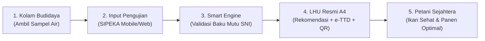

# 📚 Pusat Dokumentasi & Perencanaan SIPEKA / MINAMUTU
**Dinas Perikanan Kabupaten Lembata — Inovasi Latsar CPNS 2026**

Selamat datang di direktori dokumentasi dan perencanaan sistem **SIPEKA** (*Sistem Pemantauan Kualitas Air Budidaya*) / **MINAMUTU**. Direktori ini memuat seluruh materi presentasi prototype untuk audiens umum/penguji, proses bisnis, fitur modul, serta arsip dokumen perencanaan teknis pembangunan sistem.

---

## 🌟 Dokumen Utama untuk Presentasi Prototype

Bagi Anda yang akan mempresentasikan aplikasi ini di hadapan audiens awam, mentor, atau dewan penguji, dokumen utama yang telah disiapkan secara lengkap dan terstruktur adalah:

👉 **[BACA DI SINI: MATERI_PRESENTASI_PROTOTYPE_SIPEKA.md](./MATERI_PRESENTASI_PROTOTYPE_SIPEKA.md)**

### Isi Dokumen Materi Presentasi Tersebut Mencakup:
1. **Identitas Inovasi & Latar Belakang**: Alasan mendasar mengapa aplikasi ini dibangun untuk pembudidaya ikan di Kabupaten Lembata.
2. **Kondisi Sebelum vs Sesudah**: Tabel komparasi konkret antara pencatatan manual berbasis kertas vs sistem digital SIPEKA.
3. **Proses Bisnis End-to-End**: Diagram alir (Mermaid) dan narasi alur kerja dari pengambilan sampel di kolam, validasi otomatis, hingga terbit LHU resmi.
4. **Bedah Modul & Fitur (Bahasa Awam)**: Penjelasan 9 modul sistem lengkap dengan analogi dan manfaat praktisnya.
5. **Manfaat & Dampak Nyata**: Bagi Pembudidaya (Pokdakan), Petugas Uji, dan Kepala Dinas / Pemda Lembata.
6. **Roadmap Pembangunan Sistem**: Tahapan pengembangan dari analisis kebutuhan sampai prototype siap pakai.
7. **Blueprint Slide Presentasi PowerPoint (Slide by Slide)**: Panduan 11 slide siap pakai lengkap dengan poin kunci dan naskah narasi presenter (*script* bicara).

---

## 🔄 Ringkasan Kilas: Proses Bisnis SIPEKA

1. **Pengambilan Sampel Terstandar**: Berpedoman pada Instruksi Kerja (IK) resmi dengan identitas botol berlabel QR Code.
2. **Pengujian Parameter Kunci**: Mengukur parameter fisika dan kimia kritis (Suhu, pH, Oksigen Terlarut/DO, Amonia, Nitrit, Turbiditas).
3. **Validasi Cerdas Real-Time**: Sistem otomatis mencocokkan hasil ukur dengan standar baku mutu (PP 22/2021 & SNI) dan menetapkan status kelayakan (**NORMAL / PERINGATAN / KRITIS**).
4. **Saran Penanganan Langsung**: Mengeluarkan rekomendasi teknis instan ke pembudidaya (misal: penyiponan kotoran dasar, aerasi, penambahan kapur dolomit).
5. **Penerbitan Dokumen Resmi**: Menghasilkan Lembar Hasil Uji (LHU) format kedinasan resmi A4 lengkap tanda tangan pejabat dan QR Code verifikasi keaslian publik.

---

## 🧩 Ringkasan 9 Modul & Fitur Aplikasi

| # | Modul Aplikasi | Rute Halaman | Fungsi & Fitur Utama Bagi Pengguna |
|---|---|---|---|
| 1 | **Dashboard Utama** | `/dashboard` | Menampilkan ringkasan visual kesehatan air kolam se-Lembata, status kepatuhan, dan peringatan darurat. |
| 2 | **Instruksi Kerja (IK)** | `/instruksi-kerja` | Katalog SOP pengujian resmi, pengarsipan PDF berversi, dan cetak stiker label QR Code botol sampel. |
| 3 | **Lokasi Kolam & Pokdakan** | `/lokasi-kolam` | Database profil kelompok pembudidaya ikan, pemilik kolam, lokasi desa/kecamatan, koordinat GPS, dan jenis ikan. |
| 4 | **Master Baku Mutu Air** | `/baku-mutu` | Manajemen ambang batas parameter sesuai regulasi nasional (PP 22/2021 & SNI) dengan riwayat versi. |
| 5 | **Pengujian Kualitas Air** | `/uji-kualitas` | Formulir input hasil uji lapangan, mesin validasi otomatis, penentuan status (Normal/Peringatan/Kritis), dan saran teknis. |
| 6 | **Laporan Hasil Uji (LHU)** | `/laporan` | Penerbitan lembar sertifikat hasil uji resmi standar dinas A4, kontrol status (Draft/Final/Arsip), dan rekap tahunan. |
| 7 | **Analisis Tren Mutu** | `/tren` | Grafik interaktif fluktuasi mutu air dari waktu ke waktu per kolam untuk mendeteksi pola penurunan kualitas air. |
| 8 | **Verifikasi Publik QR** | `/verifikasi/[hash]` | Portal terbuka bagi masyarakat/pembudidaya untuk memverifikasi keaslian hasil uji cukup dengan memindai kamera smartphone. |
| 9 | **Pegawai & Hak Akses** | `/pegawai`, `/pengguna` | Pengelolaan data aparatur dinas untuk pejabat penandatangan LHU dan proteksi akses berdasarkan peran (RBAC). |

---

## 🛠️ Arsip Perencanaan Teknis & Status Implementasi

Bagi tim teknis pengembang, berikut adalah tautan ke rencana implementasi fitur teknis yang tersedia di folder ini:

| File Perencanaan | Deskripsi Fitur Teknis | Prioritas | Status |
|---|---|---|---|
| [01-lokasi-kolam-edit-nonaktifkan.md](./01-lokasi-kolam-edit-nonaktifkan.md) | Fitur Edit & Nonaktifkan Data Lokasi Kolam Pembudidaya | 🔴 Tinggi | Terencana |
| [02-baku-mutu-nonaktifkan-hapus.md](./02-baku-mutu-nonaktifkan-hapus.md) | Proteksi Relasi & Nonaktifkan Baku Mutu Versi Lama | 🔴 Tinggi | Terencana |
| [03-modul-pegawai-crud.md](./03-modul-pegawai-crud.md) | Manajemen CRUD Daftar Pegawai & Pejabat Penandatangan | 🔴 Tinggi | Terencana |
| [04-integrasi-pelaporan-pegawai.md](./04-integrasi-pelaporan-pegawai.md) | Integrasi Otomatis Pejabat Penanggung Jawab pada LHU | 🟡 Sedang | Terencana |
| [05-laporan-status-ubah-hapus.md](./05-laporan-status-ubah-hapus.md) | Siklus Dokumen LHU (Draft/Final/Arsip) & Manajemen Hapus | 🔴 Tinggi | Terencana |
| [Arsip Rencana Pembangunan Awal](./implemted/) | Kumpulan rencana arsitektur awal, migrasi Better Auth, & standarisasi UI | 🟢 Arsip | Terimplementasi |

---

*(Direktori ini dikelola untuk kebutuhan Pelatihan Dasar CPNS — Dinas Perikanan Kabupaten Lembata)*
