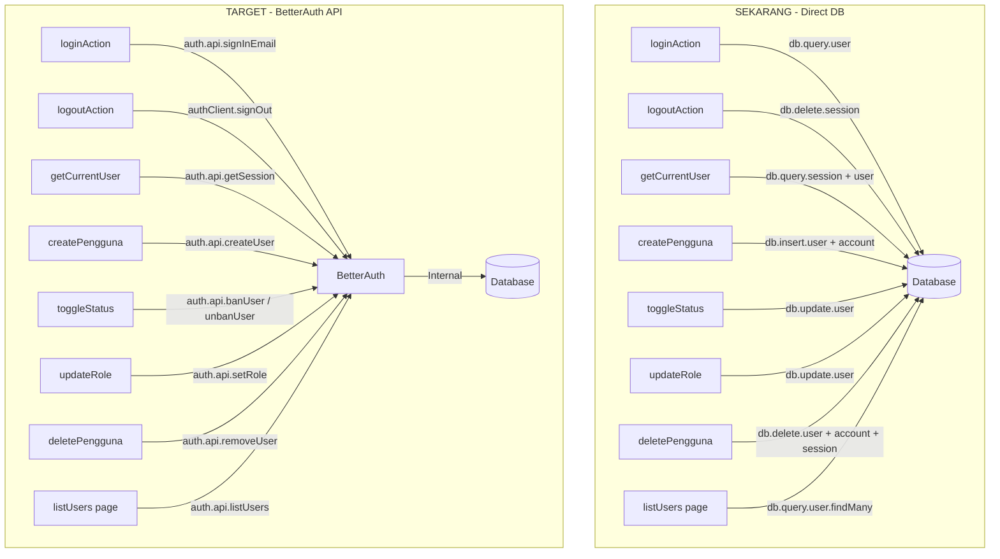

# 🔐 Rencana Migrasi Autentikasi: Full BetterAuth Integration

> **Dokumen Perencanaan Implementasi**
> **Proyek:** SIPEKA / MINAMUTU — Dinas Perikanan Kabupaten Lembata
> **Tanggal:** 26 September 2026
> **Versi:** 1.0

---

## 📋 Ringkasan Eksekutif

Dokumen ini merencanakan migrasi **seluruh fitur autentikasi** agar menggunakan **BetterAuth API** secara eksklusif. Saat ini, banyak operasi auth (login, logout, CRUD user, session) dilakukan dengan **query langsung ke tabel database** (`db.query.user`, `db.insert(schema.session)`, dll). Ini harus dihilangkan dan digantikan oleh BetterAuth API (`auth.api.*` di server, `authClient.*` di client).

### Prinsip Utama

> **PENTING:** TIDAK BOLEH ADA kode yang langsung mengakses/memanipulasi tabel-tabel auth (`user`, `session`, `account`, `verification`) menggunakan Drizzle ORM.
> Semua operasi auth WAJIB melalui BetterAuth API.

---

## 📊 Audit Kondisi Saat Ini

### File yang Melanggar Prinsip (Direct DB Access ke Tabel Auth)

| # | File | Baris | Operasi Langsung | Keterangan |
|---|------|-------|-------------------|------------|
| 1 | `lib/actions/auth.ts` | L85 | `db.query.user.findFirst(...)` | Login: cari user langsung dari DB |
| 2 | `lib/actions/auth.ts` | L110 | `db.query.account.findFirst(...)` | Login: cek password langsung dari DB |
| 3 | `lib/actions/auth.ts` | L127 | `db.insert(schema.session)` | Login: buat session manual ke DB |
| 4 | `lib/actions/auth.ts` | L181 | `db.delete(schema.session)` | Logout: hapus session langsung dari DB |
| 5 | `lib/auth.ts` | L71 | `db.query.session.findFirst(...)` | getCurrentUser: query session dari DB |
| 6 | `lib/auth.ts` | L76 | `db.query.user.findFirst(...)` | getCurrentUser: query user dari DB |
| 7 | `lib/actions/pengguna.ts` | L31 | `db.query.user.findFirst(...)` | Create user: cek duplikasi email langsung |
| 8 | `lib/actions/pengguna.ts` | L46 | `db.insert(schema.user)` | Create user: insert user langsung |
| 9 | `lib/actions/pengguna.ts` | L59 | `db.insert(schema.account)` | Create user: insert account langsung |
| 10 | `lib/actions/pengguna.ts` | L93-96 | `db.update(schema.user)` | Toggle status: update aktif langsung |
| 11 | `lib/actions/pengguna.ts` | L116-119 | `db.update(schema.user)` | Update role: update role langsung |
| 12 | `lib/actions/pengguna.ts` | L140 | `db.query.user.findFirst(...)` | Delete: cari user langsung |
| 13 | `lib/actions/pengguna.ts` | L167-169 | `db.delete(schema.session/account/user)` | Delete: hapus session+account+user langsung |
| 14 | `app/(dashboard)/pengguna/page.tsx` | L25 | `db.query.user.findMany(...)` | List users: query semua user langsung |
| 15 | `middleware.ts` | L20 | Cookie `sipeka_auth_user` | Membaca user data dari custom cookie, bukan dari session BetterAuth |

### Konfigurasi BetterAuth Saat Ini

```
lib/auth.ts         → betterAuth config (tanpa admin plugin)
lib/auth-client.ts  → createAuthClient (tanpa adminClient plugin)
app/api/auth/[...all]/route.ts → Handler BetterAuth (sudah benar)
```

---

## 🎯 Target Migrasi

### Yang Harus Berubah



---

## 🔧 Fase Implementasi

### FASE 0: Persiapan — Install Admin Plugin

**Prioritas:** KRITIS (harus selesai duluan)
**File yang diubah:** `lib/auth.ts`, `lib/auth-client.ts`, `db/schema.ts`

#### 0.1 — Update `lib/auth.ts`: Tambah Admin Plugin

```typescript
import { betterAuth } from 'better-auth';
import { drizzleAdapter } from 'better-auth/adapters/drizzle';
import { admin } from 'better-auth/plugins';
import { db } from '@/db';
import * as schema from '@/db/schema';

export const auth = betterAuth({
  database: drizzleAdapter(db, {
    provider: 'pg',
    schema: {
      user: schema.user,
      session: schema.session,
      account: schema.account,
      verification: schema.verification,
    },
  }),
  emailAndPassword: {
    enabled: true,
    autoSignIn: true,
  },
  user: {
    additionalFields: {
      role: {
        type: 'string',
        defaultValue: 'petugas_lapangan',
      },
      aktif: {
        type: 'boolean',
        defaultValue: true,
      },
    },
  },
  plugins: [
    admin({
      defaultRole: 'petugas_lapangan',
    }),
  ],
});
```

#### 0.2 — Update `lib/auth-client.ts`: Tambah Admin Client Plugin

```typescript
import { createAuthClient } from 'better-auth/react';
import { adminClient } from 'better-auth/client/plugins';

export const authClient = createAuthClient({
  baseURL: typeof window !== 'undefined'
    ? window.location.origin
    : (process.env.NEXT_PUBLIC_APP_URL || 'http://localhost:3000'),
  plugins: [
    adminClient(),
  ],
});

export const { signIn, signOut, useSession } = authClient;
```

#### 0.3 — Migrasi Database untuk Admin Plugin

```bash
# Jalankan migrasi untuk menambah kolom admin plugin
# (banned, banReason, banExpires di tabel user; impersonatedBy di tabel session)
bunx auth migrate
# atau generate schema dulu lalu push
bunx auth generate
bunx drizzle-kit push
```

#### 0.4 — Update `db/schema.ts`: Tambah Kolom Admin Plugin

Tambahkan kolom berikut pada tabel `user`:
```typescript
export const user = pgTable('user', {
  // ... kolom existing ...
  role: text('role').notNull().default('petugas_lapangan'),
  aktif: boolean('aktif').notNull().default(true),
  // Kolom baru dari admin plugin:
  banned: boolean('banned').default(false),
  banReason: text('ban_reason'),
  banExpires: timestamp('ban_expires'),
});
```

Tambahkan kolom pada tabel `session`:
```typescript
export const session = pgTable('session', {
  // ... kolom existing ...
  impersonatedBy: text('impersonated_by'),
});
```

#### 0.5 — Update Seed Password Hashing

Password di `db/seed.ts` saat ini disimpan sebagai plain text (`'password123'`). BetterAuth menggunakan hashing (scrypt/bcrypt). Seed perlu diupdate agar menggunakan `auth.api.createUser` atau menggunakan hashing yang kompatibel.

```typescript
// Opsi: Gunakan auth.api.createUser dalam seed
import { auth } from '../lib/auth';

for (const u of usersToSeed) {
  await auth.api.createUser({
    body: {
      email: u.email,
      password: 'password123',
      name: u.name,
      role: u.role,
      data: { aktif: true },
    },
  });
}
```

---

### FASE 1: Autentikasi (Login & Logout)

**Prioritas:** KRITIS
**File yang diubah:** `lib/actions/auth.ts`, `app/(auth)/login/page.tsx`

#### 1.1 — Refactor `loginAction` -> Gunakan `auth.api.signInEmail`

**Sebelum:**
- Query user dari DB langsung
- Cek password tanpa hashing
- Buat session manual di DB
- Set custom cookie `sipeka_auth_user`

**Sesudah:**
```typescript
'use server';

import { auth } from '@/lib/auth';
import { loginSchema, type LoginInput } from '@/lib/validations/auth';
import { headers } from 'next/headers';
import { redirect } from 'next/navigation';

export async function loginAction(formData: FormData | LoginInput) {
  let rawData: Record<string, unknown>;

  if (formData instanceof FormData) {
    rawData = Object.fromEntries(formData.entries());
  } else {
    rawData = formData;
  }

  const validation = loginSchema.safeParse(rawData);
  if (!validation.success) {
    return {
      success: false,
      error: validation.error.flatten().fieldErrors,
      message: 'Format data login tidak valid',
    };
  }

  const { email, password } = validation.data;

  // Resolusi alias email (pertahankan logika domain matching)
  const resolvedEmail = resolveEmailAlias(email);

  try {
    const response = await auth.api.signInEmail({
      body: {
        email: resolvedEmail,
        password,
      },
      headers: await headers(),
      asResponse: true,
    });

    if (!response.ok) {
      return {
        success: false,
        message: 'Email atau kata sandi tidak cocok.',
      };
    }

    // BetterAuth otomatis set session cookie
    return { success: true };
  } catch {
    return {
      success: false,
      message: 'Terjadi kesalahan saat proses login.',
    };
  }
}

// Helper: resolusi alias email (pindahkan logika yang sudah ada)
function resolveEmailAlias(input: string): string {
  const trimmed = input.toLowerCase().trim();
  // ... (pertahankan logika alias domain yang sudah ada) ...
  return trimmed;
}
```

**Catatan Penting:**
- `asResponse: true` membuat BetterAuth mengembalikan `Response` object yang include Set-Cookie header
- Cookie `sipeka_auth_user` **dihilangkan** — data user didapat dari `auth.api.getSession()`
- Logika alias email (`mutu <-> pengelola`, `kadis <-> kadin`) tetap dipertahankan tapi dipindah ke helper function

#### 1.2 — Refactor `logoutAction` -> Gunakan BetterAuth signOut

**Sesudah:**
```typescript
export async function logoutAction() {
  const headersList = await headers();

  try {
    await auth.api.signOut({
      headers: headersList,
    });
  } catch {
    // ignore
  }

  redirect('/login');
}
```

#### 1.3 — Update Login Page Client

Login page (`app/(auth)/login/page.tsx`) perlu diupdate:
- Setelah `loginAction` berhasil, **tidak perlu** router.refresh() manual karena BetterAuth sudah mengelola session cookie
- Hapus dependency pada cookie `sipeka_auth_user`

---

### FASE 2: Manajemen Session — `getCurrentUser()`

**Prioritas:** KRITIS (dipakai di seluruh app)
**File yang diubah:** `lib/auth.ts`

#### 2.1 — Refactor `getCurrentUser` -> Gunakan `auth.api.getSession`

**Sebelum:**
- Baca cookie manual
- Parse JSON dari cookie
- Query session + user dari DB langsung

**Sesudah:**
```typescript
import { auth } from '@/lib/auth'; // instance betterAuth
import { headers } from 'next/headers';

export type UserRole = 'admin' | 'pengelola_mutu' | 'petugas_lapangan' | 'kepala_dinas';

export interface CurrentUser {
  id: string;
  name: string;
  email: string;
  image?: string | null;
  role: UserRole;
  aktif: boolean;
  banned?: boolean;
  banReason?: string | null;
}

export async function getCurrentUser(): Promise<CurrentUser | null> {
  try {
    const session = await auth.api.getSession({
      headers: await headers(),
    });

    if (!session || !session.user) {
      return null;
    }

    const user = session.user;

    // Cek apakah user banned (dinonaktifkan)
    if (user.banned) {
      return null;
    }

    return {
      id: user.id,
      name: user.name,
      email: user.email,
      image: user.image,
      role: (user.role as UserRole) || 'petugas_lapangan',
      aktif: !user.banned, // mapping: banned = !aktif
      banned: user.banned,
      banReason: user.banReason,
    };
  } catch (error: any) {
    if (error?.digest === 'DYNAMIC_SERVER_USAGE') {
      throw error;
    }
    console.error('Error saat getCurrentUser:', error);
    return null;
  }
}
```

**Dampak:** Fungsi ini digunakan di 6 file berikut, yang seharusnya tetap bekerja tanpa perubahan setelah refactor:
- `app/(dashboard)/layout.tsx`
- `app/(dashboard)/pengguna/page.tsx`
- `app/(dashboard)/uji-kualitas/input/page.tsx`
- `app/page.tsx`
- `lib/actions/pengguna.ts`

---

### FASE 3: Manajemen User (CRUD via Admin Plugin)

**Prioritas:** TINGGI
**File yang diubah:** `lib/actions/pengguna.ts`, `app/(dashboard)/pengguna/page.tsx`

#### 3.1 — Refactor `createPenggunaAction` -> `auth.api.createUser`

**Sesudah:**
```typescript
'use server';

import { auth } from '@/lib/auth';
import { penggunaSchema } from '@/lib/validations/pengguna';
import { getCurrentUser } from '@/lib/auth';
import { headers } from 'next/headers';
import { revalidatePath } from 'next/cache';

export async function createPenggunaAction(formData: FormData | Record<string, unknown>) {
  const admin = await getCurrentUser();
  if (!admin || admin.role !== 'admin') {
    return { success: false, message: 'Akses ditolak: Hanya admin yang diizinkan.' };
  }

  const rawData = formData instanceof FormData ? Object.fromEntries(formData.entries()) : formData;

  const validation = penggunaSchema.safeParse(rawData);
  if (!validation.success) {
    return {
      success: false,
      errors: validation.error.flatten().fieldErrors,
      message: 'Data pengguna tidak valid.',
    };
  }

  const { nama, email, role, aktif, password } = validation.data;

  try {
    const newUser = await auth.api.createUser({
      body: {
        email: email.toLowerCase().trim(),
        password: password || 'password123',
        name: nama,
        role: role,
        data: {
          aktif: aktif ?? true,
        },
      },
      headers: await headers(),
    });

    revalidatePath('/pengguna');
    return {
      success: true,
      data: newUser,
      message: `Pengguna ${nama} (${role}) berhasil ditambahkan.`,
    };
  } catch (error: any) {
    // BetterAuth mengembalikan error jika email sudah ada
    if (error?.message?.includes('already exists') || error?.status === 422) {
      return {
        success: false,
        errors: { email: ['Alamat email ini sudah terdaftar'] },
        message: 'Email sudah digunakan.',
      };
    }
    console.error('Error createPenggunaAction:', error);
    return { success: false, message: 'Gagal membuat pengguna baru.' };
  }
}
```

#### 3.2 — Refactor `toggleStatusPenggunaAction` -> `auth.api.banUser` / `auth.api.unbanUser`

**Mapping Konsep:**
- `aktif = true` -> `auth.api.unbanUser`
- `aktif = false` -> `auth.api.banUser`
- BetterAuth ban = revoke semua session otomatis

**Sesudah:**
```typescript
export async function toggleStatusPenggunaAction(userId: string, currentStatus: boolean) {
  const admin = await getCurrentUser();
  if (!admin || admin.role !== 'admin') {
    return { success: false, message: 'Akses ditolak.' };
  }

  if (admin.id === userId) {
    return { success: false, message: 'Anda tidak dapat menonaktifkan akun Anda sendiri.' };
  }

  try {
    const headersList = await headers();

    if (currentStatus) {
      // Saat ini aktif -> nonaktifkan (ban)
      await auth.api.banUser({
        body: {
          userId,
          banReason: 'Dinonaktifkan oleh administrator',
        },
        headers: headersList,
      });
    } else {
      // Saat ini nonaktif -> aktifkan (unban)
      await auth.api.unbanUser({
        body: { userId },
        headers: headersList,
      });
    }

    revalidatePath('/pengguna');
    return {
      success: true,
      message: `Status pengguna berhasil diubah menjadi: ${currentStatus ? 'Nonaktif' : 'Aktif'}.`,
    };
  } catch (error) {
    console.error('Error toggleStatusPenggunaAction:', error);
    return { success: false, message: 'Gagal mengubah status pengguna.' };
  }
}
```

#### 3.3 — Refactor `updateRolePenggunaAction` -> `auth.api.setRole`

**Sesudah:**
```typescript
export async function updateRolePenggunaAction(userId: string, newRole: string) {
  const admin = await getCurrentUser();
  if (!admin || admin.role !== 'admin') {
    return { success: false, message: 'Akses ditolak.' };
  }

  try {
    await auth.api.setRole({
      body: {
        userId,
        role: newRole,
      },
      headers: await headers(),
    });

    revalidatePath('/pengguna');
    return { success: true, message: `Role berhasil diperbarui menjadi ${newRole}.` };
  } catch (error) {
    console.error('Error updateRolePenggunaAction:', error);
    return { success: false, message: 'Gagal mengubah role pengguna.' };
  }
}
```

#### 3.4 — Refactor `deletePenggunaAction` -> `auth.api.removeUser`

**Sesudah:**
```typescript
export async function deletePenggunaAction(userId: string) {
  const admin = await getCurrentUser();
  if (!admin || admin.role !== 'admin') {
    return { success: false, message: 'Akses ditolak: Hanya admin yang diizinkan.' };
  }

  if (admin.id === userId) {
    return { success: false, message: 'Anda tidak dapat menghapus akun Anda sendiri.' };
  }

  try {
    // Cek info user via BetterAuth API
    const targetUser = await auth.api.getUser({
      query: { id: userId },
      headers: await headers(),
    });

    if (!targetUser) {
      return { success: false, message: 'Pengguna tidak ditemukan.' };
    }

    // Cek apakah akun sudah terpakai dalam transaksi pengujian (query ke tabel bisnis OK)
    const ujiRecords = await db.query.ujiKualitasAir.findMany({
      where: or(
        eq(schema.ujiKualitasAir.petugas_uji, targetUser.name),
        eq(schema.ujiKualitasAir.petugas_uji, targetUser.email),
        eq(schema.ujiKualitasAir.petugas_uji, targetUser.id)
      ),
      limit: 10,
    });

    if (ujiRecords.length > 0) {
      return {
        success: false,
        canOnlyDeactivate: true,
        message: `Pengguna "${targetUser.name}" tidak dapat dihapus karena tercatat pada ${ujiRecords.length} data pengujian. Akun hanya dapat dinonaktifkan.`,
      };
    }

    // Hapus user via BetterAuth (otomatis hapus session + account)
    await auth.api.removeUser({
      body: { userId },
      headers: await headers(),
    });

    revalidatePath('/pengguna');
    return {
      success: true,
      message: `Akun pengguna "${targetUser.name}" berhasil dihapus secara permanen.`,
    };
  } catch (error) {
    console.error('Error deletePenggunaAction:', error);
    return { success: false, message: 'Gagal menghapus pengguna dari sistem.' };
  }
}
```

#### 3.5 — Refactor Halaman List Users -> `auth.api.listUsers`

**File:** `app/(dashboard)/pengguna/page.tsx`

**Sesudah:**
```typescript
import { auth } from '@/lib/auth';
import { headers } from 'next/headers';

export default async function PenggunaPage() {
  const user = await getCurrentUser();
  if (!user || user.role !== 'admin') {
    // ... tampilkan akses ditolak ...
  }

  const headersList = await headers();

  // Ambil daftar user via BetterAuth API
  const { users } = await auth.api.listUsers({
    query: {
      limit: 200,
      sortBy: 'name',
      sortDirection: 'asc',
    },
    headers: headersList,
  });

  // Cek riwayat pengujian (tabel bisnis, BUKAN tabel auth — diperbolehkan)
  const allUji = await db
    .select({ petugas_uji: schema.ujiKualitasAir.petugas_uji })
    .from(schema.ujiKualitasAir);

  const enrichedUsers = users.map((u) => {
    // ... logika enrichment sama seperti sebelumnya ...
    return {
      ...u,
      aktif: !u.banned, // mapping dari BetterAuth
      transactionCount: count,
      isUsed: count > 0,
    };
  });

  return <PenggunaClient initialUsers={enrichedUsers} currentUserId={user.id} />;
}
```

---

### FASE 4: Middleware — Hapus Custom Cookie

**Prioritas:** TINGGI
**File yang diubah:** `middleware.ts`

#### 4.1 — Refactor Middleware

**Perubahan utama:**
- Hapus dependency pada cookie `sipeka_auth_user`
- Gunakan HANYA `better-auth.session_token` untuk cek autentikasi
- RBAC di middleware cukup cek keberadaan session token (validasi detail di server component)

**Sesudah:**
```typescript
import { NextResponse } from 'next/server';
import type { NextRequest } from 'next/server';

export function middleware(request: NextRequest) {
  const { pathname } = request.nextUrl;

  // 1. Rute publik
  if (
    pathname.startsWith('/verifikasi') ||
    pathname.startsWith('/api/auth') ||
    pathname.startsWith('/_next') ||
    pathname.startsWith('/static') ||
    pathname === '/favicon.ico' ||
    pathname.includes('.')
  ) {
    return NextResponse.next();
  }

  // Cek session token dari BetterAuth (satu-satunya sumber kebenaran)
  const sessionToken = request.cookies.get('better-auth.session_token')?.value;

  // Halaman login
  if (pathname === '/login') {
    if (sessionToken) {
      return NextResponse.redirect(new URL('/dashboard', request.url));
    }
    return NextResponse.next();
  }

  // Root redirect
  if (pathname === '/') {
    return NextResponse.redirect(
      new URL(sessionToken ? '/dashboard' : '/login', request.url)
    );
  }

  // Proteksi rute internal
  if (!sessionToken) {
    const loginUrl = new URL('/login', request.url);
    loginUrl.searchParams.set('callbackUrl', pathname);
    return NextResponse.redirect(loginUrl);
  }

  // RBAC detail dilakukan di Server Component/Layout via getCurrentUser()
  // Middleware hanya memastikan user sudah terautentikasi
  return NextResponse.next();
}
```

> **CATATAN:** RBAC yang sebelumnya ada di middleware (cek role dari cookie JSON) dipindahkan ke **Server Component** (`layout.tsx`, `page.tsx`) karena middleware tidak bisa mengakses BetterAuth API secara langsung. `getCurrentUser()` di Server Component sudah meng-cover RBAC dengan benar.

---

### FASE 5: Profil User & Update Data Diri

**Prioritas:** SEDANG
**File baru:** `lib/actions/profil.ts`, `app/(dashboard)/profil/page.tsx`

#### 5.1 — Update Profil User (Self-Service)

BetterAuth menyediakan `auth.api.updateUser` untuk admin dan `authClient.updateUser` untuk user sendiri.

```typescript
// lib/actions/profil.ts
'use server';

import { auth } from '@/lib/auth';
import { headers } from 'next/headers';
import { revalidatePath } from 'next/cache';

export async function updateProfilAction(data: {
  name?: string;
  image?: string;
}) {
  try {
    const result = await auth.api.updateUser({
      body: data,
      headers: await headers(),
    });

    revalidatePath('/profil');
    revalidatePath('/dashboard');

    return {
      success: true,
      data: result,
      message: 'Profil berhasil diperbarui.',
    };
  } catch (error) {
    console.error('Error updateProfilAction:', error);
    return { success: false, message: 'Gagal memperbarui profil.' };
  }
}
```

#### 5.2 — Ganti Password (Self-Service)

```typescript
export async function changePasswordAction(data: {
  currentPassword: string;
  newPassword: string;
}) {
  try {
    await auth.api.changePassword({
      body: {
        currentPassword: data.currentPassword,
        newPassword: data.newPassword,
      },
      headers: await headers(),
    });

    return {
      success: true,
      message: 'Kata sandi berhasil diperbarui.',
    };
  } catch (error) {
    return {
      success: false,
      message: 'Gagal mengubah kata sandi. Pastikan kata sandi lama benar.',
    };
  }
}
```

#### 5.3 — Admin Reset Password User

```typescript
export async function adminResetPasswordAction(userId: string, newPassword: string) {
  const admin = await getCurrentUser();
  if (!admin || admin.role !== 'admin') {
    return { success: false, message: 'Akses ditolak.' };
  }

  try {
    await auth.api.setUserPassword({
      body: {
        userId,
        newPassword,
      },
      headers: await headers(),
    });

    return {
      success: true,
      message: 'Password pengguna berhasil direset.',
    };
  } catch (error) {
    return { success: false, message: 'Gagal mereset password.' };
  }
}
```

---

### FASE 6: Manajemen Session Lanjutan

**Prioritas:** SEDANG
**File baru:** `lib/actions/session.ts`

#### 6.1 — List Active Sessions (Admin)

```typescript
export async function listUserSessionsAction(userId: string) {
  const admin = await getCurrentUser();
  if (!admin || admin.role !== 'admin') {
    return { success: false, message: 'Akses ditolak.' };
  }

  try {
    const sessions = await auth.api.listUserSessions({
      body: { userId },
      headers: await headers(),
    });

    return { success: true, data: sessions };
  } catch (error) {
    return { success: false, message: 'Gagal mengambil daftar session.' };
  }
}
```

#### 6.2 — Revoke Session

```typescript
export async function revokeSessionAction(sessionToken: string) {
  const admin = await getCurrentUser();
  if (!admin || admin.role !== 'admin') {
    return { success: false, message: 'Akses ditolak.' };
  }

  try {
    await auth.api.revokeUserSession({
      body: { sessionToken },
      headers: await headers(),
    });

    return { success: true, message: 'Session berhasil dicabut.' };
  } catch (error) {
    return { success: false, message: 'Gagal mencabut session.' };
  }
}
```

#### 6.3 — Revoke All Sessions for User

```typescript
export async function revokeAllSessionsAction(userId: string) {
  const admin = await getCurrentUser();
  if (!admin || admin.role !== 'admin') {
    return { success: false, message: 'Akses ditolak.' };
  }

  try {
    await auth.api.revokeUserSessions({
      body: { userId },
      headers: await headers(),
    });

    return { success: true, message: 'Semua session pengguna berhasil dicabut.' };
  } catch (error) {
    return { success: false, message: 'Gagal mencabut semua session.' };
  }
}
```

---

### FASE 7: Client-Side Auth Hooks

**Prioritas:** SEDANG
**File yang diubah:** Semua client component yang membutuhkan auth state

#### 7.1 — Gunakan `useSession` dari BetterAuth Client

```typescript
'use client';
import { useSession } from '@/lib/auth-client';

function ProfileWidget() {
  const { data: session, isPending } = useSession();

  if (isPending) return <Skeleton />;
  if (!session) return null;

  return (
    <div>
      <p>{session.user.name}</p>
      <p>{session.user.email}</p>
      <p>{session.user.role}</p>
    </div>
  );
}
```

#### 7.2 — Client-Side Logout

```typescript
import { signOut } from '@/lib/auth-client';

async function handleLogout() {
  await signOut({
    fetchOptions: {
      onSuccess: () => {
        window.location.href = '/login';
      },
    },
  });
}
```

---

## 📝 Mapping Konsep: Sebelum -> Sesudah

| Konsep Lama | Implementasi Lama | Implementasi Baru (BetterAuth) |
|---|---|---|
| Login | `db.query.user` + `db.insert(session)` + set cookies | `auth.api.signInEmail()` |
| Logout | `db.delete(session)` + delete cookies | `auth.api.signOut()` |
| Get Current User | `db.query.session` + `db.query.user` | `auth.api.getSession()` |
| Create User | `db.insert(user)` + `db.insert(account)` | `auth.api.createUser()` |
| List Users | `db.query.user.findMany()` | `auth.api.listUsers()` |
| Update Role | `db.update(user).set({ role })` | `auth.api.setRole()` |
| Toggle Aktif | `db.update(user).set({ aktif })` | `auth.api.banUser()` / `unbanUser()` |
| Delete User | `db.delete(session+account+user)` | `auth.api.removeUser()` |
| Cek Password | `account.password !== password` | BetterAuth internal (hashed) |
| Session Token | Manual generate + manual cookie | BetterAuth internal (otomatis) |
| Custom Cookie | `sipeka_auth_user` (JSON user data) | **Dihapus** — gunakan `getSession()` |
| RBAC Middleware | Parse JSON cookie -> cek role | `getCurrentUser()` di Server Component |
| Update Profil | Belum ada | `auth.api.updateUser()` |
| Ganti Password | Belum ada | `auth.api.changePassword()` |
| Admin Reset Password | Belum ada | `auth.api.setUserPassword()` |
| List Sessions | Belum ada | `auth.api.listUserSessions()` |
| Revoke Session | Belum ada | `auth.api.revokeUserSession()` |

---

## Yang BOLEH dan TIDAK BOLEH

### BOLEH Query Langsung ke Database

| Tabel | Alasan |
|-------|--------|
| `uji_kualitas_air` | Tabel bisnis, bukan tabel auth |
| `detail_uji_parameter` | Tabel bisnis |
| `instruksi_kerja` | Tabel bisnis |
| `lokasi_kolam` | Tabel bisnis |
| `master_baku_mutu` | Tabel bisnis |
| `master_pegawai` | Tabel bisnis |

### DILARANG Query Langsung ke Database

| Tabel | Gunakan Alternatif |
|-------|-------------------|
| `user` | `auth.api.getSession()`, `auth.api.listUsers()`, `auth.api.getUser()` |
| `session` | `auth.api.getSession()`, `auth.api.listUserSessions()` |
| `account` | `auth.api.createUser()`, `auth.api.setUserPassword()` |
| `verification` | BetterAuth internal |

---

## 📋 Urutan Eksekusi & Checklist

### Tahap 1 — Foundation (HARUS SELESAI DULU)

- [ ] **FASE 0.1** — Tambah admin plugin di `lib/auth.ts`
- [ ] **FASE 0.2** — Tambah adminClient di `lib/auth-client.ts`
- [ ] **FASE 0.3** — Jalankan migrasi database
- [ ] **FASE 0.4** — Update schema Drizzle (kolom banned, banReason, banExpires, impersonatedBy)
- [ ] **FASE 0.5** — Update seed untuk gunakan password hashing yang kompatibel

### Tahap 2 — Core Auth (LOGIN/LOGOUT/SESSION)

- [ ] **FASE 2.1** — Refactor `getCurrentUser()` -> `auth.api.getSession()`
- [ ] **FASE 1.1** — Refactor `loginAction` -> `auth.api.signInEmail()`
- [ ] **FASE 1.2** — Refactor `logoutAction` -> `auth.api.signOut()`
- [ ] **FASE 1.3** — Update login page client
- [ ] **FASE 4.1** — Refactor middleware (hapus `sipeka_auth_user` cookie)

### Tahap 3 — User Management (CRUD)

- [ ] **FASE 3.1** — Refactor `createPenggunaAction` -> `auth.api.createUser()`
- [ ] **FASE 3.2** — Refactor `toggleStatusPenggunaAction` -> `banUser/unbanUser`
- [ ] **FASE 3.3** — Refactor `updateRolePenggunaAction` -> `auth.api.setRole()`
- [ ] **FASE 3.4** — Refactor `deletePenggunaAction` -> `auth.api.removeUser()`
- [ ] **FASE 3.5** — Refactor halaman list users -> `auth.api.listUsers()`

### Tahap 4 — Fitur Baru

- [ ] **FASE 5.1** — Implementasi update profil
- [ ] **FASE 5.2** — Implementasi ganti password (self-service)
- [ ] **FASE 5.3** — Implementasi admin reset password
- [ ] **FASE 6.1** — Implementasi list active sessions
- [ ] **FASE 6.2** — Implementasi revoke session
- [ ] **FASE 6.3** — Implementasi revoke all sessions
- [ ] **FASE 7.1** — Gunakan `useSession` di client components
- [ ] **FASE 7.2** — Implementasi client-side logout

### Tahap 5 — Validasi Final

- [ ] Grep codebase: pastikan TIDAK ADA `db.query.user`, `db.query.session`, `db.query.account`
- [ ] Grep codebase: pastikan TIDAK ADA `db.insert(schema.user)`, `db.insert(schema.session)`, `db.insert(schema.account)`
- [ ] Grep codebase: pastikan TIDAK ADA `db.delete(schema.user)`, `db.delete(schema.session)`, `db.delete(schema.account)`
- [ ] Grep codebase: pastikan TIDAK ADA `db.update(schema.user)` (kecuali kolom custom non-auth)
- [ ] Grep codebase: pastikan TIDAK ADA cookie `sipeka_auth_user`
- [ ] Test login dengan semua role
- [ ] Test logout
- [ ] Test CRUD pengguna
- [ ] Test toggle aktif/nonaktif
- [ ] Test update role
- [ ] Test hapus pengguna (yang sudah terpakai dan belum)

---

## 🗂️ Daftar File yang Akan Diubah/Dibuat

### File yang Diubah (Modify)

| File | Perubahan |
|------|-----------|
| `lib/auth.ts` | Tambah admin plugin + refactor getCurrentUser |
| `lib/auth-client.ts` | Tambah adminClient plugin |
| `lib/actions/auth.ts` | Full rewrite: login & logout via BetterAuth API |
| `lib/actions/pengguna.ts` | Full rewrite: semua CRUD via BetterAuth admin API |
| `app/(dashboard)/pengguna/page.tsx` | Ganti `db.query.user.findMany` -> `auth.api.listUsers` |
| `middleware.ts` | Hapus dependency `sipeka_auth_user`, simplifikasi |
| `db/schema.ts` | Tambah kolom `banned`, `banReason`, `banExpires`, `impersonatedBy` |
| `db/seed.ts` | Update seed agar kompatibel dengan BetterAuth hashing |

### File yang Dibuat (New)

| File | Fungsi |
|------|--------|
| `lib/actions/profil.ts` | Update profil, ganti password |
| `lib/actions/session.ts` | Manajemen session (list, revoke) |
| `app/(dashboard)/profil/page.tsx` | Halaman profil user |
| `app/(dashboard)/profil/client.tsx` | Client component profil |

### File yang Mungkin Terpengaruh (Indirect Impact)

| File | Alasan |
|------|--------|
| `app/(dashboard)/layout.tsx` | Menggunakan `getCurrentUser()` — seharusnya tetap bekerja |
| `app/(dashboard)/pengguna/client.tsx` | Mungkin perlu update interface `UserItem` (tambah `banned`) |
| `components/app-sidebar.tsx` | Menggunakan user data — seharusnya tetap bekerja |

---

> **REKOMENDASI:** Jalankan migrasi ini secara bertahap per fase. Setelah setiap fase, pastikan aplikasi masih berfungsi normal sebelum melanjutkan ke fase berikutnya. Mulai dari **FASE 0** (install plugin) -> **FASE 2** (getCurrentUser, karena paling banyak digunakan) -> **FASE 1** (login/logout) -> sisanya.
