# SIPAN — Standarisasi Input dan Navigasi UI

> **Kode Proyek:** SIPAN  
> **Tanggal:** 2026-09-26  
> **Scope:** Seluruh halaman dan komponen form di proyek Minamutu (SIPEKA)  
> **Tujuan:** Menyeragamkan semua elemen UI form (Input, Select, Textarea, Combobox, Checkbox, Switch, RadioGroup, Button, Label, Error) agar konsisten secara visual dan struktural di seluruh aplikasi.

---

## 1. Ringkasan Masalah Saat Ini

### 1.1 Inkonsistensi Spacing Label ↔ Input

Terdapat **3 pola spacing berbeda** yang digunakan secara campur-aduk:

| Pola | Digunakan di | Gap |
|------|-------------|-----|
| `space-y-1` | `quick-add-lokasi-dialog.tsx`, `lokasi-kolam/client.tsx` | `0.25rem` (4px) |
| `space-y-1.5` | `form-uji-lapangan.tsx`, `login/page.tsx` | `0.375rem` (6px) |
| `space-y-2` | `form-uji-lapangan.tsx` (beberapa bagian) | `0.5rem` (8px) |

### 1.2 Custom className yang Tidak Perlu

Banyak komponen mendapat **override className** yang seharusnya tidak diperlukan:

```tsx
// ❌ ANTI-PATTERN: Custom className di Label (text-xs sudah bawaan Field)
<Label className="text-xs">Nama *</Label>

// ❌ ANTI-PATTERN: Custom className di Input (text-xs, h-8 dll)
<Input className="text-xs font-mono font-semibold h-8" />

// ❌ ANTI-PATTERN: Custom native <textarea> padahal sudah ada <Textarea>
<textarea className="w-full rounded-lg border border-input bg-transparent px-3 py-2 text-xs ..." />

// ❌ ANTI-PATTERN: Manual error display (className berulang)
<p className="text-xs text-destructive">{fieldErrors.nama[0]}</p>
```

### 1.3 Tidak Menggunakan Komponen `Field`

Sudah tersedia komponen `Field` yang lengkap dengan sub-komponen:
- `Field` — wrapper group utama
- `FieldLabel` — label standar
- `FieldDescription` — teks deskripsi/helper
- `FieldError` — error message (otomatis styling destructive)
- `FieldSet` — pengelompokan fieldset
- `FieldGroup` — pengelompokan field group

Namun **tidak ada satupun halaman** yang menggunakan komponen `Field` ini. Semua masih pakai pola manual `<div className="space-y-..."><Label>...<Input>...`.

---

## 2. Prinsip & Aturan Standarisasi

### 2.1 WAJIB Gunakan `Field` untuk Setiap Form Control

Setiap pasangan label + input control **WAJIB** dibungkus dengan komponen `Field`:

```tsx
// ✅ STANDAR BAKU: Field vertical (default)
<Field>
  <FieldLabel htmlFor="nama">Nama Pokdakan *</FieldLabel>
  <Input id="nama" placeholder="Contoh: Mina Segara" />
  <FieldDescription>Nama resmi kelompok pembudidaya.</FieldDescription>
  <FieldError>{error}</FieldError>
</Field>
```

### 2.2 DILARANG Custom className untuk Style Biasa

| Kondisi | Boleh? | Penjelasan |
|---------|--------|------------|
| `className="text-xs"` pada Label | ❌ | Sudah diatur oleh `FieldLabel` |
| `className="text-xs"` pada Input | ❌ | Ukuran teks `md:text-sm` sudah bawaan |
| `className="h-8"` pada Input | ❌ | Gunakan `h-9` bawaan. Jika butuh kecil, **minta varian size** |
| `className="w-full"` pada Input/Select | ❌ | `Field` orientation="vertical" sudah set `*:w-full` |
| `className="text-xs text-destructive"` untuk error | ❌ | Gunakan `<FieldError>` |
| `className="text-xs text-muted-foreground"` untuk helper | ❌ | Gunakan `<FieldDescription>` |
| `className="font-mono font-semibold"` pada Input | ✅ | Ini **format data spesifik** (kode sampel), bukan style umum |
| `className="pl-10"` untuk input dengan ikon kiri | ✅ | Ini **layout unik** yang tidak ada varian standar |

### 2.3 Aturan Custom className — Hanya 2 Kondisi

Custom `className` **HANYA diperbolehkan** apabila:

1. **Semantik Unik** — kebutuhan yang benar-benar spesifik untuk komponen itu dan tidak ada di varian/size standar shadcn.
   - Contoh: `className="font-mono"` untuk kode sampel
   - Contoh: `className="pl-10"` untuk input dengan ikon di dalamnya

2. **Layout Unik** — pengaturan posisi yang benar-benar berbeda dari default.
   - Contoh: `className="sm:col-span-2"` untuk grid span

**Tidak boleh** meng-custom:
- Warna teks (`text-xs`, `text-muted-foreground`)
- Tinggi (`h-8`, `h-10`)
- Border (`border-input`, `rounded-lg`)
- Shadow (`shadow-xs`)
- Focus ring (`focus-visible:ring-1 focus-visible:ring-ring`)

---

## 3. Pola Standar per Jenis Komponen

### 3.1 Input Teks Biasa

```tsx
<Field>
  <FieldLabel htmlFor="nama">Nama Lengkap *</FieldLabel>
  <Input id="nama" placeholder="Masukkan nama" required />
  <FieldError>{errors?.nama}</FieldError>
</Field>
```

### 3.2 Input dengan Ikon (Left Icon)

```tsx
<Field>
  <FieldLabel htmlFor="email">Email *</FieldLabel>
  <InputGroup>
    <InputGroupAddon align="inline-start">
      <Mail className="size-4 text-muted-foreground" />
    </InputGroupAddon>
    <InputGroupInput id="email" type="email" placeholder="email@domain.go.id" required />
  </InputGroup>
  <FieldError>{errors?.email}</FieldError>
</Field>
```

> **Catatan:** Gunakan `InputGroup` + `InputGroupAddon` dari `@/components/ui/input-group` alih-alih `<div className="relative"><icon className="absolute ..."/><Input className="pl-10"/>`.

### 3.3 Textarea

```tsx
// ✅ Gunakan komponen <Textarea>, BUKAN native <textarea>
<Field>
  <FieldLabel htmlFor="catatan">Catatan Lapangan</FieldLabel>
  <Textarea id="catatan" placeholder="Kondisi cuaca, observasi..." rows={3} />
  <FieldDescription>Opsional. Tambahkan observasi relevan.</FieldDescription>
</Field>
```

### 3.4 Select (Dropdown)

```tsx
<Field>
  <FieldLabel>Kecamatan *</FieldLabel>
  <Select value={kecamatan} onValueChange={setKecamatan}>
    <SelectTrigger>
      <SelectValue placeholder="Pilih Kecamatan" />
    </SelectTrigger>
    <SelectContent>
      {KECAMATAN_LIST.map((kec) => (
        <SelectItem key={kec} value={kec}>{kec}</SelectItem>
      ))}
    </SelectContent>
  </Select>
  <FieldError>{errors?.kecamatan}</FieldError>
</Field>
```

### 3.5 NativeSelect (untuk form ringan/mobile-friendly)

```tsx
<Field>
  <FieldLabel>Status</FieldLabel>
  <NativeSelect value={status} onChange={(e) => setStatus(e.target.value)}>
    <NativeSelectOption value="aktif">Aktif</NativeSelectOption>
    <NativeSelectOption value="nonaktif">Nonaktif</NativeSelectOption>
  </NativeSelect>
</Field>
```

### 3.6 Combobox (Autocomplete Search)

```tsx
<Field>
  <FieldLabel>Lokasi Kolam *</FieldLabel>
  <Combobox items={lokasiOptions} value={selectedOption} onValueChange={handleChange} ...>
    <ComboboxInput placeholder="Cari lokasi..." showClear />
    <ComboboxContent>
      <ComboboxEmpty>Tidak ditemukan.</ComboboxEmpty>
      <ComboboxList>
        {(item) => (
          <ComboboxItem key={item.value} value={item}>
            <div className="flex flex-col py-0.5">
              <span className="font-medium">{item.label}</span>
              {item.sublabel && (
                <span className="text-muted-foreground">{item.sublabel}</span>
              )}
            </div>
          </ComboboxItem>
        )}
      </ComboboxList>
    </ComboboxContent>
  </Combobox>
  <FieldError>{errors?.lokasi_id}</FieldError>
</Field>
```

### 3.7 Checkbox

```tsx
<Field orientation="horizontal">
  <Checkbox id="setuju" checked={checked} onCheckedChange={setChecked} />
  <FieldLabel htmlFor="setuju">Saya menyetujui ketentuan</FieldLabel>
</Field>
```

### 3.8 Switch

```tsx
<Field orientation="horizontal">
  <FieldLabel htmlFor="aktif">Status Aktif</FieldLabel>
  <Switch id="aktif" checked={isActive} onCheckedChange={setIsActive} />
</Field>
```

### 3.9 RadioGroup

```tsx
<FieldSet>
  <FieldLegend>Jenis Pengujian</FieldLegend>
  <RadioGroup value={tipe} onValueChange={setTipe}>
    <Field orientation="horizontal">
      <RadioGroupItem value="lapangan" id="lapangan" />
      <FieldLabel htmlFor="lapangan">Uji Lapangan</FieldLabel>
    </Field>
    <Field orientation="horizontal">
      <RadioGroupItem value="laboratorium" id="lab" />
      <FieldLabel htmlFor="lab">Uji Laboratorium</FieldLabel>
    </Field>
  </RadioGroup>
</FieldSet>
```

### 3.10 FieldGroup untuk Pengelompokan

```tsx
// Untuk baris form yang di-grid
<FieldGroup>
  <div className="grid grid-cols-1 sm:grid-cols-2 gap-4">
    <Field>
      <FieldLabel htmlFor="kode">Kode Sampel *</FieldLabel>
      <Input id="kode" className="font-mono" ... />
    </Field>
    <Field>
      <FieldLabel htmlFor="tanggal">Tanggal *</FieldLabel>
      <Input id="tanggal" type="datetime-local" ... />
    </Field>
  </div>
</FieldGroup>
```

---

## 4. Spacing Standar Baku

### 4.1 Jarak Internal Field (Label → Input → Error)

Komponen `Field` sudah mengelola ini secara otomatis via `gap-3` di `fieldVariants`:

```
Field (gap-3 = 12px)
├── FieldLabel
├── Input/Select/Textarea/Combobox
├── FieldDescription (opsional)
└── FieldError (opsional)
```

**JANGAN** override gap ini. Tidak perlu `space-y-1`, `space-y-1.5`, atau `space-y-2` di dalam Field.

### 4.2 Jarak Antar Field

| Konteks | Utility | Gap |
|---------|---------|-----|
| Antar field dalam satu Card/Section | `space-y-4` atau `gap-4` | `1rem` (16px) |
| Antar section/Card | `space-y-6` atau `gap-6` | `1.5rem` (24px) |
| Antar field dalam FieldGroup | `gap-7` (sudah bawaan FieldGroup) | otomatis |
| Antar field dalam FieldSet | `gap-6` (sudah bawaan FieldSet) | otomatis |

### 4.3 Hierarki Kontainer

```
<form>                                    → space-y-6  (antar Card)
  <Card>
    <CardHeader>...</CardHeader>
    <CardContent>                          → space-y-4  (antar Field)
      <Field>                             → gap-3      (internal, otomatis)
        <FieldLabel>...</FieldLabel>
        <Input ... />
        <FieldError>...</FieldError>
      </Field>

      <div className="grid gap-4">        → gap-4      (antar Field dalam grid)
        <Field>...</Field>
        <Field>...</Field>
      </div>
    </CardContent>
  </Card>
</form>
```

---

## 5. Daftar File yang Perlu Direfaktor

### 5.1 Prioritas TINGGI (Form Utama)

| # | File | Masalah | Estimasi |
|---|------|---------|----------|
| 1 | `components/form-uji-lapangan.tsx` | Manual Label+Input, native `<textarea>`, inkonsisten spacing (`space-y-1`, `space-y-1.5`, `space-y-2`), banyak `className="text-xs"` | Besar |
| 2 | `components/quick-add-lokasi-dialog.tsx` | Manual Label+Input, manual error display, `space-y-1`, Select tanpa Field | Sedang |
| 3 | `app/(auth)/login/page.tsx` | Manual Label+Input, manual ikon absolute positioning, `space-y-1.5` | Sedang |

### 5.2 Prioritas SEDANG (CRUD Pages)

| # | File | Masalah | Estimasi |
|---|------|---------|----------|
| 4 | `app/(dashboard)/pengguna/client.tsx` | Dialog form, manual Label+Input+Select | Sedang |
| 5 | `app/(dashboard)/lokasi-kolam/client.tsx` | Dialog form, manual Label+Input+Select | Sedang |
| 6 | `app/(dashboard)/baku-mutu/client.tsx` | Dialog form, manual fields | Sedang |
| 7 | `app/(dashboard)/instruksi-kerja/client.tsx` | Dialog form, manual fields | Sedang |

### 5.3 Prioritas RENDAH (Halaman Non-Form / Partial)

| # | File | Masalah | Estimasi |
|---|------|---------|----------|
| 8 | `app/(dashboard)/profil/client.tsx` | Profil form (jika ada input) | Kecil |
| 9 | `app/(dashboard)/tren/client.tsx` | Filter controls (jika ada select/input) | Kecil |
| 10 | `app/(dashboard)/laporan/laporan-table-client.tsx` | Search/filter controls | Kecil |

---

## 6. Contoh Refaktor Konkret

### 6.1 Before: `quick-add-lokasi-dialog.tsx` (Pola Lama)

```tsx
// ❌ SEBELUM
<div className="space-y-1">
  <Label className="text-xs">Nama Kelompok Pembudidaya (Pokdakan) *</Label>
  <Input
    value={namaPokdakan}
    onChange={(e) => setNamaPokdakan(e.target.value)}
    placeholder="Contoh: Pokdakan Mina Segara Lembata"
    autoFocus
  />
  {fieldErrors.nama_pokdakan && (
    <p className="text-xs text-destructive">{fieldErrors.nama_pokdakan[0]}</p>
  )}
</div>
```

### 6.2 After: Pola Standar SIPAN

```tsx
// ✅ SESUDAH
<Field>
  <FieldLabel htmlFor="namaPokdakan">
    Nama Kelompok Pembudidaya (Pokdakan) *
  </FieldLabel>
  <Input
    id="namaPokdakan"
    value={namaPokdakan}
    onChange={(e) => setNamaPokdakan(e.target.value)}
    placeholder="Contoh: Pokdakan Mina Segara Lembata"
    autoFocus
  />
  <FieldError errors={fieldErrors.nama_pokdakan?.map(m => ({ message: m }))} />
</Field>
```

### 6.3 Before: Native `<textarea>` (Pola Lama)

```tsx
// ❌ SEBELUM
<div className="space-y-1">
  <Label htmlFor="catatan" className="text-xs">Catatan Observasi Tambahan</Label>
  <textarea
    id="catatan"
    value={catatanLapangan}
    onChange={(e) => setCatatanLapangan(e.target.value)}
    placeholder="Kondisi cuaca..."
    rows={2}
    className="w-full rounded-lg border border-input bg-transparent px-3 py-2 text-xs shadow-xs
      focus-visible:outline-none focus-visible:ring-1 focus-visible:ring-ring"
  />
</div>
```

### 6.4 After: Menggunakan `<Textarea>` + `Field`

```tsx
// ✅ SESUDAH
<Field>
  <FieldLabel htmlFor="catatan">Catatan Observasi Tambahan</FieldLabel>
  <Textarea
    id="catatan"
    value={catatanLapangan}
    onChange={(e) => setCatatanLapangan(e.target.value)}
    placeholder="Kondisi cuaca..."
    rows={2}
  />
  <FieldDescription>Opsional. Informasi tambahan tentang kondisi lapangan.</FieldDescription>
</Field>
```

### 6.5 Before: Login Input dengan Ikon (Pola Lama)

```tsx
// ❌ SEBELUM
<div className="space-y-1.5">
  <Label htmlFor="email" className="text-xs font-medium">Alamat Email</Label>
  <div className="relative">
    <Mail className="size-4 absolute left-3 top-1/2 -translate-y-1/2 text-muted-foreground pointer-events-none" />
    <Input
      id="email"
      type="email"
      placeholder="nama@sipeka.lembata.go.id"
      className="pl-10 text-xs h-10"
    />
  </div>
  {fieldErrors.email && (
    <p className="text-xs text-destructive">{fieldErrors.email[0]}</p>
  )}
</div>
```

### 6.6 After: Menggunakan `InputGroup` + `Field`

```tsx
// ✅ SESUDAH
<Field>
  <FieldLabel htmlFor="email">Alamat Email</FieldLabel>
  <InputGroup>
    <InputGroupAddon align="inline-start">
      <Mail className="size-4 text-muted-foreground" />
    </InputGroupAddon>
    <InputGroupInput
      id="email"
      type="email"
      placeholder="nama@sipeka.lembata.go.id"
      autoComplete="email"
      required
    />
  </InputGroup>
  <FieldError errors={fieldErrors.email?.map(m => ({ message: m }))} />
</Field>
```

---

## 7. Konversi Error Display

### 7.1 Pola Error Helper

Untuk mengkonversi error dari `Record<string, string[]>` ke format `FieldError`:

```tsx
// Helper function (bisa diletakkan di lib/utils.ts)
function toFieldErrors(messages?: string[]) {
  if (!messages?.length) return undefined;
  return messages.map((m) => ({ message: m }));
}

// Penggunaan:
<FieldError errors={toFieldErrors(fieldErrors.nama)} />
```

### 7.2 Atau Langsung Pakai Children

```tsx
// Jika error hanya 1:
<FieldError>
  {fieldErrors.nama?.[0]}
</FieldError>
```

---

## 8. Checklist Import

Setiap file form WAJIB mengimpor dari `Field`:

```tsx
import {
  Field,
  FieldLabel,
  FieldDescription,
  FieldError,
  FieldGroup,    // jika perlu grouping
  FieldSet,      // jika perlu fieldset/legend
  FieldLegend,   // jika perlu legend
} from '@/components/ui/field';
```

Dan **WAJIB** menggunakan `<Textarea>` dari shadcn:

```tsx
import { Textarea } from '@/components/ui/textarea';
```

**BUKAN** native `<textarea>`.

---

## 9. Urutan Eksekusi

```mermaid
gantt
    title SIPAN Execution Order
    dateFormat  X
    axisFormat %s

    section Prioritas Tinggi
    form-uji-lapangan.tsx        :a1, 0, 3
    quick-add-lokasi-dialog.tsx  :a2, 3, 2
    login/page.tsx               :a3, 5, 2

    section Prioritas Sedang
    pengguna/client.tsx          :b1, 7, 2
    lokasi-kolam/client.tsx      :b2, 9, 2
    baku-mutu/client.tsx         :b3, 11, 1
    instruksi-kerja/client.tsx   :b4, 12, 1

    section Prioritas Rendah
    profil/client.tsx            :c1, 13, 1
    tren/client.tsx              :c2, 14, 1
    laporan-table-client.tsx     :c3, 15, 1
```



### Tahapan:

1. **Tahap 1:** Refaktor 3 file prioritas tinggi
2. **Tahap 2:** Refaktor 4 file prioritas sedang (CRUD pages)
3. **Tahap 3:** Refaktor 3 file prioritas rendah
4. **Tahap 4:** Review final & QA visual

---

## 10. Validasi Sukses

Refaktor dianggap **SELESAI** jika:

- [ ] Semua `<Label>` di dalam form diganti dengan `<FieldLabel>` di dalam `<Field>`
- [ ] Semua `<p className="text-xs text-destructive">` diganti dengan `<FieldError>`
- [ ] Semua `<p className="text-xs text-muted-foreground">` (helper) diganti dengan `<FieldDescription>`
- [ ] Semua native `<textarea>` diganti dengan `<Textarea>` dari shadcn
- [ ] Semua pola `<div className="relative"><Icon className="absolute ..."/><Input className="pl-10"/>` diganti dengan `<InputGroup>` + `<InputGroupAddon>`
- [ ] Tidak ada `className="text-xs"` pada Label
- [ ] Tidak ada `className="h-8"` atau `className="h-10"` pada Input (gunakan default h-9)
- [ ] Tidak ada `space-y-1` atau `space-y-1.5` sebagai gap internal label↔input (digantikan oleh `Field` gap-3)
- [ ] Spacing antar `Field` konsisten: `space-y-4` / `gap-4` dalam satu card
- [ ] Spacing antar Card/Section konsisten: `space-y-6` / `gap-6`
- [ ] Visual rendering sudah seragam di semua halaman (QA browser)

---

## 11. Anti-Pattern Reference

> Daftar pola yang **DILARANG** setelah SIPAN diterapkan.

```tsx
// ❌ 1. Manual spacing label-input
<div className="space-y-1">
  <Label>...</Label>
  <Input ... />
</div>

// ❌ 2. Custom text-xs pada Label  
<Label className="text-xs">...</Label>

// ❌ 3. Manual error styling
<p className="text-xs text-destructive">{error}</p>

// ❌ 4. Native textarea
<textarea className="w-full rounded-lg border ..." />

// ❌ 5. Manual icon positioning
<div className="relative">
  <Icon className="absolute left-3 top-1/2 -translate-y-1/2" />
  <Input className="pl-10" />
</div>

// ❌ 6. Custom height pada Input
<Input className="h-8" />
<Input className="h-10" />

// ❌ 7. Custom width pada Input dalam form
<Input className="w-full" />

// ❌ 8. Select tanpa Field wrapper
<Label>Kecamatan</Label>
<Select ...>...</Select>
```

---

> **Catatan Akhir:** Dokumen ini adalah panduan eksekusi. Setiap file direfaktor satu per satu, diverifikasi secara visual di browser sebelum lanjut ke file berikutnya. Jangan mengubah komponen UI primitif (`components/ui/*`) — hanya mengubah **cara penggunaannya** di halaman dan komponen form.
