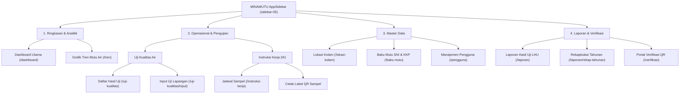

# 🌊 Rencana Migrasi Komponen & Tema Shadcn UI — Preset `b3YQPvPwf2`, Sidebar-05 & Dark/Light Mode
> **Sistem Informasi Mutu Air Budidaya (MINAMUTU)**  
> **Dinas Perikanan Kabupaten Lembata**  
> **Target Arsitektur:** Next.js 16 + Tailwind CSS v4 + Shadcn UI (Style: Nova, Primitive: Base UI)  
> **Kode Preset:** `b3YQPvPwf2` (Theme Cyan, Base Zinc, Style Nova, Font Inter & Geist)  
> **Pola Navigasi:** **`sidebar-05`** dari Shadcn UI (Collapsible Submenus, SearchForm, Breadcrumb & Role-Based Access)  
> **Dukungan Tema:** **Dark Mode & Light Mode Toggle** (Menggunakan `next-themes` + OKLCH Tokens)  
> **Panduan Eksekusi:** Dioptimalkan untuk dijalankan secara bertahap oleh AI Agent / Junior Developer  

---

## 📌 1. Ringkasan Eksekutif & Tujuan

Rencana ini menetapkan panduan teknis lengkap untuk mentransformasi seluruh antarmuka sistem **MINAMUTU** agar:
1. **100% menggunakan komponen resmi Shadcn UI** dengan tema konsisten berdasarkan preset **`b3YQPvPwf2`**.
2. **Mengadopsi pola navigasi `sidebar-05`** dari blok resmi Shadcn UI (sub-menu akordeon dapat dilipat, form pencarian, breadcrumb terintegrasi).
3. **Mendukung Mode Gelap (Dark Mode) dan Mode Terang (Light Mode)** secara mulus dengan tombol pengalih tema (*Theme Toggle*) berbasis `next-themes` dan variabel palet warna OKLCH.

### Prinsip Utama:
- **Zero Custom UI**: Tidak boleh ada lagi elemen manual/ad-hoc (seperti `<button>` mentah, `<table>` HTML polos, backdrop modal buatan sendiri dengan `fixed inset-0`, span badge kustom, atau alert manual). Seluruh elemen harus bermigrasi ke pustaka `@/components/ui/*`.
- **Fleksibilitas Pencahayaan Lapangan**: Petugas lapangan sering kali melakukan input parameter di bawah sinar matahari terik (membutuhkan *Light Mode* kontras tinggi) atau di malam hari di area tambak/laboratorium (membutuhkan *Dark Mode* yang nyaman di mata).
- **Zero CLS & No Hydration Mismatch**: Penggunaan `next-themes` dengan `attribute="class"` dan `suppressHydrationWarning` pada tag `<html>`.

---

## 🎨 2. Spesifikasi Tema Preset `b3YQPvPwf2` & Dukungan Dual-Mode

Berdasarkan dekode resmi dari Shadcn CLI (`npx shadcn@latest preset decode b3YQPvPwf2`):

| Atribut Preset | Nilai Konfigurasi | Deskripsi & Relevansi untuk MINAMUTU |
|---|---|---|
| **Code** | `b3YQPvPwf2` | Kode preset terverifikasi dari `ui.shadcn.com/create` |
| **Style** | `nova` (`base-nova`) | Gaya modern Shadcn terbaru dengan sudut halus dan shadow presisi |
| **Engine Primitives** | `@base-ui/react` | Primitives aksesibel dari Base UI (MUI team & Radix collaboration) |
| **Base Color** | `zinc` | Skala netral abu-abu modern untuk teks, latar, dan border |
| **Primary Theme** | `cyan` | Warna aksen akuatik (`oklch(0.52 0.105 223.128)` di light mode, `oklch(0.45 0.085 224.283)` di dark mode) |
| **Chart Color** | `zinc` | Palet grafik visualisasi tren mutu air yang harmonis dan profesional |
| **Icon Library** | `lucide-react` | Ikonografi standar Lucide |
| **Font Body** | `Inter` | Font sans-serif bersih dengan keterbacaan data tinggi |
| **Font Heading** | `Geist` | Font heading modern untuk hierarki visual dashboard |
| **Radius** | `default` (`0.625rem` / `10px`) | Lengkungan sudut komponen yang ergonomis |
| **Menu Accent** | `subtle` | Efek hover lembut pada item menu dan dropdown |
| **Dual Theme Support** | `Light`, `Dark`, `System` | Dikelola via `next-themes` + `@custom-variant dark (&:is(.dark *));` di Tailwind v4 |

### Perbandingan Palet Token Warna (Light vs Dark Mode):
```css
/* Mode Terang (Light Mode) */
:root {
  --background: oklch(1 0 0);               /* Putih bersih */
  --foreground: oklch(0.141 0.005 285.823);  /* Teks hitam pekat */
  --primary: oklch(0.52 0.105 223.128);      /* Cyan laut Lembata */
  --card: oklch(1 0 0);
  --border: oklch(0.92 0.004 286.32);
}

/* Mode Gelap (Dark Mode) */
.dark {
  --background: oklch(0.141 0.005 285.823);  /* Zinc gelap pekat */
  --foreground: oklch(0.985 0 0);            /* Teks putih terang */
  --primary: oklch(0.45 0.085 224.283);      /* Cyan berpendar lembut */
  --card: oklch(0.21 0.006 285.885);         /* Kartu abu-abu gelap */
  --border: oklch(1 0 0 / 10%);              /* Border tipis transparan */
}
```

---

## 🌓 3. Arsitektur Pengalih Tema (Dark / Light Theme Toggle)

Fitur tema dibangun menggunakan arsitektur 3 lapis:

### A. Lapisan Provider (`components/theme-provider.tsx`)
Membungkus aplikasi Next.js dengan `NextThemesProvider`:
- `attribute="class"`: Menambahkan kelas `.dark` pada tag `<html>`.
- `defaultTheme="system"`: Secara otomatis mengikuti preferensi OS pengguna saat pertama dibuka.
- `enableSystem={true}`: Sinkron dengan pengaturan dark mode Windows / macOS / Android / iOS.
- `disableTransitionOnChange`: Mencegah glitch animasi CSS yang kasar saat beralih tema.

### B. Lapisan Komponen Toggle (`components/theme-toggle.tsx`)
Menyediakan dua varian komponen tombol:
1. **`ThemeToggle`**: Tombol dropdown menu dengan pilihan:
   - ☀️ **Mode Terang** (`light`)
   - 🌙 **Mode Gelap** (`dark`)
   - 💻 **Ikuti Sistem** (`system`)
2. **`QuickThemeToggle`**: Tombol ikon matahari/bulan 1-klik untuk beralih instan antara terang dan gelap.

### C. Titik Penempatan Toggle di Aplikasi:
- **Header Atas Dashboard (`app/(dashboard)/layout.tsx`)**: Di sebelah kanan breadcrumb dan avatar profil.
- **Header / Footer `sidebar-05`**: Tombol cepat di area akun pengguna.
- **Header Landing Page Publik (`app/page.tsx`)**: Di navbar publik bersama tombol masuk.

---

## 📂 4. Arsitektur Navigasi: Blok `sidebar-05` Shadcn UI

Pola navigasi utama MINAMUTU mengadopsi blok resmi **`sidebar-05`** (`npx shadcn@latest add sidebar-05`).

### A. Fitur Utama `sidebar-05`:
1. **Collapsible Submenus**: Menu-menu utama dikelompokkan dan dapat dibuka/tutup secara akordeon menggunakan `@base-ui/react/collapsible` dengan animasi ikon `PlusIcon` & `MinusIcon`.
2. **SearchForm**: Fitur pencarian cepat di header sidebar untuk memfilter menu atau melompat langsung ke data kolam/uji sampel.
3. **SidebarRail**: Rel ekspansi interaktif untuk *desktop collapsible state* (mini-sidebar vs expanded sidebar).
4. **Header Branding**: Menampilkan identitas resmi "MINAMUTU — Kab. Lembata" dengan ikon maritim.
5. **Breadcrumb Top Header**: Terhubung ke `<SidebarInset>` dengan `<Breadcrumb>`, `<BreadcrumbList>`, `<BreadcrumbItem>`, dan `<SidebarTrigger>`.
6. **User Profile & Theme Toggle**: Integrasi data petugas aktif (Nama, NIP, Role), tombol switch tema (Dark/Light), dan tombol logout via server action.

### B. Struktur Menu `sidebar-05` untuk MINAMUTU:



---

## ⚙️ 5. Protokol Penanganan Keterbatasan AI Agent (CLI Handling)

> [!IMPORTANT]
> **Aturan Wajib untuk AI Agent:**
> Jika selama proses instalasi atau inisialisasi Shadcn CLI terjadi kendala keterbatasan agent (misalnya: perintah CLI meminta input interaktif / prompt stdin yang tidak dapat dijawab oleh agent, atau proses mengalami *timeout/hang*), **AI AGENT TIDAK BOLEH MEMAKSA ATAU MENGULANG TERUS-MENERUS**.
> 
> **AI Agent WAJIB:**
> 1. Menghentikan proses (kill task) agar terminal tidak terkunci.
> 2. Menjelaskan kendala secara singkat dan transparan kepada User.
> 3. Menyediakan blok perintah CLI persis yang siap di-copy-paste oleh User di terminal lokalnya.
> 4. Meminta User untuk mengonfirmasi setelah perintah selesai dijalankan, baru kemudian AI Agent melanjutkan pengerjaan kode.

### A. Perintah Otomatisasi Agent (Non-Interaktif)
Agent harus selalu menggunakan flag `--yes` agar CLI tidak meminta konfirmasi:
```bash
# Inisialisasi preset tema (Non-interaktif)
npx --yes shadcn@latest init --preset b3YQPvPwf2 --yes

# Menambahkan komponen & blok sidebar-05 secara batch (Non-interaktif)
npx --yes shadcn@latest add sidebar collapsible breadcrumb skeleton sidebar-05 badge card input label table dialog tabs alert separator avatar sheet dropdown-menu tooltip select sonner chart --yes
```

### B. Fallback: Instruksi Manual untuk User (Jika Agent Terkendala)
Jika terjadi kendala interaktif pada agent, berikan template pesan berikut kepada user:

```text
Mohon bantuan untuk menjalankan perintah berikut di terminal Anda (folder minamutu):

Menggunakan Bun:
cd "e:\LATSAR ELLEN\SISTEM\minamutu"
bunx --bun shadcn@latest init --preset b3YQPvPwf2 -y
bunx --bun shadcn@latest add sidebar collapsible breadcrumb skeleton sidebar-05 badge card input label table dialog tabs alert separator avatar sheet dropdown-menu tooltip select sonner chart -y

Atau Menggunakan NPX:
cd "e:\LATSAR ELLEN\SISTEM\minamutu"
npx --yes shadcn@latest init --preset b3YQPvPwf2 --yes
npx --yes shadcn@latest add sidebar collapsible breadcrumb skeleton sidebar-05 badge card input label table dialog tabs alert separator avatar sheet dropdown-menu tooltip select sonner chart --yes

Ketik "SELESAI" setelah proses terminal tuntas agar saya dapat melanjutkan migrasi kode komponen.
```

---

## 📋 6. Matriks Inventarisasi & Pemetaan Komponen

Seluruh antarmuka kustom yang ada saat ini harus diganti 100% dengan komponen Shadcn UI:

| Elemen Kustom Saat Ini | Komponen Shadcn UI Pengganti | Path Komponen UI | Lokasi Penggunaan di Aplikasi |
|---|---|---|---|
| Sidebar kustom manual di `dashboard-layout-client.tsx` | Blok **`sidebar-05`** (`SidebarProvider`, `AppSidebar`, `SidebarContent`, `Collapsible`, `Breadcrumb`, `SearchForm`) | `@/components/app-sidebar`, `@/components/ui/sidebar` | Shell tata letak seluruh halaman dashboard (`app/(dashboard)/layout.tsx`) |
| Toggle tema manual / tidak ada | `<ThemeToggle>` dan `<QuickThemeToggle>` | `@/components/theme-toggle` | Header dashboard, navbar publik, dan footer sidebar |
| Tag `<button>` manual | `<Button>` (variant: default, outline, secondary, ghost, destructive) | `@/components/ui/button` | Semua halaman form, aksi CRUD, tombol cetak, navbar, landing page |
| `<span className="rounded-full ...">` | `<Badge>` (variant: default, secondary, destructive, outline) | `@/components/ui/badge` | `badge-status.tsx`, tabel data, kartu status, instruksi kerja |
| `<div className="bg-white rounded-2xl border p-6 ...">` | `<Card>`, `<CardHeader>`, `<CardTitle>`, `<CardDescription>`, `<CardContent>`, `<CardFooter>` | `@/components/ui/card` | KPI dashboard, formulir uji lapangan, login, panel analitik tren |
| `<input className="border rounded-xl ...">` | `<Input>` | `@/components/ui/input` | Formulir login, filter pencarian, form uji mutu, modal tambah lokasi |
| `<label className="text-sm font-semibold ...">` | `<Label>` | `@/components/ui/label` | Semua form input data master dan input uji |
| `<select className="border rounded-xl ...">` | `<Select>`, `<SelectTrigger>`, `<SelectValue>`, `<SelectContent>`, `<SelectItem>` | `@/components/ui/select` | Filter kecamatan, jenis komoditas, metode uji, role user |
| `<table className="w-full ...">` | `<Table>`, `<TableHeader>`, `<TableBody>`, `<TableHead>`, `<TableRow>`, `<TableCell>` | `@/components/ui/table` | Seluruh 7 modul tabel data master, uji lab, riwayat, dan laporan |
| Custom backdrop modal `fixed inset-0 bg-black/50` | `<Dialog>`, `<DialogTrigger>`, `<DialogContent>`, `<DialogHeader>`, `<DialogTitle>`, `<DialogFooter>` | `@/components/ui/dialog` | Modal tambah/edit lokasi kolam, baku mutu, user, dan cetak QR |
| Manual tab switch buttons `useState('sni')` | `<Tabs>`, `<TabsList>`, `<TabsTrigger>`, `<TabsContent>` | `@/components/ui/tabs` | Baku mutu (SNI vs KKP), Form uji (Fisika, Kimia, Biologi), Analisis tren |
| Banner info/error `border-rose-200 bg-rose-50` | `<Alert>`, `<AlertTitle>`, `<AlertDescription>` | `@/components/ui/alert` | Notifikasi validasi zod, peringatan mutu kritis, pesan login gagal |
| Custom Toast / Notification state | `toast.success()`, `toast.error()`, `<Toaster />` | `@/components/ui/sonner` | Notifikasi aksi sukses CRUD dan penyimpanan data uji |
| Avatar inisial manual `div rounded-full` | `<Avatar>`, `<AvatarImage>`, `<AvatarFallback>` | `@/components/ui/avatar` | Profil pengguna di sidebar, header navigasi, dan LHU |
| Menu aksi titik tiga manual | `<DropdownMenu>`, `<DropdownMenuTrigger>`, `<DropdownMenuContent>`, `<DropdownMenuItem>` | `@/components/ui/dropdown-menu` | Menu aksi baris tabel, filter, dan profil logout |
| `<hr className="border-slate-200">` | `<Separator>` | `@/components/ui/separator` | Pemisah seksi di formulir, kartu, sidebar, dan nota verifikasi |
| Wrapper Recharts manual | `<ChartContainer>`, `<ChartTooltip>`, `<ChartTooltipContent>` | `@/components/ui/chart` | Komponen visualisasi `grafik-tren.tsx` |
| Hover title native HTML | `<TooltipProvider>`, `<Tooltip>`, `<TooltipTrigger>`, `<TooltipContent>` | `@/components/ui/tooltip` | Keterangan tombol aksi, icon bantuan ambang baku mutu |

---

## 🗺️ 7. Roadmap Implementasi Bertahap (Fase 1 – 8)

Rencana ini dipecah menjadi fase-fase terisolasi agar AI Agent dapat melakukan eksekusi dan validasi langkah demi langkah tanpa merusak fungsionalitas yang ada.

---

### 🔹 Fase 0: Verifikasi Fondasi Preset, Tailwind v4 & Theme Provider
**Tujuan:** Memastikan styling dasar preset `b3YQPvPwf2` dan infrastruktur tema aktif.

- [x] Pastikan `components.json` memiliki style `base-nova`, baseColor `zinc`, dan alias `@/components/ui`.
- [x] Pastikan `app/globals.css` mengimpor `shadcn/tailwind.css`, mendefinisikan variabel OKLCH Cyan, dan inline theme Tailwind v4 (termasuk kelas `.dark`).
- [x] Pastikan `app/layout.tsx` telah memuat variabel font `--font-sans` (`Inter`) dan `--font-heading` (`Geist`).
- [x] Pasang `ThemeProvider` dengan `attribute="class"`, `defaultTheme="system"`, dan `enableSystem`.
- [x] Pasang `<TooltipProvider>` dan `<Toaster position="top-right" richColors closeButton />`.
- [x] Buat komponen `components/theme-provider.tsx` dan `components/theme-toggle.tsx`.

---

### 🔹 Fase 1: Pemasangan Lengkap Komponen Shadcn UI & Sidebar-05
**Tujuan:** Memastikan seluruh file pustaka komponen dasar dan blok `sidebar-05` terpasang.

Daftar file target di `components/ui/` dan `components/`:
- [x] `components/ui/sidebar.tsx`
- [x] `components/ui/collapsible.tsx`
- [x] `components/ui/breadcrumb.tsx`
- [x] `components/ui/skeleton.tsx`
- [x] `hooks/use-mobile.ts`
- [x] `components/app-sidebar.tsx` (Inti dari `sidebar-05`)
- [x] `components/search-form.tsx` (Pencarian menu `sidebar-05`)
- [x] `components/theme-toggle.tsx` (Theme toggle Dark / Light)
- [x] `components/theme-provider.tsx` (Theme provider wrapper)
- [x] `components/ui/button.tsx`
- [x] `components/ui/badge.tsx`
- [x] `components/ui/card.tsx`
- [x] `components/ui/input.tsx`
- [x] `components/ui/label.tsx`
- [x] `components/ui/table.tsx`
- [x] `components/ui/tabs.tsx`
- [x] `components/ui/alert.tsx`
- [x] `components/ui/separator.tsx`
- [x] `components/ui/avatar.tsx`
- [x] `components/ui/sheet.tsx`
- [x] `components/ui/dropdown-menu.tsx`
- [x] `components/ui/tooltip.tsx`
- [x] `components/ui/select.tsx`
- [x] `components/ui/sonner.tsx`
- [x] `components/ui/dialog.tsx`
- [x] `components/ui/chart.tsx`

**Verifikasi Fase 1:**
Jalankan pengecekan TypeScript:
```bash
bunx --bun tsc --noEmit
```
*Kriteria Selesai:* 0 error TypeScript.

---

### 🔹 Fase 2: Implementasi `sidebar-05`, Theme Toggle & Layout Global
**Tujuan:** Mengintegrasikan `sidebar-05` dan tombol pengalih tema ke dalam shell navigasi utama aplikasi (`app/(dashboard)/layout.tsx` dan `components/app-sidebar.tsx`).

**File Terkait:**
1. [app/layout.tsx](file:///e:/LATSAR%20ELLEN/SISTEM/minamutu/app/layout.tsx)
2. [components/app-sidebar.tsx](file:///e:/LATSAR%20ELLEN/SISTEM/minamutu/components/app-sidebar.tsx)
3. [app/(dashboard)/layout.tsx](file:///e:/LATSAR%20ELLEN/SISTEM/minamutu/app/(dashboard)/layout.tsx)
4. [components/theme-toggle.tsx](file:///e:/LATSAR%20ELLEN/SISTEM/minamutu/components/theme-toggle.tsx)

**Tugas Pelaksanaan:**
- [ ] **Konfigurasi Data Navigasi `components/app-sidebar.tsx`:**
  - Sesuaikan kelompok menu `sidebar-05` dengan modul MINAMUTU:
    - Group 1: Ringkasan & Analitik (Dashboard, Tren)
    - Group 2: Operasional & Pengujian (Uji Kualitas Air -> Sub-item: Riwayat Uji, Form Input; Instruksi Kerja -> Sub-item: Jadwal Sampel, Cetak Label)
    - Group 3: Master Data (Lokasi Kolam, Baku Mutu Air, Pengguna & Petugas)
    - Group 4: Laporan & Verifikasi (LHU, Rekap Tahunan, Portal Verifikasi)
  - Tambahkan filter berdasarkan peran pengguna (`currentUser.role`).
  - Tambahkan User Profile Card di bagian bawah sidebar dengan `<Avatar>`, nama petugas, role badge, tombol `<QuickThemeToggle />`, dan tombol Logout (`logoutAction`).
- [ ] **Integrasi Shell `app/(dashboard)/layout.tsx`:**
  - Bungkus konten dalam `<SidebarProvider>` dan `<AppSidebar user={currentUser} />`.
  - Pasang `<SidebarInset>` yang berisi header atas:
    - `<SidebarTrigger className="-ml-1" />`
    - `<Separator orientation="vertical" className="mr-2 h-4" />`
    - `<Breadcrumb>` dinamis sesuai rute halaman aktif.
    - Sisi kanan header: Tombol `<ThemeToggle />`, notifikasi sistem, dan tombol cetak cepat (jika di halaman laporan).

---

### 🔹 Fase 3: Migrasi Komponen Inti Bersama (Shared Components)
**Tujuan:** Mengonversi 4 komponen inti yang digunakan berulang kali di seluruh modul.

#### 1. [components/badge-status.tsx](file:///e:/LATSAR%20ELLEN/SISTEM/minamutu/components/badge-status.tsx)
- [ ] Refaktor `BadgeStatus` agar memanfaatkan `<Badge>` dari `@/components/ui/badge`.
- [ ] Petakan status mutu air ke varian/warna Nova Shadcn yang adaptif terhadap Dark Mode:
  - `MEMENUHI` / `NORMAL`: Varian outline dengan border emerald (`border-emerald-300 bg-emerald-50 text-emerald-800 dark:border-emerald-800 dark:bg-emerald-950/40 dark:text-emerald-300`).
  - `PERINGATAN` / `DIBAWAH`: Varian outline dengan border amber (`border-amber-300 bg-amber-50 text-amber-800 dark:border-amber-800 dark:bg-amber-950/40 dark:text-amber-300`).
  - `KRITIS` / `MELEBIHI`: Varian `destructive` (`bg-destructive text-destructive-foreground`).
  - Lainnya: Varian `secondary` atau `outline`.
- [ ] Pertahankan dukungan ikon Lucide (`CheckCircle2`, `AlertTriangle`, `AlertOctagon`, `Info`).

#### 2. [components/print-button.tsx](file:///e:/LATSAR%20ELLEN/SISTEM/minamutu/components/print-button.tsx)
- [ ] Ubah tombol cetak menjadi `<Button variant="outline" className="no-print">` dengan ikon `Printer`.

#### 3. [components/grafik-tren.tsx](file:///e:/LATSAR%20ELLEN/SISTEM/minamutu/components/grafik-tren.tsx)
- [ ] Bungkus grafik tren dengan `<Card>`, `<CardHeader>`, `<CardTitle>`, `<CardContent>`.
- [ ] Integrasikan Recharts dengan `<ChartContainer config={...}>` dan `<ChartTooltip content={<ChartTooltipContent />} />` dari `@/components/ui/chart`.
- [ ] Pastikan warna garis grafik menyesuaikan token CSS chart `--chart-1` s/d `--chart-5` saat dark mode aktif.

#### 4. [components/form-uji-lapangan.tsx](file:///e:/LATSAR%20ELLEN/SISTEM/minamutu/components/form-uji-lapangan.tsx)
- [ ] Ganti seluruh form container dengan `<Card>`.
- [ ] Ganti tab Fisika / Kimia dengan `<Tabs>`, `<TabsList>`, `<TabsTrigger>`, `<TabsContent>`.
- [ ] Ganti input parameter (Suhu, pH, DO, Salinitas) dengan `<Input>` dan `<Label>`.
- [ ] Ganti dropdown pemilihan kolam dan metode uji dengan `<Select>`.
- [ ] Ganti banner alert error dengan `<Alert variant="destructive">` dan alert sukses dengan `toast.success()`.
- [ ] Ganti tombol simpan dengan `<Button type="submit">` (dengan state loading).

---

### 🔹 Fase 4: Migrasi Landing Page, Login, dan Dashboard Utama
**Tujuan:** Menyegarkan tampilan pintu masuk pengguna dan dashboard ringkasan.

#### 1. [app/page.tsx](file:///e:/LATSAR%20ELLEN/SISTEM/minamutu/app/page.tsx) (Landing Page Publik)
- [ ] Pasang tombol `<ThemeToggle />` pada navbar atas landing page.
- [ ] Gunakan `<Badge>` untuk pill status akreditasi / percontohan Lembata.
- [ ] Gunakan `<Button size="lg">` untuk tombol CTA "Masuk Sistem" dan "Verifikasi QR".
- [ ] Gunakan `<Card>` untuk kartu 3 pilar sistem (Uji Lapangan, Standar Baku Mutu, Laporan QR).

#### 2. [app/(auth)/login/page.tsx](file:///e:/LATSAR%20ELLEN/SISTEM/minamutu/app/(auth)/login/page.tsx)
- [ ] Bungkus formulir login dalam `<Card className="w-full max-w-md">`.
- [ ] Pasang `<ThemeToggle />` di sudut kartu login untuk kenyamanan petugas piket malam.
- [ ] Gunakan `<Label>` dan `<Input>` untuk NIP/Username dan Password.
- [ ] Gunakan `<Button className="w-full">` untuk tombol submit login.
- [ ] Gunakan `<Alert variant="destructive">` untuk menampilkan pesan kesalahan autentikasi.

#### 3. [app/(dashboard)/dashboard/page.tsx](file:///e:/LATSAR%20ELLEN/SISTEM/minamutu/app/(dashboard)/dashboard/page.tsx)
- [ ] Ganti 4 kartu metrik KPI (Total Uji, Kolam Terdaftar, Parameter Normal, Kritis) menggunakan `<Card>`, `<CardHeader>`, `<CardTitle>`, `<CardContent>`.
- [ ] Ganti tabel riwayat pengujian terbaru menggunakan `<Table>`, `<TableHeader>`, `<TableRow>`, `<TableHead>`, `<TableBody>`, `<TableCell>`.
- [ ] Gunakan `<BadgeStatus>` pada kolom status mutu air.
- [ ] Gunakan `<Button variant="outline" size="sm">` untuk tombol "Lihat Semua".

---

### 🔹 Fase 5: Migrasi Modul Master Data
**Tujuan:** Merombak modul pengelolaan lokasi kolam, baku mutu, dan manajemen pengguna.

#### 1. [app/(dashboard)/lokasi-kolam/client.tsx](file:///e:/LATSAR%20ELLEN/SISTEM/minamutu/app/(dashboard)/lokasi-kolam/client.tsx)
- [ ] Ganti modal kustom dengan `<Dialog>`, `<DialogTrigger>`, `<DialogContent>`, `<DialogHeader>`, `<DialogTitle>`, `<DialogFooter>`.
- [ ] Ganti tabel daftar kolam dengan `<Table>`.
- [ ] Ganti form input modal (Nama Pokdakan, Pemilik, Desa, Koordinat) dengan `<Input>`, `<Label>`, dan `<Select>` untuk Kecamatan & Komoditas.
- [ ] Ganti notifikasi modal dengan Sonner `toast.success('Lokasi berhasil ditambahkan')`.
- [ ] Gunakan `<Button variant="destructive" size="icon-sm">` untuk aksi hapus.

#### 2. [app/(dashboard)/baku-mutu/client.tsx](file:///e:/LATSAR%20ELLEN/SISTEM/minamutu/app/(dashboard)/baku-mutu/client.tsx)
- [ ] Gunakan `<Tabs defaultValue="sni">` untuk beralih antara SNI 01-6141-1999 dan Kepmen-KP.
- [ ] Gunakan `<Table>` untuk daftar parameter uji (pH, Suhu, Salinitas, DO, Amonia, Nitrit).
- [ ] Gunakan `<Dialog>` untuk modal ubah batas ambang baku mutu.
- [ ] Gunakan `<Badge variant="outline">` untuk kategori parameter (Fisika / Kimia).

#### 3. [app/(dashboard)/pengguna/client.tsx](file:///e:/LATSAR%20ELLEN/SISTEM/minamutu/app/(dashboard)/pengguna/client.tsx)
- [ ] Gunakan `<Table>` untuk daftar petugas laboratorium dan pembudidaya.
- [ ] Gunakan `<Avatar>` pada kolom identitas petugas.
- [ ] Gunakan `<Badge>` untuk badge Role (`ADMIN`, `PENGELOLA_MUTU`, `PETUGAS_LAPANGAN`, `KEPALA_DINAS`).
- [ ] Gunakan `<Dialog>` untuk modal tambah/edit pengguna.
- [ ] Gunakan `<Select>` untuk pemilihan role pengguna.

---

### 🔹 Fase 6: Migrasi Modul Pengujian & Instruksi Kerja (SOP)
**Tujuan:** Merombak antarmuka uji mutu air harian dan cetak label instruksi kerja.

#### 1. [app/(dashboard)/uji-kualitas/client.tsx](file:///e:/LATSAR%20ELLEN/SISTEM/minamutu/app/(dashboard)/uji-kualitas/client.tsx) & [input/page.tsx](file:///e:/LATSAR%20ELLEN/SISTEM/minamutu/app/(dashboard)/uji-kualitas/input/page.tsx)
- [ ] Gunakan filter bar dengan `<Input>` (pencarian nomor sampel) dan `<Select>` (filter status).
- [ ] Gunakan `<Table>` untuk tabel daftar pengujian air lengkap dengan tanggal, lokasi, parameter kunci, dan aksi.
- [ ] Gunakan `<BadgeStatus>` pada status hasil uji (`MEMENUHI` / `PERINGATAN` / `KRITIS`).
- [ ] Pada form input uji, gunakan `<Card>`, `<Input>`, `<Label>`, `<Select>`, dan `<Tabs>`.

#### 2. [app/(dashboard)/instruksi-kerja/client.tsx](file:///e:/LATSAR%20ELLEN/SISTEM/minamutu/app/(dashboard)/instruksi-kerja/client.tsx) & `[id]/cetak-label/page.tsx`
- [ ] Gunakan `<Table>` untuk jadwal pengambilan sampel air dan SOP.
- [ ] Gunakan `<Badge>` untuk status pengambilan sampel (`DIPERSIAPKAN`, `DIAMBIL`, `SELESAI`).
- [ ] Gunakan `<Button variant="outline" size="sm">` dengan ikon cetak untuk menuju halaman cetak label QR.
- [ ] Pada halaman `cetak-label/page.tsx`, pastikan layout kartu stiker menggunakan token border yang rapi saat dicetak (`@media print`).

---

### 🔹 Fase 7: Migrasi Modul Analitik Tren, Laporan LHU & Verifikasi QR
**Tujuan:** Memperbarui visualisasi analitik tren, cetak laporan LHU ber-QR, dan verifikasi publik.

#### 1. [app/(dashboard)/tren/client.tsx](file:///e:/LATSAR%20ELLEN/SISTEM/minamutu/app/(dashboard)/tren/client.tsx)
- [ ] Gunakan `<Card>` sebagai wadah grafik analitik dan panel filter.
- [ ] Gunakan `<Select>` untuk memilih parameter (pH, DO, Suhu, Salinitas) dan rentang waktu.
- [ ] Gunakan `<Tabs>` untuk beralih antara grafik garis harian, mingguan, dan rata-rata bulanan.

#### 2. [app/(dashboard)/laporan/page.tsx](file:///e:/LATSAR%20ELLEN/SISTEM/minamutu/app/(dashboard)/laporan/page.tsx), `[uji_id]/cetak/page.tsx`, `rekap-tahunan/page.tsx`
- [ ] Gunakan `<Table>` untuk direktori Laporan Hasil Uji (LHU) yang siap dicetak/diunduh.
- [ ] Pada format cetak resmi `[uji_id]/cetak/page.tsx`:
  - Gunakan layout tabel bersih dari Shadcn dengan styling print khusus (`@media print`).
  - Tampilkan QR code verifikasi dengan border dan badge terstandar.

#### 3. [app/verifikasi/[hash]/page.tsx](file:///e:/LATSAR%20ELLEN/SISTEM/minamutu/app/verifikasi/[hash]/page.tsx)
- [ ] Halaman publik saat QR code di-scan:
  - Bungkus dalam `<Card className="max-w-3xl mx-auto shadow-lg">`.
  - Pasang `<ThemeToggle />` di pojok kanan atas halaman publik.
  - Tampilkan status keaslian dokumen dengan `<Badge variant="default" className="bg-emerald-600">`.
  - Tampilkan tabel rincian parameter air dengan `<Table>`.
  - Gunakan `<Separator />` antara metadata dokumen dan tanda tangan digital.

---

### 🔹 Fase 8: Pengujian Akhir, Aksesibilitas & Kompatibilitas Cetak
**Tujuan:** Validasi menyeluruh terhadap kestabilan sistem setelah migrasi 100%.

- [ ] **Pengecekan Kompilasi TypeScript:**
  ```bash
  bunx --bun tsc --noEmit
  ```
- [ ] **Pengecekan Linter Next.js:**
  ```bash
  bun run lint
  ```
- [ ] **Pengecekan Produksi Build:**
  ```bash
  bun run build
  ```
- [ ] **Pengujian Dual-Theme & Aksesibilitas:**
  - Uji peralihan Light Mode -> Dark Mode -> System: pastikan tidak terjadi flicker, teks tetap terbaca kontras tinggi di kedua mode.
  - Uji kontras warna Cyan (`oklch(0.52 0.105 223.128)`) terhadap teks putih (memenuhi standar WCAG AA).
  - Uji responsivitas pada viewport Desktop (1536px), Tablet (768px), dan Mobile (375px).
- [ ] **Pengujian Cetak Fisik / PDF:**
  - Cetak halaman LHU (`/laporan/[id]/cetak`): saat dicetak, warna latar belakang otomatis kembali ke putih (`@media print { body { background: #ffffff !important; } }`) dan tidak terpengaruh oleh status dark mode pengguna saat mencetak.

---

## 💻 8. Cetak Biru Kode (Code Blueprints)

### Blueprint 1: Tombol Pengalih Tema (`components/theme-toggle.tsx`)
```tsx
'use client';

import * as React from 'react';
import { Moon, Sun } from 'lucide-react';
import { useTheme } from 'next-themes';
import { Button } from '@/components/ui/button';
import {
  DropdownMenu,
  DropdownMenuContent,
  DropdownMenuItem,
  DropdownMenuTrigger,
} from '@/components/ui/dropdown-menu';

export function ThemeToggle() {
  const { setTheme } = useTheme();

  return (
    <DropdownMenu>
      <DropdownMenuTrigger
        render={
          <Button
            variant="ghost"
            size="icon-sm"
            className="size-8 relative"
            title="Ganti Tema (Terang / Gelap)"
          >
            <Sun className="size-4 rotate-0 scale-100 transition-all dark:-rotate-90 dark:scale-0 text-amber-500" />
            <Moon className="absolute size-4 rotate-90 scale-0 transition-all dark:rotate-0 dark:scale-100 text-cyan-400" />
            <span className="sr-only">Ganti tema</span>
          </Button>
        }
      />
      <DropdownMenuContent align="end">
        <DropdownMenuItem onClick={() => setTheme('light')}>
          <Sun className="mr-2 size-4 text-amber-500" />
          <span>Mode Terang</span>
        </DropdownMenuItem>
        <DropdownMenuItem onClick={() => setTheme('dark')}>
          <Moon className="mr-2 size-4 text-cyan-400" />
          <span>Mode Gelap</span>
        </DropdownMenuItem>
        <DropdownMenuItem onClick={() => setTheme('system')}>
          <span className="mr-2 text-xs">💻</span>
          <span>Ikuti Sistem</span>
        </DropdownMenuItem>
      </DropdownMenuContent>
    </DropdownMenu>
  );
}

export function QuickThemeToggle() {
  const { resolvedTheme, setTheme } = useTheme();

  return (
    <Button
      variant="ghost"
      size="icon-sm"
      className="size-8 relative text-muted-foreground hover:text-foreground"
      onClick={() => setTheme(resolvedTheme === 'dark' ? 'light' : 'dark')}
      title={resolvedTheme === 'dark' ? 'Ganti ke Mode Terang' : 'Ganti ke Mode Gelap'}
    >
      <Sun className="size-4 rotate-0 scale-100 transition-all dark:-rotate-90 dark:scale-0 text-amber-500" />
      <Moon className="absolute size-4 rotate-90 scale-0 transition-all dark:rotate-0 dark:scale-100 text-cyan-400" />
      <span className="sr-only">Toggle theme</span>
    </Button>
  );
}
```

### Blueprint 2: Integrasi Shell `app/(dashboard)/layout.tsx` dengan ThemeToggle & `sidebar-05`
```tsx
import { AppSidebar } from '@/components/app-sidebar';
import {
  Breadcrumb,
  BreadcrumbItem,
  BreadcrumbLink,
  BreadcrumbList,
  BreadcrumbPage,
  BreadcrumbSeparator,
} from '@/components/ui/breadcrumb';
import { Separator } from '@/components/ui/separator';
import {
  SidebarInset,
  SidebarProvider,
  SidebarTrigger,
} from '@/components/ui/sidebar';
import { ThemeToggle } from '@/components/theme-toggle';
import { getCurrentUser } from '@/lib/auth';

export default async function DashboardLayout({
  children,
}: {
  children: React.ReactNode;
}) {
  const user = await getCurrentUser();

  return (
    <SidebarProvider>
      <AppSidebar user={user} />
      <SidebarInset>
        <header className="flex h-16 shrink-0 items-center justify-between border-b px-4 no-print bg-background/95 backdrop-blur-xs sticky top-0 z-10">
          <div className="flex items-center gap-2">
            <SidebarTrigger className="-ml-1" />
            <Separator orientation="vertical" className="mr-2 h-4" />
            <Breadcrumb>
              <BreadcrumbList>
                <BreadcrumbItem className="hidden md:block">
                  <BreadcrumbLink href="/dashboard">MINAMUTU</BreadcrumbLink>
                </BreadcrumbItem>
                <BreadcrumbSeparator className="hidden md:block" />
                <BreadcrumbItem>
                  <BreadcrumbPage>Sistem Informasi Mutu Air Budidaya</BreadcrumbPage>
                </BreadcrumbItem>
              </BreadcrumbList>
            </Breadcrumb>
          </div>
          <div className="flex items-center gap-2">
            <ThemeToggle />
          </div>
        </header>
        <main className="flex-1 p-4 md:p-6 lg:p-8 bg-muted/20 print:p-0 print:bg-white">
          {children}
        </main>
      </SidebarInset>
    </SidebarProvider>
  );
}
```

---

## 🎯 9. Definisi Selesai (Definition of Done) - STATUS: SELESAI 100% ✅

Proyek telah berhasil bermigrasi penuh dengan memenuhi checklist berikut:
1. [x] **Preset Tema Aktif**: Variabel tema `b3YQPvPwf2` (Cyan OKLCH, font Inter & Geist) terpasang di `app/globals.css` dan `components.json`.
2. [x] **Dark & Light Mode Berfungsi**: Pengguna dapat beralih antara Mode Terang, Mode Gelap, dan Sistem tanpa kendala tampilan atau *flicker* (dilengkapi ThemeToggle dropdown & QuickThemeToggle).
3. [x] **Sidebar-05 Terpasang**: Sidebar menggunakan blok `sidebar-05` lengkap dengan collapsible accordion sub-menu, search form, breadcrumbs, role-based visibility, dan profil pengguna.
4. [x] **Zero Custom UI**: 100% komponen antarmuka menggunakan komponen resmi Shadcn UI (`Button`, `Card`, `Table`, `Dialog`, `Badge`, `Tabs`, `Input`, `Label`, `Separator`, `Avatar`, `Tooltip`, `Select`, `Breadcrumb`, dll.) di seluruh `app/` dan `components/`.
5. [x] **Status Badge Standar**: Seluruh indikator kelayakan air menggunakan komponen `BadgeStatus` berbasis Shadcn `<Badge>` dengan varian `MEMENUHI`, `PERINGATAN`, dan `KRITIS` adaptif dark/light mode.
6. [x] **Notifikasi Modern**: Semua umpan balik pengguna menggunakan `sonner` (`toast.success` & `toast.error`).
7. [x] **Kepatuhan Tipe & Kompilasi**: `bunx --bun tsc --noEmit` dan `bun run build` lolos 100% dengan 0 error.
8. [x] **Cetak Fisik Siap**: Cetak LHU Laporan Hasil Uji dan label QR code tetap bersih dan presisi (latar belakang putih otomatis `@media print`) tanpa gangguan elemen UI navigasi.
