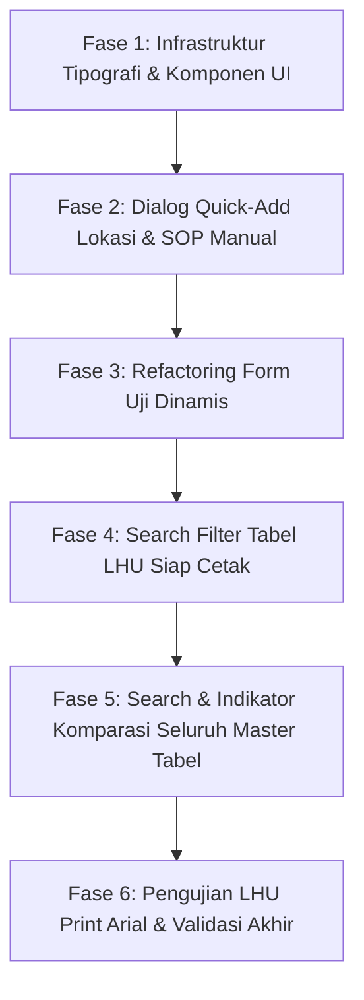

# 📋 Rencana Pembangunan & Penyempurnaan Fitur MINAMUTU
**Sistem Informasi Mutu Air Budidaya Terpadu — Dinas Perikanan Kabupaten Lembata**

*Dokumen Perencanaan Teknis & Arsitektur Fitur Lanjutan (Versi 2.1)*  
*Tanggal: 26 September 2026*  
*Target Stack: Next.js 16 (App Router), Bun, Shadcn UI (Preset Nova Cyan `b3YQPvPwf2`), Drizzle ORM, Zod, Tailwind CSS v4*

---

## 📑 Daftar Isi
1. [Latar Belakang & Analisis Kebutuhan](#1-latar-belakang--analisis-kebutuhan)
2. [Spesifikasi Fitur & Perubahan Sistem](#2-spesifikasi-fitur--perubahan-sistem)
   - [Poin 1: Form Uji Dinamis (Parameter Kosong & Pemilihan Versi Baku Mutu)](#poin-1-form-uji-dinamis-parameter-kosong--pemilihan-versi-baku-mutu)
   - [Poin 2: Fleksibilitas SOP / Instruksi Kerja (Pilih Arsip vs Input Manual)](#poin-2-fleksibilitas-sop--instruksi-kerja-pilih-arsip-vs-input-manual)
   - [Poin 3: Quick-Add Lokasi Kolam di Samping Dropdown Form](#poin-3-quick-add-lokasi-kolam-di-samping-dropdown-form)
   - [Poin 4: Standarisasi Input (Combobox vs Select) & Tipografi Font (Geist & Arial)](#poin-4-standarisasi-input-combobox-vs-select--tipografi-font-geist--arial)
   - [Poin 5: Pencarian Multi-Kriteria pada Tabel LHU Siap Cetak](#poin-5-pencarian-multi-kriteria-pada-tabel-lhu-siap-cetak)
   - [Poin 6: Standardisasi & Fleksibilitas Kode Sampel](#poin-6-standardisasi--fleksibilitas-kode-sampel)
   - [Poin 7: Filter Pencarian & Indikator Komparasi Seluruh Tabel Master & Operasional](#poin-7-filter-pencarian--indikator-komparasi-seluruh-tabel-master--operasional)
3. [Skema Basis Data & Validasi Zod](#3-skema-basis-data--validasi-zod)
4. [Rancangan Antarmuka & Blueprint Kode](#4-rancangan-antarmuka--blueprint-kode)
5. [Tahapan Implementasi & Timeline Eksekusi](#5-tahapan-implementasi--timeline-eksekusi)
6. [Definisi Selesai (Definition of Done)](#6-definisi-selesai-definition-of-done)

---

## 1. 🔍 Latar Belakang & Analisis Kebutuhan

Berdasarkan pengujian operasional lapangan pada prototipe awal MINAMUTU, ditemukan beberapa kendala praktis yang dihadapi petugas pengawas budidaya perikanan di Kabupaten Lembata:
1. **Keterbatasan Alat di Lapangan**: Petugas tidak selalu menguji seluruh 6 parameter secara serentak. Pada kunjungan tertentu, mungkin hanya dilakukan uji cepat 2 parameter (misal: Suhu dan pH menggunakan pen tester), atau 1 parameter DO (Oksigen Terlarut). Form pengujian sebelumnya memaksakan seluruh parameter terisi dengan nilai bawaan.
2. **Fleksibilitas Regulasi / Versi Standar**: Saat terjadi pembaharuan regulasi (misal revisi ambang batas budidaya ikan kerapu vs bandeng, atau revisi tahun regulasi), pengujian sampel tertentu mungkin masih harus mengacu pada baku mutu versi lama/riwayat.
3. **Kendala SOP Lapangan**: Petugas di lapangan terkadang menerapkan variasi SOP situasional atau metode uji cepat yang belum terinput di master database IK pusat. Proses input tidak boleh terhenti hanya karena SOP belum terdaftar.
4. **Kolam Baru Belum Terdaftar**: Pembudidaya baru kerap ditemukan secara mendadak saat monitoring wilayah pesisir Lembata. Petugas membutuhkan tombol penambahan lokasi secara instan (*modal in-place*) tanpa keluar dari lembar kerja form.
5. **Ergonomi Input & Hirarki Data**: Elemen `<select>` konvensional menyulitkan pencarian jika data kolam/baku mutu mencapai puluhan atau ratusan entitas. Diperlukan komponen **Combobox / Autocomplete** pencarian cepat.
6. **Kerapian Tipografi Birokrasi**: Aplikasi sistem informasi wajib konsisten menggunakan font modern **Geist**, sedangkan dokumen resmi cetak pemerintah (Laporan Hasil Uji / LHU) menggunakan standar instansi pemerintahan **Arial** dengan *fallback* aman ke Geist.
7. **Visibilitas Data & Filter**: Petugas membutuhkan pencarian nomor sampel / lokasi di tabel LHU, serta indikator transparan pada setiap tabel data jika jumlah baris yang tampil lebih sedikit dari total data dalam basis data.

---

## 2. ⚙️ Spesifikasi Fitur & Perubahan Sistem

### Poin 1: Form Uji Dinamis (Parameter Kosong & Pemilihan Versi Baku Mutu)
* **Kondisi Awal**: Form otomatis me-load seluruh parameter baku mutu aktif dan mengisinya dengan default dummy value.
* **Perubahan Desain**:
  1. Form dimulai dengan daftar parameter **kosong**.
  2. Disediakan tombol aksi utama: `[+ Tambah Parameter Uji]`.
  3. Setiap baris parameter memiliki:
     - **Pilihan Parameter & Versi Baku Mutu**: Menampilkan parameter aktif serta parameter arsip/versi lama dengan label jelas (contoh: *"pH (PP 22/2021) — 6.5 s/d 8.5"* atau *"pH (SNI Lama 2018) — Versi Arsip"*).
     - **Input Nilai Hasil Pengukuran**: Input numerik presisi tinggi (desimal).
     - **Preview Kelayakan Otomatis**: Komponen `<BadgeStatus>` yang langsung mengevaluasi apakah nilai memenuhi, mendekati peringatan, atau melebihi/kurang dari ambang batas secara *real-time*.
     - **Tombol Hapus (`Trash2`)**: Menghapus baris parameter yang tidak jadi diuji.
  4. **Validasi**:
     - Minimal 1 parameter wajib ditambahkan sebelum form dapat disimpan.
     - Proteksi anti-duplikasi: Satu parameter tidak dapat dipilih lebih dari satu kali dalam satu nomor sampel yang sama.
     - Perhitungan kesimpulan status mutu sampel (`NORMAL`, `PERINGATAN`, `KRITIS`) hanya mengagregasi parameter-parameter yang benar-benar dipilih dan diuji.

### Poin 2: Fleksibilitas SOP / Instruksi Kerja (Pilih Arsip vs Input Manual)
* **Kondisi Awal**: Dropdown hanya mengambil dari tabel `instruksiKerja` yang ada.
* **Perubahan Desain**:
  1. Menambahkan switch tab atau radio selector pada field SOP:
     - **Opsi A: "Pilih dari SOP Tersimpan"** (Default): Menggunakan Combobox autocomplete dengan pencarian kode dan judul SOP.
     - **Opsi B: "Isi Manual / Belum Terarsip"**: Membuka dua field input teks:
       - `Kode / Rujukan SOP`: misal `IK-MANUAL-01` atau `METODE-CEPH-2026`.
       - `Judul / Metodologi Pengujian`: misal `Pengujian Mandiri Lapangan Strip pH & DO Meter Digital Portabel`.
  2. **Penanganan Backend**:
     - Ketika opsi manual dipilih, Server Action otomatis membuat catatan IK baru dengan kategori `"Manual Lapangan"` dan membuat kode QR hash unik (SHA-256) sehingga dokumen verifikasi publik dan cetak label QR tetap berfungsi secara resmi.

### Poin 3: Quick-Add Lokasi Kolam di Samping Dropdown Form
* **Kondisi Awal**: Dropdown lokasi statis. Jika lokasi belum ada, user harus navigasi ke `/lokasi-kolam`, menambahkan data, lalu kembali ke form uji dan mengulang pengisian.
* **Perubahan Desain**:
  1. Di sebelah kanan field pemilihan lokasi kolam pada form, diletakkan tombol:  
     `<Button variant="outline" size="sm" type="button"><Plus className="size-3.5" /> Tambah Lokasi</Button>`
  2. Tombol ini memicu pembukaan Shadcn `<Dialog>` (modal in-place) tanpa meninggalkan halaman atau me-refresh form.
  3. Dialog memuat formulir singkat penambahan lokasi:
     - Nama Kelompok Pembudidaya (Pokdakan)
     - Penanggung Jawab / Pemilik
     - Kecamatan (Dropdown 9 kecamatan Lembata: Nubatukan, Ile Ape, Lebatukan, dll.)
     - Desa / Kelurahan
     - Titik Koordinat GPS (opsional)
     - Komoditas Budidaya (misal: Ikan Kerapu, Bandeng, Nila, Udang Vaname)
  4. Ketika berhasil disimpan, lokasi baru langsung masuk ke *local state* list lokasi, langsung terpilih otomatis di form uji, dan modal tertutup dengan notifikasi sukses Sonner.

### Poin 4: Standarisasi Input (Combobox vs Select) & Tipografi Font (Geist & Arial)
* **Aturan Komponen Pemilihan Data**:
  - **Gunakan Shadcn Combobox (`Popover` + `Command` autocomplete)**:
    - Pemilihan Lokasi Kolam (karena jumlah Pokdakan bisa puluhan/ratusan).
    - Pemilihan Parameter & Baku Mutu (karena mencakup parameter aktif dan arsip riwayat).
    - Pemilihan SOP Instruksi Kerja.
  - **Gunakan Shadcn `<Select>` Biasa**:
    - Data yang opsinya sedikit dan tetap (contoh: Pilihan 9 Kecamatan Lembata, Status Mutu: Semua/Normal/Peringatan/Kritis, Role Pengguna: Admin/Pengelola/Petugas/Kadin).
* **Aturan Tipografi Font Sistem**:
  - **Sistem Global & Seluruh Halaman Dashboard**: Menggunakan font **Geist** (`font-sans` dan `font-heading`). Seluruh antarmuka web menggunakan token `--font-sans: var(--font-geist-sans)` dan `--font-mono: var(--font-geist-mono)`.
  - **Laporan Hasil Uji (LHU) Resmi & Lembar Cetak A4**: Menggunakan font instansi resmi **Arial** dengan deklarasi CSS khusus:
    ```css
    .print-lhu-canvas {
      font-family: Arial, var(--font-geist-sans), sans-serif !important;
    }
    ```
    *Fallback mekanisme*: Jika Arial tidak terpasang pada perangkat klien (misal perangkat Linux/mobile tertentu), sistem otomatis jatuh ke Geist sans-serif tanpa merusak tata letak margin dokumen.

### Poin 5: Pencarian Multi-Kriteria pada Tabel LHU Siap Cetak
* **Kondisi Awal**: Tabel daftar LHU di halaman `/laporan` dirender secara statis tanpa input pencarian.
* **Perubahan Desain**:
  1. Mentransformasikan tabel LHU menjadi Client Component interaktif (`LaporanTableClient`).
  2. Input Search Bar di atas tabel dengan placeholder:  
     `"Cari nomor LHU, kode sampel, Pokdakan, desa, kecamatan, atau penguji..."`
  3. Fitur filter mencocokkan teks pencarian terhadap:
     - Nomor LHU / Kode Sampel (`nomor_sampel`)
     - Nama Pokdakan (`lokasi.nama_pokdakan`)
     - Desa & Kecamatan (`lokasi.desa`, `lokasi.kecamatan`)
     - Nama Petugas Uji (`petugas_uji`)
  4. Indikator counter: *"Menampilkan X dari Y dokumen LHU"* dilengkapi tombol reset pencarian instan.

### Poin 6: Standardisasi & Fleksibilitas Kode Sampel
* **Spesifikasi Kode Sampel**:
  1. **Format Standar Bawaan**: `SMP-YYYYMMDD-[RANDOM_3_DIGIT]` (contoh: `SMP-20260926-318`).
  2. **Fleksibilitas Input Manual**: Petugas lapangan diperbolehkan mengedit kode sampel secara bebas sesuai nomor register fisik label botol sampel laboratorium bila diperlukan.
  3. **Tombol Regenerate Otomatis**: Tombol ikon `RefreshCw` di samping input field untuk mengacak ulang kode sampel baru dalam format standar dengan 1 klik.
  4. **Proteksi Integritas Data**: Validasi keunikan (*unique constraint*) di basis data dan schema Zod untuk mencegah tabrakan data (*collision*).

### Poin 7: Filter Pencarian & Indikator Komparasi Seluruh Tabel Master & Operasional
* **Kondisi Saat Ini**: Sebagian tabel belum memiliki pencarian teks, dan counter hanya menampilkan total statis tanpa indikator saat data tersaring.
* **Perubahan Komprehensif**:
  Terapkan pada seluruh tabel data:
  1. `Master Lokasi Kolam` (`/lokasi-kolam`)
  2. `Master Baku Mutu Air` (`/baku-mutu`)
  3. `Manajemen Pengguna` (`/pengguna`)
  4. `Instruksi Kerja (IK / SOP)` (`/instruksi-kerja`)
  5. `Log Riwayat Uji Kualitas Air` (`/uji-kualitas`)
  6. `Pusat Laporan LHU Siap Cetak` (`/laporan`)
  7. `Analisis Tren Parameter` (`/tren`)
* **Standar Indikator Komparasi**:
  - Bila `dataTerfilter.length === totalDatabase`:  
    `"Total: X data terdaftar"`
  - Bila `dataTerfilter.length < totalDatabase`:  
    `"Menampilkan X dari Y data (Difilter)"` + Tombol `[Reset Filter]` berukuran `xs`.
  - Bila tidak ada data yang cocok (`dataTerfilter.length === 0`):  
    Tampilan tabel baris tunggal: `"Tidak ada data yang cocok dengan pencarian \"[kata kunci]\". [Tombol Kosongkan Pencarian]"`.

---

## 3. 🗄️ Skema Basis Data & Validasi Zod

### 3.1 Drizzle ORM Schema Update
Tabel `ujiKualitasAir` dan `instruksiKerja` telah mendukung foreign key opsional dan integritas relasional:
- `ujiKualitasAir.nomor_sampel`: `varchar(50).notNull().unique()`
- `ujiKualitasAir.ik_id`: `uuid().references(() => instruksiKerja.id)`
- `detailUjiParameter.baku_mutu_id`: `uuid().references(() => masterBakuMutu.id)` (mendukung referensi ke record versi baku mutu lama yang berstatus `aktif: false`).

### 3.2 Zod Schema Form Uji Fleksibel
```typescript
import { z } from 'zod';

export const detailParameterDynamicSchema = z.object({
  baku_mutu_id: z.string().uuid({ message: 'Baku mutu harus dipilih.' }),
  nilai_hasil: z
    .number({ invalid_type_error: 'Nilai pengukuran harus berupa angka valid.' })
    .min(0, { message: 'Nilai tidak boleh negatif.' }),
});

export const inputUjiKualitasFlexibleSchema = z.object({
  nomor_sampel: z
    .string()
    .min(3, { message: 'Kode sampel minimal 3 karakter.' })
    .max(50, { message: 'Kode sampel maksimal 50 karakter.' }),
  lokasi_id: z.string().uuid({ message: 'Lokasi kolam wajib dipilih.' }),
  
  // SOP: Bisa memilih IK terdaftar atau mengisi manual
  tipe_sop: z.enum(['arsip', 'manual']).default('arsip'),
  ik_id: z.string().uuid().optional().nullable(),
  sop_manual_kode: z.string().max(50).optional(),
  sop_manual_judul: z.string().max(255).optional(),

  tanggal_pengambilan: z.string().min(1, { message: 'Tanggal dan waktu sampling wajib diisi.' }),
  petugas_uji: z.string().min(2, { message: 'Nama petugas penguji wajib diisi.' }),
  catatan_lapangan: z.string().max(500).optional(),
  
  // Minimal 1 parameter uji
  detail_parameter: z
    .array(detailParameterDynamicSchema)
    .min(1, { message: 'Minimal harus menambahkan 1 parameter uji untuk sampel ini.' })
    .refine((items) => {
      const ids = items.map((i) => i.baku_mutu_id);
      return new Set(ids).size === ids.length;
    }, { message: 'Terdapat parameter uji yang duplikat dalam sampel ini.' }),
});
```

---

## 4. 🎨 Rancangan Antarmuka & Blueprint Kode

### Blueprint 1: Konfigurasi Font Geist Global & Arial Khusus LHU
Pada [app/layout.tsx](file:///e:/LATSAR%20ELLEN/SISTEM/minamutu/app/layout.tsx) dan [app/globals.css](file:///e:/LATSAR%20ELLEN/SISTEM/minamutu/app/globals.css):
```css
/* app/globals.css */
@theme inline {
  --font-sans: var(--font-geist-sans), sans-serif;
  --font-heading: var(--font-geist-sans), sans-serif;
  --font-mono: var(--font-geist-mono), monospace;
  --font-lhu-print: Arial, var(--font-geist-sans), sans-serif;
}

/* Khusus canvas LHU cetak fisik & PDF */
.lhu-print-document {
  font-family: var(--font-lhu-print) !important;
}
```

### Blueprint 2: Komponen Shadcn Combobox (`components/ui/combobox.tsx`)
Implementasi komponen reusable autocomplete berbasis Shadcn Popover & Command:
```tsx
import * as React from "react";
import { Check, ChevronsUpDown } from "lucide-react";
import { cn } from "@/lib/utils";
import { Button } from "@/components/ui/button";
import {
  Command,
  CommandEmpty,
  CommandGroup,
  CommandInput,
  CommandItem,
  CommandList,
} from "@/components/ui/command";
import {
  Popover,
  PopoverContent,
  PopoverTrigger,
} from "@/components/ui/popover";

export interface ComboboxOption {
  value: string;
  label: string;
  sublabel?: string;
}

interface ComboboxProps {
  options: ComboboxOption[];
  value?: string;
  onSelect: (value: string) => void;
  placeholder?: string;
  searchPlaceholder?: string;
  emptyText?: string;
  className?: string;
}

export function Combobox({
  options,
  value,
  onSelect,
  placeholder = "Pilih opsi...",
  searchPlaceholder = "Cari data...",
  emptyText = "Tidak ada hasil.",
  className,
}: ComboboxProps) {
  const [open, setOpen] = React.useState(false);
  const selectedOption = options.find((item) => item.value === value);

  return (
    <Popover open={open} onOpenChange={setOpen}>
      <PopoverTrigger asChild>
        <Button
          variant="outline"
          role="combobox"
          aria-expanded={open}
          className={cn("w-full justify-between font-normal text-xs h-9", className)}
        >
          <span className="truncate">
            {selectedOption ? selectedOption.label : placeholder}
          </span>
          <ChevronsUpDown className="ml-2 size-3.5 shrink-0 opacity-50" />
        </Button>
      </PopoverTrigger>
      <PopoverContent className="w-[--radix-popover-trigger-width] p-0" align="start">
        <Command>
          <CommandInput placeholder={searchPlaceholder} className="text-xs h-9" />
          <CommandList>
            <CommandEmpty className="text-xs p-3 text-muted-foreground">{emptyText}</CommandEmpty>
            <CommandGroup>
              {options.map((option) => (
                <CommandItem
                  key={option.value}
                  value={option.label + " " + (option.sublabel || "")}
                  onSelect={() => {
                    onSelect(option.value);
                    setOpen(false);
                  }}
                  className="text-xs flex items-center justify-between"
                >
                  <div>
                    <div className="font-medium text-foreground">{option.label}</div>
                    {option.sublabel && (
                      <div className="text-[10px] text-muted-foreground">{option.sublabel}</div>
                    )}
                  </div>
                  <Check
                    className={cn(
                      "ml-2 size-3.5",
                      value === option.value ? "opacity-100" : "opacity-0"
                    )}
                  />
                </CommandItem>
              ))}
            </CommandGroup>
          </CommandList>
        </Command>
      </PopoverContent>
    </Popover>
  );
}
```

### Blueprint 3: Form Pengujian Dinamis (`components/form-uji-lapangan.tsx`)
```tsx
// Struktur baris parameter dinamis
{parameterRows.length === 0 ? (
  <div className="text-center py-8 border-2 border-dashed border-border rounded-xl p-6 bg-muted/20">
    <Droplets className="size-8 mx-auto text-muted-foreground/60 mb-2" />
    <p className="font-semibold text-sm text-foreground">Belum Ada Parameter Uji Ditambahkan</p>
    <p className="text-xs text-muted-foreground mt-1 max-w-sm mx-auto">
      Pilih parameter apa saja yang benar-benar diukur pada sampel air ini. Tekan tombol di bawah untuk menambah parameter.
    </p>
    <Button type="button" onClick={handleAddParameterRow} className="mt-4 gap-1.5 text-xs">
      <Plus className="size-3.5" />
      <span>Tambah Parameter Pertama</span>
    </Button>
  </div>
) : (
  <div className="space-y-3">
    {parameterRows.map((row, idx) => (
      <Card key={row.tempId} className="p-3 border-border bg-card/60">
        <div className="grid grid-cols-1 md:grid-cols-12 gap-3 items-end">
          {/* Kolom 1: Pilihan Parameter & Baku Mutu */}
          <div className="md:col-span-6 space-y-1">
            <Label className="text-xs">Parameter & Standar Baku Mutu</Label>
            <Combobox
              options={bakuMutuOptions}
              value={row.baku_mutu_id}
              onSelect={(val) => handleSelectBakuMutu(row.tempId, val)}
              placeholder="Pilih parameter yang diuji..."
            />
          </div>

          {/* Kolom 2: Nilai Pengukuran */}
          <div className="md:col-span-3 space-y-1">
            <Label className="text-xs">Hasil Ukur ({row.satuan || '-'})</Label>
            <Input
              type="number"
              step="0.01"
              value={row.nilai_hasil}
              onChange={(e) => handleValueChange(row.tempId, e.target.value)}
              placeholder="0.00"
              className="text-xs"
            />
          </div>

          {/* Kolom 3: Status Evaluasi & Tombol Hapus */}
          <div className="md:col-span-3 flex items-center justify-between gap-2">
            <div className="flex-1">
              <BadgeStatus status={row.statusKelayakan} size="sm" />
            </div>
            <Button
              type="button"
              variant="ghost"
              size="icon-sm"
              onClick={() => handleRemoveRow(row.tempId)}
              className="text-destructive hover:bg-destructive/10"
              title="Hapus parameter ini"
            >
              <Trash2 className="size-4" />
            </Button>
          </div>
        </div>
      </Card>
    ))}
    
    <Button
      type="button"
      variant="outline"
      size="sm"
      onClick={handleAddParameterRow}
      className="gap-1.5 text-xs w-full"
    >
      <Plus className="size-3.5" />
      <span>Tambah Parameter Lainnya</span>
    </Button>
  </div>
)}
```

---

## 5. 🚀 Tahapan Implementasi & Timeline Eksekusi



### Rincian Fase Eksekusi:

* **Fase 1: Standarisasi Tipografi & Registri Komponen UI**
  - Ubah `layout.tsx` dan `globals.css` agar seluruh UI default menggunakan **Geist** (`Geist` dan `Geist_Mono`), melepaskan dependensi Inter.
  - Buat definisi class `.lhu-print-document` yang mengikat font **Arial** dengan fallback ke Geist untuk keperluan cetak dokumen LHU.
  - Install/pasang komponen `popover` dan `command` untuk membuat komponen reusable `Combobox` (autocomplete).

* **Fase 2: Quick-Add Lokasi Kolam & SOP Fleksibel**
  - Buat komponen modal dialog `QuickAddLokasiDialog` di dalam form pengujian.
  - Tambahkan state dan Server Action handler untuk menyimpan lokasi instan tanpa reload.
  - Sediakan opsi toggle SOP: *"Pilih dari Arsip"* vs *"Isi Manual Lapangan"*.

* **Fase 3: Refactoring Form Uji Kualitas Lapangan**
  - Ubah `components/form-uji-lapangan.tsx`:
    - Mulai form dengan daftar parameter kosong.
    - Sediakan tombol `+ Tambah Parameter Uji`.
    - Sediakan Combobox untuk memilih parameter (baik aktif maupun versi arsip/riwayat).
    - Tambahkan input nilai, preview status kelayakan otomatis, dan tombol hapus baris.
    - Perbarui validasi Zod (`inputUjiKualitasFlexibleSchema`) & Server Action (`submitHasilUjiAction`).
    - Tambahkan tombol refresh generate kode sampel otomatis dan izinkan edit manual.

* **Fase 4: Pencarian Multi-Kriteria Tabel LHU (`/laporan`)**
  - Buat `LaporanTableClient` pada halaman `app/(dashboard)/laporan/`.
  - Integrasikan filter instan berdasarkan nomor LHU, kode sampel, pokdakan, desa, kecamatan, dan petugas uji.
  - Pasang indikator counter *"Menampilkan X dari Y dokumen"*.

* **Fase 5: Search Filter & Indikator Komparasi di Seluruh Tabel**
  - Terapkan search input dan indikator komparasi data di:
    - `app/(dashboard)/lokasi-kolam/client.tsx`
    - `app/(dashboard)/baku-mutu/client.tsx`
    - `app/(dashboard)/pengguna/client.tsx`
    - `app/(dashboard)/instruksi-kerja/client.tsx`
    - `app/(dashboard)/uji-kualitas/client.tsx`
    - `app/(dashboard)/tren/client.tsx`
  - Ganti seluruh raw `<select>` menjadi Shadcn `<Select>` atau Combobox.

* **Fase 6: Validasi Cetak LHU & Verifikasi Sistem**
  - Verifikasi tampilan cetak `app/(dashboard)/laporan/[uji_id]/cetak/page.tsx` memastikan font Arial aktif pada cetak A4.
  - Jalankan `bunx --bun tsc --noEmit` untuk memastikan 0 type error.
  - Jalankan `bun run build` untuk pengujian optimasi Next.js Turbopack.
  - Verifikasi menyeluruh via browser agent.

---

## 6. ✅ Definisi Selesai (Definition of Done)

Proyek dinyatakan tuntas memenuhi instruksi bila:
1. [ ] **Parameter Kosong di Awal**: Form uji kualitas air dimulai dengan tabel parameter kosong, dan user bebas menambah/menghapus parameter serta memilih versi baku mutu yang diinginkan.
2. [ ] **SOP Manual & Terarsip**: User dapat memilih SOP dari arsip atau mengetikkan kode dan judul SOP manual jika belum terdaftar.
3. [ ] **Quick-Add Lokasi**: Terdapat tombol di samping pemilih lokasi yang memunculkan dialog tambah lokasi baru secara instan tanpa me-reset form.
4. [ ] **Combobox Autocomplete**: Komponen pemilih dengan data berpotensi banyak (lokasi, baku mutu, SOP) menggunakan Combobox dengan fitur pencarian teks; select sederhana hanya untuk opsi sedikit/tetap.
5. [ ] **Tipografi Geist & Arial**: Seluruh sistem menggunakan font Geist, sementara Laporan Hasil Uji (LHU) resmi menggunakan Arial dengan fallback ke Geist.
6. [ ] **Pencarian LHU**: Tabel daftar LHU di `/laporan` dapat dicari berdasarkan lokasi kolam dan kode sampel.
7. [ ] **Kode Sampel Fleksibel**: Kode sampel memiliki format bawaan otomatis, tombol regenerate, dan dapat diedit manual bila diperlukan.
8. [ ] **Filter & Indikator Komparasi di Seluruh Tabel**: Seluruh tabel master dan operasional memiliki search bar dan indikator komparatif (`Menampilkan X dari Y data`) bila hasil filter lebih sedikit dari total basis data.
9. [ ] **Kepatuhan Tipe & Build**: Bebas error kompilasi TypeScript dan lolos `bun run build`.
