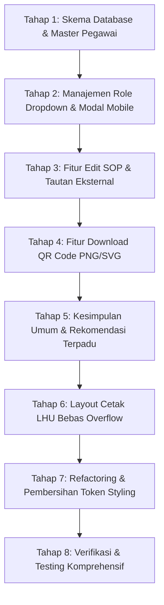

# Rencana Penyempurnaan Lanjutan & Optimasi Sistem MINAMUTU
**Dinas Perikanan Kabupaten Lembata — Nusa Tenggara Timur**

---

## 1. Latar Belakang & Tujuan
Berdasarkan evaluasi penggunaan operasional dan masukan teknis (tertuang dalam dokumen isu `Buatkan perencanaan untuk perubhan berik.yaml`), terdapat beberapa area penting yang perlu disempurnakan guna meningkatkan pengalaman pengguna (*user experience*), responsivitas pada perangkat mobile (*mobile-friendly*), legitimasi dokumen resmi kedinasan, serta fleksibilitas pengelolaan dokumen mutu eksternal.

Dokumen ini memuat arsitektur, rencana modifikasi basis data, alur antarmuka, dan tahapan implementasi teknis untuk 8 poin perubahan prioritas.

---

## 2. Rincian Kebutuhan & Solusi Teknis

### Poin 0: Migrasi Pilihan Parameter Kualitas Air ke Combobox (`/tren`)
- **Kondisi Sebelumnya**: Filter parameter pada visualisasi tren di `/tren` masih menggunakan komponen `<Select>` statis.
- **Solusi**: Telah dimigrasikan menggunakan Shadcn `<Combobox>` berbasis `@base-ui/react`, memungkinkan pengguna mengetik dan mencari di antara seluruh parameter baku mutu (Suhu, pH, DO, Amonia, Nitrit, Salinitas, Kecerahan, dll.) secara instan.

---

### Poin 1: Manajemen Role & Status Akun Berbasis Dropdown Menu & Modal (Mobile-Friendly)
- **Masalah**: Pada halaman `/pengguna`, baris tabel saat ini memiliki inline select untuk role dan tombol aksi terpisah. Pada layar ponsel pintar / tablet petugas lapangan, tabel menjadi terlalu lebar, terpotong, dan sulit disentuh (*touch target* sempit).
- **Solusi**:
  1. Gantikan kontrol inline dengan tombol aksi tunggal titik tiga (`MoreVertical` / `DotsHorizontalIcon`) berukuran `size-8`.
  2. Klik tombol memunculkan Shadcn `DropdownMenu` dengan opsi:
     - `Ubah Wewenang / Role` (ikon `ShieldCheck`) $\rightarrow$ Membuka dialog modal `UbahRoleDialog`.
     - `Nonaktifkan Akun` / `Aktifkan Akun` (ikon `UserX` / `UserCheck`) $\rightarrow$ Membuka dialog konfirmasi.
     - `Reset Password` (ikon `KeyRound`).
  3. Dialog modal responsif dirancang optimal untuk mobile dengan *safe touch area* dan tombol aksi yang jelas.

---

### Poin 2 (Isu 3): Data Master Pegawai & Penandatangan LHU Otomatis
- **Masalah**: Form uji lapangan dan dokumen cetak LHU membutuhkan identitas resmi penandatangan (Petugas Pengambil Contoh/Penguji, Verifikator Mutu, dan Kepala Dinas Perikanan) dengan NIP, Pangkat/Golongan, dan Jabatan resmi. Saat ini masih diketik manual atau hanya berupa string nama.
- **Solusi**:
  1. **Skema Database Baru**: Tabel `master_pegawai`:
     - `id`: UUID (Primary Key)
     - `nip`: VARCHAR(25) (Unik, misal: `19850315 201001 1 008`)
     - `nama`: VARCHAR(150) (Lengkap dengan gelar)
     - `jabatan`: VARCHAR(150) (misal: "Kepala Dinas Perikanan", "Pengawas Mutu Hasil Perikanan", "Petugas Lapangan")
     - `pangkat_golongan`: VARCHAR(100) (misal: "Pembina Utama Muda (IV/c)")
     - `aktif`: BOOLEAN (default `true`)
     - `role_tanda_tangan`: VARCHAR(50) (`KEPALA_DINAS`, `VERIFIKATOR`, `PETUGAS_UJI`)
  2. **Antarmuka Form Uji & Cetak**:
     - Gantikan input teks bebas dengan `Combobox` / `Select` Pegawai.
     - Penguji cukup memilih nama pegawai dari daftar; sistem otomatis mengisi NIP, Jabatan, dan Pangkat pada dokumen LHU.

---

### Poin 3 (Isu 4): Kesimpulan Umum & Saran Budidaya Menyeluruh Lintas Parameter
- **Masalah**: Evaluasi mutu saat ini menghasilkan status per parameter (Suhu, pH, Amonia, dll.). Petugas membutuhkan kolom kesimpulan komprehensif serta catatan rekomendasi lapangan menyeluruh yang mencakup keseluruhan kondisi kolam/perairan budidaya.
- **Solusi**:
  1. **Penambahan Kolom pada `uji_kualitas_air`**:
     - `kesimpulan_umum`: Teks ringkasan kondisi mutu air secara makro (misal: *"Kualitas air kolam memenuhi standar budidaya ikan bandeng dengan catatan pengelolaan amonia"*).
     - `saran_rekomendasi_lapangan`: Rekomendasi tindakan menyeluruh yang dapat diedit oleh petugas sebelum LHU diterbitkan.
  2. **Generator Rekomendasi Otomatis yang Terpadu**:
     - Sistem otomatis menyusun rekomendasi holistik berdasarkan kombinasi parameter yang tidak memenuhi syarat (misal: jika Suhu tinggi dan DO rendah, sarankan aerasi tambahan dan penambahan debit air).
     - Petugas tetap dapat menambahkan atau menyesuaikan saran lapangan sebelum finalisasi dokumen.

---

### Poin 4 (Isu 5): Standardisasi Desain & Pembersihan Arbitrary Styles Shadcn
- **Masalah**: Terdapat penggunaan arbitrary utility classes seperti `text-[11px]`, `text-[10px]`, `text-[9px]`, serta manual inline widths/heights yang tidak konsisten dengan preset tema Shadcn.
- **Solusi**:
  1. Standardisasi hierarki tipografi:
     - `text-xs` (0.75rem / 12px) untuk keterangan, badge, dan tabel data sekunder.
     - `text-sm` (0.875rem / 14px) untuk body text dan input controls standar.
     - `text-base` / `text-lg` untuk sub-heading dan card titles.
     - `text-xl` / `text-2xl` untuk halaman utama / judul laporan.
  2. Standardisasi layout token:
     - Ukuran input & trigger dropdown: `h-9` (standar) atau `h-8` (kompak).
     - Gap kontainer: `gap-2`, `gap-3`, `gap-4`.
     - Gunakan semantic color tokens: `text-muted-foreground`, `bg-muted`, `border-border`, `bg-card`, dsb.

---

### Poin 5 (Isu 6): Fitur Download QR Code (PNG & SVG)
- **Masalah**: Gambar QR Code pada dokumen SOP dan LHU saat ini hanya ditampilkan pada layar atau langsung dicetak, belum dapat diunduh sebagai berkas gambar mandiri untuk arsip, diseminasi WhatsApp, atau dicetak pada stiker terpisah.
- **Solusi**:
  1. Tambahkan tombol **"Unduh Gambar QR (PNG)"** dan **"Unduh Vektor QR (SVG)"** pada:
     - Halaman Cetak Stiker Label (`/instruksi-kerja/[id]/cetak-label`).
     - Modal Dialog Pratinjau QR pada tabel SOP.
     - Halaman Verifikasi Publik (`/verifikasi/[hash]`).
  2. Fungsi client-side download: Mengonversi data URL base64 atau canvas ke file `QR-[KODE_IK].png` dengan nama file yang rapi.

---

### Poin 6 (Isu 7): Eliminasi Overflow-Auto pada Halaman Cetak Laporan
- **Masalah**: Layout cetak LHU (`/laporan/[uji_id]/cetak`) memiliki pembungkus dengan `overflow-x-auto` yang menyebabkan tampilan pratinjau dan hasil cetak fisik/PDF berpotensi terpotong atau memunculkan scrollbar yang tidak diinginkan.
- **Solusi**:
  1. Hapus kelas `overflow-auto` / `overflow-x-auto` pada kontainer dokumen cetak `.lhu-print-document`.
  2. Terapkan CSS cetak profesional:
     ```css
     @media print {
       .print-area {
         overflow: visible !important;
         width: 100% !important;
         max-width: none !important;
         box-shadow: none !important;
         border: none !important;
         margin: 0 !important;
         padding: 0 !important;
       }
       .lhu-page {
         page-break-inside: avoid !important;
         break-inside: avoid !important;
       }
     }
     ```
  3. Tetapkan lebar dokumen pratinjau desktop tepat proporsional rasio A4 (`max-w-[210mm]`).

---

### Poin 7 (Isu 8): Fitur Edit Dokumen Mutu / SOP (Instruksi Kerja)
- **Masalah**: Tabel SOP di `/instruksi-kerja` hanya memiliki tombol Tambah dan Hapus. Jika petugas ingin memperbarui tautan Google Drive / link eksternal atau memperbaiki salah ketik judul, mereka terpaksa menghapus data lama yang akan membatalkan QR Code yang telah ditempel di lapangan.
- **Solusi**:
  1. **Server Action**: Buat `updateInstruksiKerjaAction(id, data)`:
     - Mengizinkan pembaruan `judul`, `kategori`, `file_path` (tautan eksternal/internal), dan `versi`.
     - Mempertahankan `qr_code_hash` yang sama agar stiker QR fisik yang sudah tercetak di lapangan **tetap valid** dan otomatis mengarah ke tautan terbaru!
  2. **Komponen UI**: Dialog modal `EditIKDialog` dengan pre-filled data dan deteksi tautan eksternal *real-time*.

---

## 3. Tahapan Eksekusi Bertahap



### Rincian Rencana Kerja per Tahap:

| Tahap | Modul Terkait | Target Hasil |
| :--- | :--- | :--- |
| **Tahap 1** | `db/schema.ts`, `db/seed.ts`, `lib/actions/pegawai.ts` | Tabel `master_pegawai` aktif lengkap dengan data awal pejabat dan petugas Dinas Perikanan Lembata. |
| **Tahap 2** | `app/(dashboard)/pengguna/client.tsx` | Tabel pengguna mobile-friendly dengan `DropdownMenu` aksi & modal ubah role yang elegan. |
| **Tahap 3** | `app/(dashboard)/instruksi-kerja/client.tsx`, `lib/actions/instruksi-kerja.ts` | Modal edit SOP aktif, mempertahankan QR hash fisik saat update tautan eksternal. |
| **Tahap 4** | `components/qr-download-button.tsx`, `cetak-label/page.tsx` | Tombol download QR PNG & SVG siap pakai dengan nama berkas standar. |
| **Tahap 5** | `lib/validations/uji-kualitas.ts`, `components/form-uji-lapangan.tsx`, `cetak/page.tsx` | Field kesimpulan & saran menyeluruh aktif di form input dan tercantum pada dokumen LHU. |
| **Tahap 6** | `app/(dashboard)/laporan/[uji_id]/cetak/page.tsx`, `app/globals.css` | Format cetak A4 presisi tanpa scrollbar overflow, siap cetak fisik dan ekspor PDF. |
| **Tahap 7** | Seluruh komponen `components/` & `app/` | Penghapusan arbitrary pixel styling dan standardisasi token Tailwind v4 & Shadcn preset. |
| **Tahap 8** | Testing, TypeScript validation, Turbopack build | Validasi tipe data (0 error), build sukses, dan pengujian alur visual via browser subagent. |

---

## 4. Kriteria Keberhasilan (*Acceptance Criteria*)
1. Tidak ada error TypeScript (`bunx --bun tsc --noEmit` = 0 error).
2. Build produksi (`bun run build`) berhasil 100% tanpa kendala SSR.
3. Seluruh dropdown yang memerlukan pencarian menggunakan Shadcn `Combobox`.
4. Scan QR pada SOP eksternal langsung mengalihkan (*redirect*) ke tautan dokumen asli.
5. Tabel pengguna responsif dan nyaman digunakan pada layar smartphone.
6. Berkas QR Code dapat diunduh dalam format PNG resolusi tinggi.
7. Dokumen cetak LHU rapi sesuai standar format dinas dan pas pada kertas A4 tanpa overflow.
