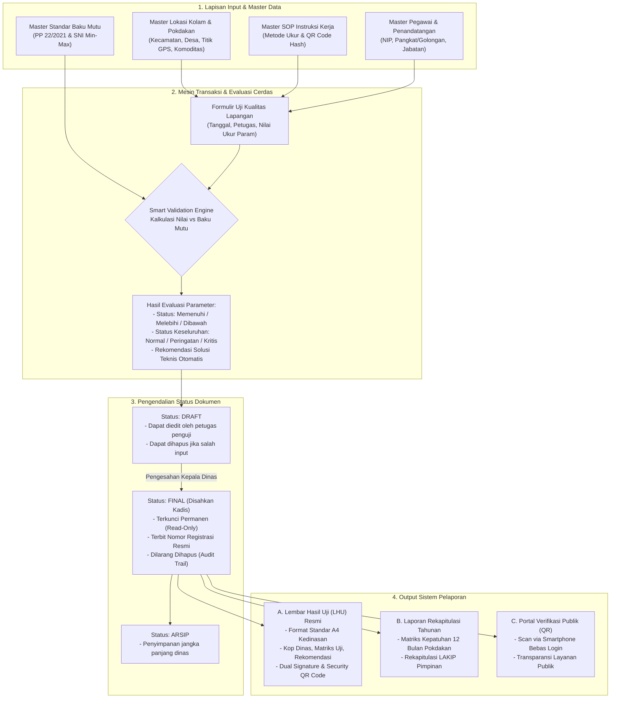
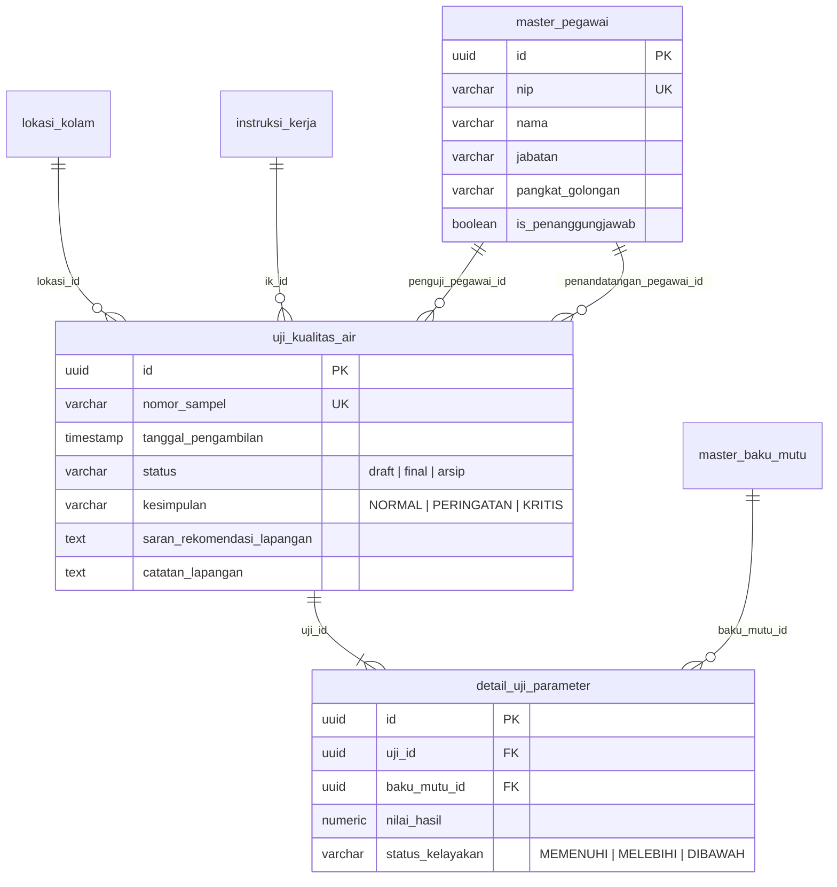
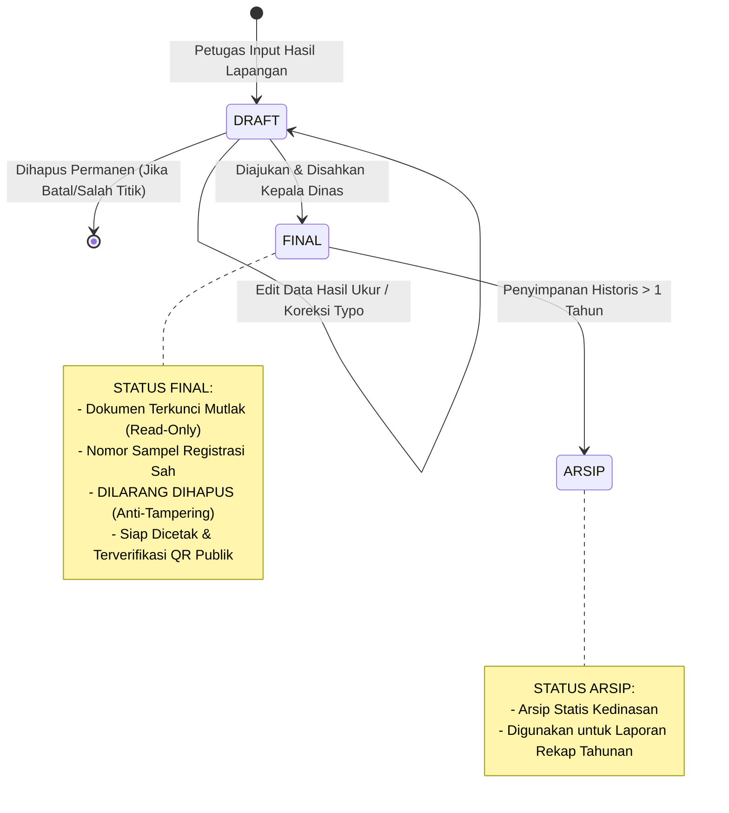
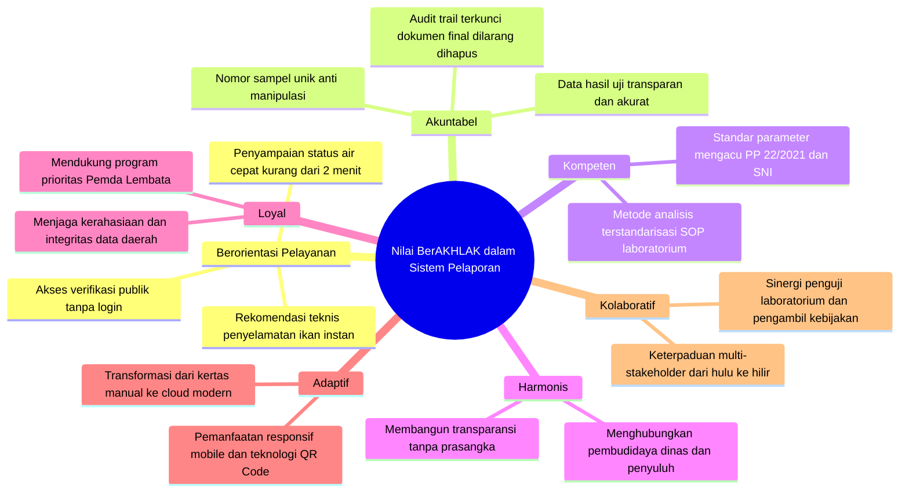

# 📄 DOKUMEN BUKTI EVIDEN AKTUALISASI LATSAR CPNS
## TAHAPAN KEGIATAN: PENYIAPAN KONSEP SISTEM PELAPORAN PEMANTAUAN MUTU AIR BUDIDAYA PERIKANAN TERPADU

---

### 📌 LEMBAR IDENTITAS EVIDEN AKTUALISASI

| Parameter Dokumen | Keterangan Rinci |
| :--- | :--- |
| **Kegiatan Utama** | Perancangan dan Pembangunan Prototype Sistem Informasi Pemantauan Mutu Air Budidaya Perikanan Terpadu |
| **Tahapan Kegiatan** | Menyiapkan bahan rancangan aktualisasi pembuatan instruksi kerja dan rancangan outline diagram alir serta konsep sistem pelaporan |
| **Output / Bukti Fisik (Eviden)** | **Dokumen Konsep Sistem Pelaporan Pemantauan Mutu Air Budidaya Perikanan Terpadu** (Khusus Konsep Sistem Pelaporan) |
| **Nama Peserta / Penyusun** | **MELANIA HERLINDA LETE BORO, S.Si** |
| **NIP** | **19940318 202506 2 005** |
| **Pangkat / Golongan** | Penata Muda / III-a |
| **Jabatan** | Pengelola Pengawasan Mutu Air |
| **Unit Kerja / Instansi** | Dinas Perikanan Kabupaten Lembata, Provinsi Nusa Tenggara Timur |
| **Angkatan Latsar** | **353** |
| **Nomor Presensi / Absen** | **8** |
| **Mentor** | **Hadi Umar, S.Pd., MT** (Kepala Dinas Perikanan Kabupaten Lembata) |
| **Coach** | Coach Pelatihan Dasar CPNS |
| **Tahun Pelaksanaan** | **2026** |

---

## DAFTAR ISI

1. [BAB I: PENDAHULUAN & URGENSI KONSEP PELAPORAN](#bab-i-pendahuluan--urgensi-konsep-pelaporan)
   - 1.1 Latar Belakang Masalah Pelaporan Eksisting
   - 1.2 Tujuan & Sasaran Konsep Sistem Pelaporan
   - 1.3 Landasan Yuridis & Standar Acuan
2. [BAB II: ARSITEKTUR & ALIRAN DATA SISTEM PELAPORAN](#bab-ii-arsitektur--aliran-data-sistem-pelaporan)
   - 2.1 Diagram Alir Data Pelaporan (*Data Flow Architecture*)
   - 2.2 Integrasi Antar-Entitas Basis Data
3. [BAB III: TAKSONOMI & STRUKTUR OUTPUT PELAPORAN](#bab-iii-taksonomi--struktur-output-pelaporan)
   - 3.1 Laporan Hasil Uji (LHU) Individual Transaksional
   - 3.2 Laporan Rekapitulasi Berkala & Evaluasi Tahunan
   - 3.3 Portal Verifikasi Publik Berbasis QR Code
4. [BAB IV: MANAJEMEN SIKLUS HIDUP DOKUMEN (*DOCUMENT LIFECYCLE*)](#bab-iv-manajemen-siklus-hidup-dokumen-document-lifecycle)
   - 4.1 Tahapan Status Dokumen: *Draft* ➔ *Final* ➔ *Arsip*
   - 4.2 Kebijakan Integritas & Proteksi Audit Trail (*Anti-Tampering*)
5. [BAB V: TATA KELOLA HAK AKSES & OTORISASI PELAPORAN (RBAC)](#bab-v-tata-kelola-hak-akses--otorisasi-pelaporan-rbac)
   - 5.1 Matriks Kewenangan Penerbitan & Pengesahan Laporan
   - 5.2 Mekanisme Pejabat Penanggung Jawab (*Default Signer*)
6. [BAB VI: INTERKONEKSI DENGAN NILAI-NILAI DASAR ASN BerAKHLAK](#bab-vi-interkoneksi-dengan-nilai-nilai-dasar-asn-berakhlak)
7. [BAB VII: LEMBAR PERSETUJUAN & PENGESAHAN MENTOR](#bab-vii-lembar-persetujuan--pengesahan-mentor)

---

## BAB I: PENDAHULUAN & URGENSI KONSEP PELAPORAN

### 1.1 Latar Belakang Masalah Pelaporan Eksisting
Kabupaten Lembata memiliki potensi budidaya perikanan air tawar dan payau yang tersebar di berbagai kelompok pembudidaya ikan (Pokdakan). Kualitas air merupakan faktor penentu vital dalam kelangsungan hidup biota air (seperti ikan Nila, Lele, Bandeng, dan Patin). Fluktuasi parameter kualitas air seperti penurunan oksigen terlarut (*Dissolved Oxygen / DO*) secara drastis atau lonjakan amonia racun (*Free Ammonia / NH₃-N*) dapat memicu kematian massal ikan dalam hitungan jam.

Sebelum adanya gagasan sistem pelaporan digital terpadu ini, mekanisme pelaporan hasil pemantauan mutu air di Dinas Perikanan Kabupaten Lembata masih dilakukan secara konvensional dengan serangkaian kelemahan kritis:
1. **Keterlambatan Penyampaian Informasi (*Information Lag*)**: Hasil pengujian dicatat di buku catatan lapangan, lalu diketik manual di komputer dinas berhari-hari kemudian. Akibatnya, rekomendasi penanganan terlambat diterima pembudidaya, dan ikan seringkali telah mengalami kematian massal.
2. **Kerapuhan Arsip Fisik (*Physical Risk & Vulnerability*)**: Dokumen lembar uji kertas rentan basah terkena air kolam, luntur, sobek, atau tercecer saat pergantian petugas lapangan.
3. **Format yang Tidak Terstandarisasi**: Format laporan hasil uji seringkali bervariasi antar-petugas, tidak menyertakan rujukan baku mutu nasional yang valid, dan tidak memiliki standar penomoran registrasi yang seragam.
4. **Ketiadaan Validasi Cerdas (*No Instant Smart Validation*)**: Petugas lapangan harus mencocokkan angka hasil uji secara manual dengan buku tabel baku mutu, membuka peluang terjadinya *human error* dalam menarik kesimpulan status kelayakan air.
5. **Kesulitan Pelacakan Historis & Agregasi Tahunan**: Saat pimpinan dinas membutuhkan data tren tahunan untuk menyusun dokumen Laporan Kinerja Instansi Pemerintah (LKjIP/LAKIP) atau penentuan alokasi bantuan sarana budidaya, petugas harus membongkar tumpukan arsip fisik satu per satu.

Oleh karena itu, **penyiapan Konsep Sistem Pelaporan Pemantauan Mutu Air Budidaya Perikanan Terpadu** menjadi tahapan fundamental agar output laporan tidak hanya sekadar formalitas administratif, melainkan instrumen hukum yang sah, cepat, akuntabel, dan transparan.

---

### 1.2 Tujuan & Sasaran Konsep Sistem Pelaporan

#### A. Tujuan Konseptual:
1. **Digitalisasi Penuh Dokumen Mutu**: Mengubah rantai pencatatan hasil ukur lapangan menjadi penerbitan dokumen resmi **Lembar Hasil Uji (LHU)** berstandar kedinasan secara instan (sekali klik).
2. **Automasi Evaluasi Parameter**: Menghubungkan pembacaan alat ukur dengan modul batas aman baku mutu nasional sehingga menghasilkan kesimpulan status (Normal, Peringatan, Kritis) dan rekomendasi penanganan otomatis.
3. **Penegakan Integritas & Legalitas**: Menyediakan mekanisme pengesahan digital berjenjang (*dual authorization*) antara Penguji Mutu Air dan Kepala Dinas Perikanan, dilengkapi dengan *Security QR Code* anti-pemalsuan.
4. **Penyajian Data Makro bagi Pimpinan**: Menyediakan rekapitulasi data pengujian berkala dan tahunan berbasis Pokdakan dan kecamatan untuk mendukung kebijakan berbasis bukti (*evidence-based policy*).

#### B. Sasaran Pengguna (*Target Stakeholders*):
- **Kelompok Pembudidaya Ikan (Pokdakan)**: Menerima bukti tertulis status kesehatan air kolam beserta langkah perbaikan teknis secara cepat.
- **Petugas Penguji Mutu Air**: Memiliki instrumen pelaporan yang cepat, presisi, dan terbebas dari beban pengetikan manual berulang.
- **Kepala Dinas Perikanan / Pimpinan Instansi**: Memantau kualitas air lintas kecamatan secara *real-time* dan menandatangani dokumen LHU resmi secara digital.
- **Masyarakat Luar / Mitra Usaha / Pembeli Ikan**: Dapat memverifikasi keabsahan mutu air kolam asal ikan melalui pemindaian QR Code pada portal publik tanpa perlu login.

---

### 1.3 Landasan Yuridis & Standar Acuan
Penyusunan konsep sistem pelaporan ini berlandaskan pada ketentuan perundang-undangan dan standar teknis resmi:
1. **Undang-Undang Nomor 20 Tahun 2023** tentang Aparatur Sipil Negara (transformasi digital birokrasi dan akuntabilitas kinerja ASN).
2. **Peraturan Pemerintah Republik Indonesia Nomor 22 Tahun 2021** tentang Penyelenggaraan Perlindungan dan Pengelolaan Lingkungan Hidup, khususnya **Lampiran VI (Baku Mutu Air Nasional untuk Badan Air Kelas II dan Kelas III)**.
3. **Keputusan Menteri Kelautan dan Perikanan Republik Indonesia Nomor 28/KEPMEN-KP/2019** tentang Standar Pelayanan Minimal Sektor Kelautan dan Perikanan.
4. **Standar Nasional Indonesia (SNI)** Budidaya Perikanan:
   - SNI 01-6141: Produksi Ikan Nila (*Oreochromis niloticus*) Kelas Pembesaran di Kolam Air Tawar.
   - SNI 7545.1: Produksi Ikan Lele Dumbo (*Clarias gariepinus*) Kelas Pembesaran di Kolam Terpal/Tanah.
5. **Peraturan Arsip Nasional Republik Indonesia (ANRI) Nomor 6 Tahun 2021** tentang Pengelolaan Arsip Dinamis Elektronik.

---

## BAB II: ARSITEKTUR & ALIRAN DATA SISTEM PELAPORAN

Konsep sistem pelaporan didesain dengan pendekatan arsitektur berlapis (*layered architecture*), di mana laporan bukan berdiri sendiri melainkan merupakan hilir pemrosesan dari master data dan transaksi pengujian lapangan.

### 2.1 Diagram Alir Data Pelaporan (*Data Flow Architecture*)

---

### 2.2 Integrasi Antar-Entitas Basis Data Pelaporan

Sistem pelaporan mengonsolidasikan 6 entitas data relasional utama untuk menjamin integritas dokumen:

*Penjelasan Rantai Integritas Dokumen Pelaporan:*
1. **Nomor Registrasi Unik (`nomor_sampel`)**: Setiap lembar laporan memiliki kode unik berformat `SPL-YYYY-MM-XXXX` yang di-generate otomatis oleh sistem saat pengujian dibuat, mencegah timbulnya dokumen ganda atau nomor pelaporan fiktif.
2. **Keterikatan Baku Mutu (`baku_mutu_id`)**: Angka hasil ukur pada laporan secara matematis terikat dengan standar acuan regulasi yang berlaku pada saat sampel diambil, sehingga jika regulasi nasional diperbarui di kemudian hari, arsip laporan lama tidak akan berubah nilainya.
3. **Keterikatan Identitas Penandatangan (`penguji_pegawai_id` & `penandatangan_pegawai_id`)**: Mengikat aparatur penanggung jawab secara sah melalui NIP, Pangkat, dan Jabatan resmi.

---

## BAB III: TAKSONOMI & STRUKTUR OUTPUT PELAPORAN

Konsep sistem pelaporan pemantauan mutu air ini menghasilkan 3 (tiga) varian instrumen pelaporan yang saling melengkapi:

---

### 3.1 Laporan Hasil Uji (LHU) Individual Transaksional

Dokumen LHU merupakan instrumen pelaporan utama yang berkekuatan hukum legal kedinasan. Dokumen ini diserahkan kepada kelompok pembudidaya ikan sebagai sertifikat kepatuhan mutu air kolam mereka.

#### A. Komponen Anatomi LHU Standar Kedinasan (Format Kertas A4):
1. **Kepala Surat (Kop Resmi Dinas Perikanan Kabupaten Lembata)**:
   - Logo Resmi Pemerintah Kabupaten Lembata.
   - Identitas Satuan Kerja: *"PEMERINTAH KABUPATEN LEMBATA — DINAS PERIKANAN"*.
   - Alamat instansi, kode pos, email resmi dinas, serta garis pembatas kop tebal-tipis ganda kedinasan.
2. **Judul Dokumen & Nomor Registrasi Legal**:
   - Judul resmi: **LEMBAR HASIL UJI KUALITAS AIR BUDIDAYA (LHU)**.
   - Nomor Registrasi: `Nomor: 523 / LHU-MUTU / [NOMOR_SAMPEL] / 2026`.
3. **Metadata Identitas Lokasi & Sampel**:
   - Nama Kelompok Pembudidaya (Pokdakan) & Nama Pemilik Kolam.
   - Alamat Lokasi Kolam (Desa dan Kecamatan di wilayah Kab. Lembata).
   - Titik Koordinat GPS (Garis Lintang & Bujur) guna kepastian lokasi fisik kolam.
   - Jenis Komoditas Budidaya (Nila, Lele, Bandeng, Mas, Patin).
   - Tanggal dan Jam Pengambilan Sampel Air.
   - Prosedur Operasional Standar (SOP) acuan pengujian yang digunakan.
4. **Tabel Matriks Uji Komparatif Kualitas Air**:
   Tabel sistematis yang menampilkan 6 parameter inti kualitas air budidaya:

   | No | Parameter Uji | Satuan | Hasil Pengujian | Nilai Rujukan Baku Mutu | Status Kelayakan | Metode Analisis / Alat |
   |:--:|:---|:--:|:--:|:--:|:--:|:---|
   | 1 | Suhu Air | °C | [Hasil] | 28,00 – 32,00 | Memenuhi / Sesuai | In-situ Digital Thermometer |
   | 2 | Derajat Keasaman (pH) | - | [Hasil] | 6,50 – 8,50 | Memenuhi / Abnormal | pH Meter Glass Electrode |
   | 3 | Oksigen Terlarut (DO) | mg/L | [Hasil] | ≥ 3,00 – 5,00 | Memenuhi / Kurang | Optical DO Meter / Winkler |
   | 4 | Amonia Bebas (NH₃-N) | mg/L | [Hasil] | ≤ 0,02 | Memenuhi / Melebihi | Spektrofotometri Fenat |
   | 5 | Nitrit (NO₂-N) | mg/L | [Hasil] | ≤ 0,06 | Memenuhi / Melebihi | Kolorimetri Asam Sulfanilat |
   | 6 | Kecerahan / Turbiditas | cm / NTU | [Hasil] | ≥ 30 cm / ≤ 25 NTU | Memenuhi / Keruh | Secchi Disk / Turbidimeter |

5. **Kesimpulan & Rekomendasi Solusi Teknis Lapangan (*Actionable Advice*)**:
   - **Badge Kesimpulan Umum**: Ditampilkan dengan indikator visual dan teks tegas:
     * 🟢 **NORMAL**: Seluruh parameter memenuhi baku mutu perikanan.
     * 🟡 **PERINGATAN**: 1–2 parameter mendekati ambang batas kritis.
     * 🔴 **KRITIS**: Parameter toksik terlampaui, ancaman kematian ikan tinggi.
   - **Rekomendasi Tindakan Cepat (*Automatic Advisory*)**:
     * Bila DO Kurang (<3.0 mg/L): Nyalakan aerasi tambahan / pompa sirkulasi air segera, hindari pemberian pakan berlebih pada sore/malam hari.
     * Bila Amonia/Nitrit Melebihi Batas (>0.02 mg/L): Lakukan penyiponan kotoran dasar kolam secara menyeluruh, puasakan ikan 24 jam atau kurangi pakan 50%, ganti air sebanyak 20–30%.
     * Bila pH Terlalu Rendah / Asam (<6.5): Lakukan pengapuran secara bertahap menggunakan kapur pertanian (Dolomit atau Kaptan) sesuai dosis debit kolam.
6. **Blok Pengesahan Ganda (*Dual Digital Signature Box*)**:
   - Kolom Kiri: **Petugas Penguji Mutu Air** (Nama Lengkap: Melania Herlinda Lete Boro, S.Si — NIP. 19940318 202506 2 005).
   - Kolom Kanan: **Kepala Dinas Perikanan Kabupaten Lembata** (Nama Lengkap: Hadi Umar, S.Pd., MT — Pangkat/Golongan & NIP).
7. **Security Verification QR Code**:
   - Barcode dua dimensi tersemat di sudut dokumen yang menautkan pembaca ke URL verifikasi publik untuk membuktikan keaslian dokumen tanpa risiko pemalsuan cetak.

---

### 3.2 Laporan Rekapitulasi Berkala & Evaluasi Tahunan

Instrumen pelaporan makro yang ditujukan untuk penanggung jawab program, Kepala Seksi, Kepala Bidang, hingga Kepala Dinas Perikanan.

#### A. Fitur & Karakteristik Laporan Rekapitulasi:
1. **Matriks Evaluasi Kepatuhan 12 Bulan (Januari s.d. Desember)**:
   Menampilkan rekapitulasi status mutu per Pokdakan sepanjang tahun kalender, sehingga mempermudah deteksi musiman (misalnya kolam yang selalu memburuk kualitas airnya pada peralihan musim kemarau di bulan September–Oktober).
2. **Agregasi Sebaran Wilayah per Kecamatan**:
   Menyajikan perbandingan rasio kolam berstatus Normal, Peringatan, dan Kritis di tiap kecamatan (Nubatukan, Ile Ape, Lebatukan, Atadei, Omesuri, Buyasuri, dll.).
3. **Penyusunan Bahan LAKIP / Renja Dinas**:
   Menghasilkan data statistik kepatuhan mutu air sebagai indikator kinerja utama (IKU) dinas dalam memastikan keberlanjutan sektor perikanan budidaya daerah.

---

### 3.3 Portal Verifikasi Publik Berbasis QR Code

Inovasi pelaporan terbuka yang menjamin prinsip transparansi (*Good Governance*) dan keterbukaan informasi publik:
1. **Aksesibilitas Tanpa Batas (*Zero-Login Requirement*)**: Pembudidaya, pedagang pengepul ikan, restoran, maupun konsumen akhir dapat memindai QR Code menggunakan kamera ponsel pintar manapun tanpa perlu membuat akun atau memasukkan kata sandi.
2. **Tampilan Responsif Mobile**: Ringkasan sertifikat LHU disajikan secara ringkas dan bersih pada layar ponsel, menampilkan: nomor sampel, nama Pokdakan, komoditas ikan, tanggal uji, kesimpulan status air, dan keabsahan tanda tangan dinas.
3. **Mencegah Penipuan Mutu**: Menghindari peredaran ikan berpenyakit atau ikan hasil budidaya air tercemar yang diklaim sehat oleh oknum penjual.

---

## BAB IV: MANAJEMEN SIKLUS HIDUP DOKUMEN (*DOCUMENT LIFECYCLE*)

Untuk menjamin integritas hukum laporan hasil uji dan mencegah pelanggaran tata kelola administrasi (seperti manipulasi nilai atau penghapusan arsip bukti audit), sistem pelaporan menerapkan tata kelola siklus hidup dokumen (*document lifecycle management*):

### 4.1 Tahapan Status Dokumen

#### Aturan Perilaku Dokumen per Status:
1. **Status `DRAFT`**:
   - Kondisi: Pengukuran lapangan baru selesai diinput oleh Petugas Lapangan atau Pengelola Mutu.
   - Hak Akses: Petugas dapat mengedit angka hasil uji, memperbaiki catatan lapangan, atau menghapus berkas jika terjadi kesalahan fatal pengambilan sampel.
   - Batasan: Belum memiliki keabsahan legal formal dan tidak boleh diserahkan kepada pihak luar dinas sebagai sertifikat resmi.
2. **Status `FINAL`**:
   - Kondisi: Data pengujian telah ditinjau dan disetujui oleh Kepala Dinas / Penanggung Jawab Mutu.
   - Hak Akses: **TERKUNCI PENUH (READ-ONLY)**.
   - **Ketentuan Anti-Penghapusan**: Backend sistem secara mutlak **menolak instruksi hapus (DELETE)** untuk dokumen berstatus `FINAL`. Tombol edit dinonaktifkan.
   - Prosedur Koreksi: Jika ditemukan ketidaksesuaian laboratorium pasca-finalisasi, prosedur yang berlaku adalah penerbitan dokumen Berita Acara Adendum Koreksi, bukan menghapus atau menimpa berkas yang lama.
3. **Status `ARSIP`**:
   - Kondisi: Dokumen lampau yang telah melewati periode pembinaan musim berjalan.
   - Hak Akses: Read-only untuk referensi analitik tren tahunan dan audit inspektorat daerah.

---

### 4.2 Kebijakan Integritas & Proteksi Audit Trail (*Anti-Tampering*)

Dalam rangka mematuhi standar audit Badan Pemeriksa Keuangan (BPK) dan Inspektorat Daerah, konsep sistem pelaporan menerapkan 4 pilar proteksi integritas:
1. **Database Foreign Key Restriction (`ON DELETE RESTRICT`)**:
   Master data kolam, master pegawai penandatangan, dan standar baku mutu tidak dapat dihapus dari database apabila telah memiliki keterkaitan dengan minimal satu lembar laporan pengujian.
2. **Immutable Unique Sample Code**:
   Nomor sampel (`SPL-YYYY-MM-XXXX`) terkunci permanen pada tingkat skema basis data (*unique constraint*), sehingga tidak memungkinkan timbul celah hilangnya urutan berkas (*missing document gap*).
3. **Cryptographic QR Code Hashing**:
   QR Code pada dokumen LHU dibuat menggunakan algoritma hash acak unik yang tersimpan di database, bukan sekadar tautan ID urut sederhana, sehingga tidak dapat dimanipulasi atau ditebak (*brute-forced*) oleh pihak yang tidak berwenang.
4. **Soft-Disable Fallback Policy**:
   Jika seorang pegawai penguji mutasi atau kolam pembudidaya beralih fungsi, entitas tidak dihapus melainkan dialihkan statusnya menjadi non-aktif (`aktif = false`), sehingga seluruh arsip dokumen pelaporan masa lampau tetap utuh 100%.

---

## BAB V: TATA KELOLA HAK AKSES & OTORISASI PELAPORAN (RBAC)

Sistem pelaporan menerapkan prinsip **Role-Based Access Control (RBAC)** dan **Separation of Duties** demi mencegah benturan kepentingan (*conflict of interest*) dan penyalahgunaan wewenang.

### 5.1 Matriks Kewenangan Penerbitan & Pengesahan Laporan

| Peran Pengguna (*Role*) | Input Data Pengujian | Koreksi Draf Laporan | Hapus Draf Laporan | Finalisasi & Pengesahan Dokumen | Cetak LHU Resmi Standar Dinas | Akses Rekap Tahunan |
| :--- | :---: | :---: | :---: | :---: | :---: | :---: |
| **Administrator (`admin`)** | ✅ Ya | ✅ Ya | ✅ Ya | ✅ Ya | ✅ Ya | ✅ Ya |
| **Pengelola Mutu Air (`pengelola_mutu`)** *(Melania H. L. Boro, S.Si)* | ✅ Ya | ✅ Ya | ✅ Ya | ⚠️ Review & Verifikasi Teknis | ✅ Ya | ✅ Ya |
| **Petugas Penguji Lapangan (`petugas_lapangan`)** | ✅ Ya | ✅ Ya (Milik Sendiri) | ✅ Ya (Milik Sendiri) | ❌ Dilarang | ⚠️ Cetak Draf Lapangan | ❌ Dilarang |
| **Kepala Dinas Perikanan (`kepala_dinas`)** *(Hadi Umar, S.Pd., MT)* | 👁️ Monitoring | 👁️ Monitoring | ❌ Dilarang | ✅ **Otoritas Tunggal Pengesahan** | ✅ **Tanda Tangan & Cetak** | ✅ Akses Penuh |
| **Masyarakat / Pokdakan (Publik)** | ❌ Dilarang | ❌ Dilarang | ❌ Dilarang | ❌ Dilarang | ❌ Dilarang | 👁️ Scan QR Bebas |

---

### 5.2 Mekanisme Pejabat Penanggung Jawab (*Default Signer*)

Untuk mempermudah operasional harian pelaporan tanpa mengabaikan tertib birokrasi, sistem mengimplementasikan logika otomatis:
1. Pada master data pegawai, terdapat penanda khusus `is_penanggungjawab: boolean`.
2. Sistem memastikan hanya ada **1 (satu) orang pejabat aktif** yang memegang status penanggung jawab utama (Kepala Dinas definitif atau Pelaksana Tugas/Plt).
3. Saat formulir pengujian air dibuka, sistem secara otomatis menetapkan pejabat berstatus `is_penanggungjawab = true` sebagai pejabat penandatangan default pada lembar LHU.
4. Jika terjadi mutasi kepemimpinan atau pendelegasian wewenang dinas, Administrator cukup mengalihkan penanda `is_penanggungjawab` ke pejabat baru tanpa merusak nama penandatangan pada arsip dokumen LHU lama yang telah diterbitkan sebelumnya.

---

## BAB VI: INTERKONEKSI DENGAN NILAI-NILAI DASAR ASN BerAKHLAK

Penyusunan konsep sistem pelaporan pemantauan mutu air ini merupakan pengejawantahan langsung Core Values ASN **BerAKHLAK**:

1. **Berorientasi Pelayanan**:
   - Memangkas waktu tunggu penerbitan laporan dari 3–5 hari menjadi **kurang dari 2 menit**.
   - Menyertakan rekomendasi penanganan otomatis sehingga pembudidaya segera mengetahui tindakan darurat penyelamatan kolam budidaya mereka.
2. **Akuntabel**:
   - Menghasilkan laporan yang tidak dapat dimanipulasi (*anti-tampering*).
   - Dokumen final terkunci permanen, menjamin pertanggungjawaban aparatur yang dapat diaudit sewaktu-waktu oleh pengawas internal pemerintah.
3. **Kompeten**:
   - Merancang instrumen pelaporan yang selaras dengan standar keilmuan dan regulasi nasional (PP No. 22/2021 dan SNI).
   - Meningkatkan profesionalisme aparatur pengelola pengawasan mutu air.
4. **Harmonis**:
   - Menjembatani komunikasi yang transparan antara dinas dengan kelompok pembudidaya ikan, menghindarkan kesalahpahaman saat terjadi kendala kematian ikan.
5. **Loyal**:
   - Mewujudkan komitmen pengabdian kepada instansi Dinas Perikanan Kabupaten Lembata dengan menghadirkan karya inovasi yang mengharumkan nama daerah.
6. **Adaptif**:
   - Bertindak proaktif merespons era digitalisasi pemerintahan (SPBE) dengan mengonversi berkas fisik rentan rusak menjadi sistem pelaporan elektronik modern berbasis web dan QR Code.
7. **Kolaboratif**:
   - Mengintegrasikan peran penguji teknis, penyuluh lapangan, dan pimpinan dinas dalam satu rantai persetujuan pelaporan digital yang sinergis.

---

## BAB VII: LEMBAR PERSETUJUAN & PENGESAHAN MENTOR

Dokumen Konsep Sistem Pelaporan Pemantauan Mutu Air Budidaya Perikanan Terpadu ini telah diperiksa, dikonsultasikan, dan disetujui sebagai **Bukti Fisik (Eviden) Sah** pelaksanaan tahapan rancangan aktualisasi Pelatihan Dasar CPNS:

 

**Disetujui dan Disahkan di Lewoleba, Kabupaten Lembata**  
Pada Tanggal: &nbsp;&nbsp;&nbsp;&nbsp;&nbsp;&nbsp;&nbsp;&nbsp;&nbsp;&nbsp;&nbsp;&nbsp;&nbsp;&nbsp;&nbsp;&nbsp;&nbsp;&nbsp;&nbsp;&nbsp;&nbsp;&nbsp;&nbsp;&nbsp;&nbsp;&nbsp;&nbsp;&nbsp; 2026

 

| Peserta Latsar CPNS / Penyusun, | Mengetahui / Menyetujui, Mentor Latsar CPNS, Kepala Dinas Perikanan Kabupaten Lembata |
| :---: | :---: |
|      |      |
| **MELANIA HERLINDA LETE BORO, S.Si** | **HADI UMAR, S.Pd., MT** |
| NIP. 19940318 202506 2 005 | Pembina Tk. I / IV-b NIP. [NIP Mentor] |

---

> **Catatan Lampiran Pendukung Eviden:**  
> Dokumen konsep ini didukung oleh implementasi kode nyata sistem pelaporan pada berkas proyek:
> 1. Cetak LHU Standar Kedinasan: `app/(dashboard)/laporan/[uji_id]/cetak/page.tsx`
> 2. Laporan Rekapitulasi Tahunan: `app/(dashboard)/laporan/rekap-tahunan/page.tsx`
> 3. Mesin Validasi Baku Mutu & Solusi: `lib/validasi-baku-mutu.ts`
> 4. Generator QR Code Verifikasi: `lib/qr.ts`
> 5. Skema Relasi Basis Data Pelaporan: `db/schema.ts`
