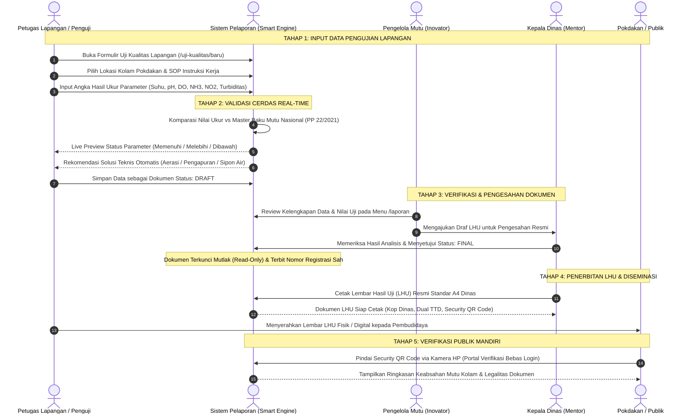

# 📄 DOKUMEN BUKTI EVIDEN AKTUALISASI LATSAR CPNS
## KEGIATAN 2: PERANCANGAN DAN PENYUSUNAN DRAF INSTRUKSI KERJA PENGUJIAN KUALITAS AIR SERTA PROTOTIPE SISTEM PELAPORAN
### TAHAPAN 4: MERANCANG ALUR PROSES BISNIS, FORMULIR INPUT, DAN PROTOTIPE SISTEM PELAPORAN DIGITAL DATA MUTU AIR

---

### 📌 LEMBAR IDENTITAS EVIDEN AKTUALISASI

| Parameter Dokumen | Keterangan Rinci |
| :--- | :--- |
| **Kegiatan Utama (Kegiatan 2)** | Perancangan dan penyusunan draf Instruksi Kerja Pengujian Kualitas Air serta Prototipe Sistem Pelaporan |
| **Tahapan Kegiatan (Tahapan 4)** | **Merancang alur proses bisnis, formulir input, dan prototipe Sistem Pelaporan digital data mutu air** |
| **Output / Bukti Fisik (Eviden)** | **Dokumen Rancangan Alur Proses Bisnis, Formulir Input, dan Prototipe Sistem Pelaporan Digital Data Mutu Air Budidaya Perikanan Terpadu** |
| **Nama Peserta / Penyusun** | **MELANIA HERLINDA LETE BORO, S.Si** |
| **NIP** | **19940318 202506 2 005** |
| **Pangkat / Golongan** | Penata Muda / III-a |
| **Jabatan** | Pengelola Pengawasan Mutu Air |
| **Unit Kerja / Instansi** | Dinas Perikanan Kabupaten Lembata, Provinsi Nusa Tenggara Timur |
| **Angkatan Latsar** | **353** |
| **Nomor Presensi / Absen** | **8** |
| **Mentor** | **Hadi Umar, S.Pd., MT** (Kepala Dinas Perikanan Kabupaten Lembata) |
| **Coach** | Coach Pelatihan Dasar CPNS |
| **Tahun Pelaksanaan** | **2026** |

---

## DAFTAR ISI

1. [BAB I: PENDAHULUAN](#bab-i-pendahuluan)
   - 1.1 Latar Belakang Perancangan Alur, Form, dan Prototipe
   - 1.2 Tujuan dan Manfaat Eviden Tahapan 4
   - 1.3 Ruang Lingkup Sistem Pelaporan Digital
2. [BAB II: RANCANGAN ALUR PROSES BISNIS (*BUSINESS PROCESS FLOW*)](#bab-ii-rancangan-alur-proses-bisnis-business-process-flow)
   - 2.1 Alur Kerja Operasional Pengawasan Mutu Air (End-to-End)
   - 2.2 Diagram Alir Swimlane Lintas Peran (*Cross-Functional Flowchart*)
   - 2.3 Uraian Prosedur Standar Tiap Titik Alur Bisnis
3. [BAB III: RANCANGAN FORMULIR INPUT DIGITAL DATA MUTU AIR](#bab-iii-rancangan-formulir-input-digital-data-mutu-air)
   - 3.1 Struktur & Anatomi Antarmuka Formulir Input
   - 3.2 Kamus Data Formulir (*Form Data Dictionary & Specifications*)
   - 3.3 Mekanisme Validasi Cerdas Terintegrasi (*Live Smart Validation & Zod Schema*)
4. [BAB IV: RANCANGAN PROTOTIPE SISTEM PELAPORAN DIGITAL](#bab-iv-rancangan-prototipe-sistem-pelaporan-digital)
   - 4.1 Arsitektur Antarmuka & Wireframe Prototipe
   - 4.2 Prototipe Lembar Hasil Uji (LHU) Resmi Standar A4 Dinas
   - 4.3 Prototipe Rekapitulasi Tahunan (Bahan LAKIP)
   - 4.4 Prototipe Portal Publik Verifikasi QR Code Bebas Login
5. [BAB V: IMPLEMENTASI NILAI-NILAI DASAR ASN BerAKHLAK & SMART ASN](#bab-v-implementasi-nilai-nilai-dasar-asn-berakhlak--smart-asn)
6. [BAB VI: LEMBAR PERSETUJUAN & PENGESAHAN MENTOR](#bab-vi-lembar-persetujuan--pengesahan-mentor)

---

## BAB I: PENDAHULUAN

### 1.1 Latar Belakang Perancangan Alur, Form, dan Prototipe
Pelaksanaan pengawasan mutu air pada kegiatan budidaya perikanan di Kabupaten Lembata memerlukan tata kelola operasional yang terintegrasi, cepat, dan terukur. Pengawasan mutu air tidak hanya menyangkut kegiatan pengukuran di pinggir kolam, melainkan mencakup suatu rangkaian siklus birokrasi: mulai dari penentuan titik kolam Kelompok Pembudidaya Ikan (Pokdakan), pencatatan parameter kimia-fisika air, analisis kesesuaian terhadap standar baku mutu nasional (PP No. 22 Tahun 2021 dan SNI), pengesahan oleh pimpinan, hingga penyampaian Lembar Hasil Uji (LHU) resmi dan diseminasi publik.

Dalam pelaksanaan Tahapan 4 dari Kegiatan 2 Aktualisasi ini, inovator merancang 3 (tiga) pilar fundamental sistem digital:
1. **Alur Proses Bisnis (*Business Process Flow*)**: Menegaskan kepastian prosedur operasional standar, pembagian peran aparatur, dan batasan wewenang dari hulu pengujian hingga hilir pelaporan.
2. **Formulir Input Digital (*Input Form Design*)**: Merancang antarmuka formulir rekam data lapangan yang ramah perangkat bergerak (*mobile-friendly*), cepat, dilengkapi dengan fitur pencarian interaktif, pencegahan kesalahan ketik (*error prevention*), dan mesin validasi otomatis.
3. **Prototipe Sistem Pelaporan Digital (*Reporting System Prototype*)**: Mengembangkan purwarupa aplikasi berbasis web modern yang siap mendemonstrasikan penerbitan dokumen kedinasan resmi berstandar A4, rekapitulasi data tahunan untuk LAKIP pimpinan, serta portal verifikasi publik berbasis kode QR.

---

### 1.2 Tujuan dan Manfaat Eviden Tahapan 4
Dokumen ini disusun sebagai wujud akuntabilitas pelaksanaan Tahapan 4 Kegiatan 2 dengan tujuan:
1. **Menyediakan Pedoman Baku Alur Kerja**: Memberikan kejelasan alur kerja bagi seluruh staf penguji lapangan, pengelola mutu air, dan pimpinan dinas mengenai bagaimana data mutu air dihimpun, divalidasi, disahkan, dan dipublikasikan.
2. **Menstandarkan Format Perekaman Data**: Mencegah variasi data atau ketidaklengkapan input melalui perancangan formulir terstruktur dengan kamus data yang baku.
3. **Menghadirkan Bukti Nyata Prototipe Fungsional**: Mendemonstrasikan purwarupa antarmuka sistem pelaporan yang siap digunakan pada tahap uji coba (*piloting*), pembinaan Pokdakan, dan audit kinerja instansi.

---

### 1.3 Ruang Lingkup Sistem Pelaporan Digital
Ruang lingkup perancangan sistem pelaporan digital mutu air ini mencakup:
- **Objek Pengawasan**: Kolam budidaya ikan milik Pokdakan di seluruh wilayah Kabupaten Lembata (komoditas utama: Ikan Nila, Lele, Bandeng, Mas, dan Patin).
- **Parameter Kualitas Air Inti**: Suhu Air (°C), Derajat Keasaman (pH), Oksigen Terlarut / DO (mg/L), Amonia Bebas / NH₃-N (mg/L), Nitrit / NO₂-N (mg/L), dan Kecerahan / Turbiditas (cm/NTU).
- **Penerima Manfaat**: Pembudidaya ikan (Pokdakan), Petugas Lapangan/Penyuluh, Pengelola Pengawasan Mutu Air, Kepala Dinas Perikanan Kabupaten Lembata, serta masyarakat konsumen perikanan.

---

## BAB II: RANCANGAN ALUR PROSES BISNIS (*BUSINESS PROCESS FLOW*)

### 2.1 Alur Kerja Operasional Pengawasan Mutu Air (End-to-End)
Proses bisnis pengawasan mutu air budidaya perikanan terbagi ke dalam 5 (lima) tahapan berkesinambungan:

```
[Tahap 1: Persiapan & Penugasan]
       │
       ▼
[Tahap 2: Pengujian Lapangan & Input Form Digital]
       │
       ▼
[Tahap 3: Mesin Validasi Cerdas & Analisis Ambang Batas]
       │
       ▼
[Tahap 4: Verifikasi Pengelola Mutu & Pengesahan Kadis]
       │
       ▼
[Tahap 5: Penerbitan LHU Resmi, Rekapitulasi & Verifikasi QR]
```

---

### 2.2 Diagram Alir Swimlane Lintas Peran (*Cross-Functional Flowchart*)

Berikut adalah diagram alir proses bisnis yang memetakan tanggung jawab setiap peran pengguna:



---

### 2.3 Uraian Prosedur Standar Tiap Titik Alur Bisnis

| No | Titik Prosedur | Penanggung Jawab | Deskripsi Aksi Operasional | Output Dokumen / Sistem |
|:--:|:---|:---|:---|:---|
| **1** | **Persiapan & Penugasan** | Pengelola Mutu / Ka. Dinas | Menerima permohonan uji atau jadwal pemantauan berkala kolam Pokdakan, menetapkan petugas penguji lapangan dan instruksi kerja acuan. | Surat Tugas / Jadwal Pemantauan |
| **2** | **Sampling & Pengukuran In-Situ** | Petugas Lapangan | Mendatangi kolam Pokdakan, mengambil sampel air, mengukur parameter fisika-kimia menggunakan probe digital / test kit lapangan. | Nilai Mentah Lapangan |
| **3** | **Perekaman Formulir Digital** | Petugas Lapangan | Membuka antarmuka aplikasi di smartphone/tablet, mengisi formulir input, memilih identitas kolam, dan memasukkan data pengukuran. | Draf Transaksi Pengujian |
| **4** | **Evaluasi Cerdas Otomatis** | Sistem (Smart Engine) | Sistem secara otomatis membandingkan angka ukur dengan ambang batas PP 22/2021 Lampiran VI & SNI, menetapkan status kelayakan, serta memunculkan saran teknis. | Kalkulasi Status & Saran Otomatis |
| **5** | **Penyimpanan Draf** | Petugas Lapangan | Memeriksa ringkasan pratinjau dan menyimpan berkas berstatus `draft`. Dokumen masih dapat dikoreksi bila ada kesalahan ketik. | Berkas Uji Status `draft` |
| **6** | **Tinjauan Teknis Pengelola** | Pengelola Mutu Air | Melakukan verifikasi teknis konsistensi data uji dan catatan lapangan. | Rekomendasi Pengesahan |
| **7** | **Pengesahan Legal Dokumen** | Kepala Dinas Perikanan | Melakukan otorisasi perubahan status dari `draft` menjadi `final`. Dokumen terkunci permanen, nomor register resmi disahkan. | Dokumen LHU Status `final` |
| **8** | **Penerbitan & Cetak LHU** | Dinas Perikanan | Mencetak dokumen fisik LHU standar A4 berkop dinas dengan embedded Security QR Code dan menyerahkannya ke ketua Pokdakan. | Lembar Hasil Uji (LHU) Fisik |
| **9** | **Verifikasi Publik Mandiri** | Pokdakan / Pembeli | Memindai QR Code pada sertifikat fisik menggunakan kamera smartphone untuk memeriksa integritas data di portal publik tanpa perlu login. | Halaman Verifikasi Publik |
| **10** | **Kompilasi Data Tahunan** | Pengelola Mutu & Kadis | Mengakses modul rekapitulasi tahunan untuk mengevaluasi peta kesehatan air 12 bulan per kecamatan sebagai bahan laporan akuntabilitas pimpinan (LAKIP). | Tabel Matriks Rekap 12 Bulan |

---

## BAB III: RANCANGAN FORMULIR INPUT DIGITAL DATA MUTU AIR

### 3.1 Struktur & Anatomi Antarmuka Formulir Input
Formulir input digital dirancang dengan struktur teratur (*card-based design*) yang dioptimalkan untuk penggunaan lapangan pada gawai seluler (*mobile-responsive*):

```
┌─────────────────────────────────────────────────────────────┐
│ 📝 FORMULIR PENGUJIAN KUALITAS AIR LAPANGAN                 │
│ Sistem Informasi Pemantauan Mutu Air Budidaya Perikanan     │
├─────────────────────────────────────────────────────────────┤
│ 1. KARTU INFORMASI UTAMA & IDENTITAS SAMPEL                 │
│    • Nomor Sampel (Auto-Generated: SPL-YYYY-MM-XXXX)        │
│    • Tanggal & Jam Pengambilan Sampel                        │
│    • Nama Petugas Lapangan (Auto-fill profil login)         │
├─────────────────────────────────────────────────────────────┤
│ 2. KARTU LOKASI BUDIDAYA & KELOMPOK (POKDAKAN)              │
│    • Dropdown Pencarian Kolam (Nama Pokdakan / Pemilik)     │
│    • Tombol Quick-Add: "Tambah Lokasi Baru" (Modal Dialog)  │
│    • Informasi Terpilih: Kecamatan, Desa, Koordinat GPS,     │
│      dan Komoditas Ikan yang Dibudidayakan                  │
├─────────────────────────────────────────────────────────────┤
│ 3. KARTU METODOLOGI & INSTRUKSI KERJA (SOP)                 │
│    • Pilihan Radio: [●] SOP Terarsip   [○] SOP Manual Lapangan │
│    • Combobox SOP Terarsip ber-hash QR (Contoh: IK-01 Oksigen) │
│    • Input Judul & Kode Metodologi (Bila SOP Manual)        │
├─────────────────────────────────────────────────────────────┤
│ 4. KARTU PENUGASAN APARATUR PENANDATANGAN DOKUMEN           │
│    • Pegawai Penguji Lab (Dropdown Master Pegawai)          │
│    • Pejabat Penandatangan LHU (Default: Ka. Dinas / Plt)   │
├─────────────────────────────────────────────────────────────┤
│ 5. KARTU INPUT PARAMETER KUALITAS AIR (DYNAMIC GRID)        │
│    ┌───────────────────────────────────────────────────────┐│
│    │ Parameter      │ Nilai Ukur │ Baku Mutu  │ Status     ││
│    ├────────────────┼────────────┼────────────┼────────────┤│
│    │ Suhu Air       │ [ 29.50 ]  │ 28 - 32 °C │ [🟢 Sesuai]││
│    │ pH Air         │ [ 7.20  ]  │ 6.5 - 8.5  │ [🟢 Sesuai]││
│    │ DO (Oksigen)   │ [ 2.40  ]  │ ≥ 3.0 mg/L │ [🔴 Kurang]││
│    │ Amonia (NH3)   │ [ 0.04  ]  │ ≤ 0.02 mg/L│ [🔴 Lebih ]││
│    │ Nitrit (NO2)   │ [ 0.01  ]  │ ≤ 0.06 mg/L│ [🟢 Sesuai]││
│    │ Kecerahan      │ [ 35.00 ]  │ ≥ 30 cm    │ [🟢 Sesuai]││
│    └───────────────────────────────────────────────────────┘│
│    • Tombol: [+ Tambah Parameter Lain]                      │
├─────────────────────────────────────────────────────────────┤
│ 6. KARTU CATATAN LAPANGAN & SARAN REKOMENDASI               │
│    • Catatan Lapangan (Kondisi cuaca, warna air, perilaku)  │
│    • Kesimpulan Umum Evaluasi Air (Otomatis terisi)         │
│    • Rekomendasi Solusi Teknis Lapangan (Otomatis terisi    │
│      berdasarkan parameter yang melebihi ambang batas)      │
├─────────────────────────────────────────────────────────────┤
│ [ 🔄 Bersihkan Form ]           [ 💾 Simpan Draf Pengujian ]│
└─────────────────────────────────────────────────────────────┘
```

---

### 3.2 Kamus Data Formulir (*Form Data Dictionary & Specifications*)

Berikut adalah kamus data komprehensif formulir input mutu air yang diimplementasikan pada skema database dan validasi Zod:

| Nama Elemen Data | Tipe Data | Kontrol UI | Batasan (*Constraints*) | Keterangan Fungsional |
| :--- | :---: | :---: | :--- | :--- |
| `nomor_sampel` | String (50) | Input Teks (Read-Only) | Unik, Format: `SPL-YYYY-MM-XXXX` | Dibuat otomatis oleh generator kode sampel sistem untuk mencegah duplikasi. |
| `tanggal_pengambilan` | Timestamp | Date-Time Picker | Wajib diisi, tidak boleh melebihi tanggal saat ini (*future date*) | Menandai waktu presisi saat air kolam diuji di lokasi. |
| `lokasi_id` | UUID | Searchable Combobox | Wajib dipilih, merujuk ke tabel `lokasi_kolam` | Mengaitkan data uji dengan Pokdakan, desa, kecamatan, titik GPS, dan jenis ikan. |
| `tipe_sop` | Enum | Radio Button | Pilihan: `'arsip'` atau `'manual'` | Menentukan apakah pengujian memakai SOP ber-QR Code atau pengujian mandiri khusus. |
| `ik_id` | UUID | Combobox | Bersyarat: Wajib jika `tipe_sop === 'arsip'` | Menautkan ke dokumen Instruksi Kerja resmi laboratorium. |
| `petugas_uji` | String (100) | Input Teks | Wajib diisi, minimal 1 karakter | Nama personil yang melakukan pengujian fisik di lapangan. |
| `penguji_pegawai_id` | UUID | Dropdown Select | Opsional / Relasi ke `master_pegawai` | NIP dan nama aparatur penguji resmi bersertifikat. |
| `penandatangan_pegawai_id` | UUID | Dropdown Select | Default: Pejabat `is_penanggungjawab = true` | Kepala Dinas Perikanan selaku pejabat pengesah LHU. |
| `baku_mutu_id` | UUID | Dropdown Select | Wajib per baris parameter | Parameter kualitas air yang diukur (Suhu, pH, DO, dll). |
| `nilai_hasil` | Numeric (8,2) | Number Input | Wajib angka numerik, rentang: -9999 s.d. 99999 | Nilai kuantitatif pembacaan alat laboratorium / sensor. |
| `catatan_lapangan` | Text | Textarea | Opsional, maksimal 1.000 karakter | Catatan visual (misal: "Ikan tampak megap-megap di permukaan pagi hari"). |
| `kesimpulan_umum` | Text | Textarea | Otomatis diisi Smart Engine | Menampilkan ringkasan status air: `NORMAL`, `PERINGATAN`, atau `KRITIS`. |
| `saran_rekomendasi_lapangan`| Text | Textarea | Otomatis diisi Smart Engine | Saran tindakan teknis mitigasi penyelamatan komoditas ikan kolam. |

---

### 3.3 Mekanisme Validasi Cerdas Terintegrasi (*Live Smart Validation & Zod Schema*)

Sistem formulir input menerapkan arsitektur validasi dua lapis (*two-tier validation*):

#### A. Validasi Sisi Klien (*Client-Side Instant Feedback*):
Setiap kali angka hasil ukur diketikkan oleh petugas pada form, modul `lib/validasi-baku-mutu.ts` secara otomatis menghitung status parameter dalam pecahan milidetik:
- Apabila $Nilai < Nilai_{min}$ $\rightarrow$ Menampilkan badge kuning **"DIBAWAH"**.
- Apabila $Nilai > Nilai_{max}$ $\rightarrow$ Menampilkan badge merah **"MELEBIHI"**.
- Apabila $Nilai_{min} \le Nilai \le Nilai_{max}$ $\rightarrow$ Menampilkan badge hijau **"MEMENUHI"**.

#### B. Logika Sintesis Rekomendasi Solusi Teknis Otomatis:
Jika terdeteksi parameter yang tidak sesuai baku mutu, formulir secara instan menyusun teks rekomendasi teknis pada kolom saran:
```typescript
// Contoh Aturan Otomatis Smart Engine pada Formulir Input
if (parameter === 'DO' && status === 'DIBAWAH') {
  saran = 'Oksigen terlarut rendah (<3.0 mg/L). Lakukan aerasi darurat dengan kincir/venturi air, siram permukaan air, dan hentikan pemberian pakan sore hari.';
} else if (parameter === 'Amonia' && status === 'MELEBIHI') {
  saran = 'Kandungan amonia toksik tinggi (>0.02 mg/L). Segera lakukan penyiponan kotoran dasar kolam, kurangi ransum pakan 50%, dan lakukan pergantian air baru 20-30%.';
} else if (parameter === 'pH' && status === 'DIBAWAH') {
  saran = 'Air kolam bersifat asam (pH < 6.5). Lakukan pengapuran bertahap dengan kapur pertanian (Dolomit/Kaptan) dosis 20-30 gr/m3.';
}
```

#### C. Validasi Sisi Server (*Server-Side Zod Enforcement*):
Di tingkat server, seluruh payload diperiksa secara ketat oleh skema `inputUjiKualitasSchema` (`lib/validations/uji-kualitas.ts`). Sistem menolak data bila:
1. Tidak ada satupun baris parameter yang diisi (`min(1)` parameter).
2. Tipe SOP arsip dipilih namun `ik_id` kosong.
3. Nilai hasil uji bukan merupakan format angka yang sah.

---

## BAB IV: RANCANGAN PROTOTIPE SISTEM PELAPORAN DIGITAL

### 4.1 Arsitektur Antarmuka & Wireframe Prototipe
Prototipe Sistem Pelaporan dibangun menggunakan tumpukan teknologi modern (**Next.js App Router, Tailwind CSS, PostgreSQL, Drizzle ORM, dan Better-Auth**) dengan mengedepankan estetika antarmuka bersih, responsif, dan elegan.

Sistem pelaporan memiliki 4 modul antarmuka utama:
1. **Pusat Manajemen Laporan (`/laporan`)**: Tabel rekapitulasi seluruh pengujian, filter multi-kolom (kecamatan, desa, Pokdakan, status draf/final, rentang tanggal), serta tombol aksi cepat (Lihat, Cetak, Ubah Draf, Hapus Draf).
2. **Kanvas Cetak LHU Kedinasan (`/laporan/[uji_id]/cetak`)**: Format dokumen fisik standar A4 yang dirancang khusus mengikuti kaidah korespondensi kedinasan pemerintah Indonesia.
3. **Pusat Rekapitulasi Tahunan (`/laporan/rekap-tahunan`)**: Tampilan matriks evaluasi 12 bulan kepatuhan mutu per Pokdakan untuk bahan pelaporan eksekutif dinas.
4. **Portal Verifikasi Publik (`/verifikasi/[hash]`)**: Laman web ringan yang dapat diakses publik dari mana saja dengan memindai kode QR tanpa perlu otentikasi login.

---

### 4.2 Prototipe Lembar Hasil Uji (LHU) Resmi Standar A4 Dinas

Prototipe dokumen cetak LHU dirancang presisi dengan tipografi resmi pemerintah (*strict Arial layout*), batas margin cetak standar A4, kop surat kedinasan ganda, dan pembagian tata letak informasi yang formal:

```
┌────────────────────────────────────────────────────────────────────────┐
│  PEMERINTAH KABUPATEN LEMBATA                                          │
│  DINAS PERIKANAN                                                       │
│  Jl. Trans Lembata, Lewoleba - Nusa Tenggara Timur                     │
├────────────────────────────────────────────────────────────────────────┤
│                   LEMBAR HASIL UJI KUALITAS AIR                        │
│                   Nomor: 523/LHU-MUTU/SPL-2026-03-0001/2026            │
│                                                                        │
│ I. DATA UMUM PEMBUDIDAYA & SAMPEL                                      │
│    • Nama Kelompok (Pokdakan) : Pokdakan Mina Sejahtera                │
│    • Nama Pemilik / Kontak   : Antonius Bala                           │
│    • Lokasi Kolam            : Desa Hadakewa, Kec. Lebatukan           │
│    • Titik Koordinat GPS     : -8.3512, 123.5678                       │
│    • Komoditas Budidaya      : Ikan Nila Bioflok                       │
│    • Tanggal Pengambilan Air : 03 Maret 2026                           │
│    • Metodologi Uji (SOP)    : IK-01 (Prosedur Pengujian Mutu Terpadu) │
│                                                                        │
│ II. MATRIKS HASIL PENGUJIAN FISIKA & KIMIA                             │
│ ┌───┬──────────────────────┬─────────┬──────────┬───────────┬─────────┐│
│ │No │ Parameter Uji        │ Satuan  │ Hasil    │ Baku Mutu │ Status  ││
│ ├───┼──────────────────────┼─────────┼──────────┼───────────┼─────────┤│
│ │ 1 │ Suhu Air             │ °C      │ 29.50    │ 28 - 32   │ Sesuai  ││
│ │ 2 │ Derajat Keasaman(pH) │ -       │ 7.20     │ 6.5 - 8.5 │ Sesuai  ││
│ │ 3 │ Oksigen Terlarut(DO) │ mg/L    │ 2.40     │ ≥ 3.00    │ Kurang  ││
│ │ 4 │ Amonia Bebas (NH3)   │ mg/L    │ 0.04     │ ≤ 0.02    │ Melebihi││
│ │ 5 │ Nitrit (NO2)         │ mg/L    │ 0.01     │ ≤ 0.06    │ Sesuai  ││
│ │ 6 │ Kecerahan            │ cm      │ 35.00    │ ≥ 30      │ Sesuai  ││
│ └───┴──────────────────────┴─────────┴──────────┴───────────┴─────────┘│
│                                                                        │
│ III. KESIMPULAN EVALUASI & REKOMENDASI TEKNIS                          │
│ Status Kualitas Air : 🔴 KRITIS (Terdeteksi Amonia & DO Melewati Batas)│
│ Saran Lapangan      : Segera hidupkan aerator tambahan/venturi, sedot  │
│                       endapan pakan di dasar kolam, ganti air 20-30%.  │
│                                                                        │
│ Lewoleba, 03 Maret 2026                                                │
│                                                                        │
│     Penguji Mutu Air,                    Mengetahui / Mengesahkan:     │
│                                          Kepala Dinas Perikanan,       │
│                                                                        │
│  [QR Code Verifikasi]                                                  │
│                                                                        │
│ MELANIA H. L. BORO, S.Si                 HADI UMAR, S.Pd., MT          │
│ NIP. 19940318 202506 2 005               Pembina Tk. I - IV/b          │
│                                          NIP. [NIP Kepala Dinas]       │
└────────────────────────────────────────────────────────────────────────┘
```

---

### 4.3 Prototipe Rekapitulasi Tahunan (Bahan LAKIP)
Modul Rekapitulasi Tahunan (`/laporan/rekap-tahunan`) mengonsolidasikan seluruh data pengujian dari database selama 1 tahun anggaran.
- **Penyajian Data Berbasis Pokdakan**: Setiap baris tabel mewakili satu kelompok pembudidaya ikan, lengkap dengan kolom kecamatan dan komoditas.
- **Matriks 12 Bulan (Januari s.d. Desember)**: Tiap kolom bulan menampilkan jumlah pengujian serta badge warna representatif (Hijau = Normal, Kuning = Peringatan, Merah = Kritis).
- **Statistik Akumulatif Akhir**: Menghitung persentase kepatuhan mutu air tahunan tingkat kabupaten sebagai tolok ukur capaian Indikator Kinerja Utama (IKU) Dinas Perikanan.

---

### 4.4 Prototipe Portal Publik Verifikasi QR Code Bebas Login
Inovasi keterbukaan informasi publik diwujudkan dalam rute portal publik (`/verifikasi/[hash]`):
- **Bebas Akses Tanpa Akun (*Zero-Login Architecture*)**: Siapapun yang memiliki lembar LHU fisik atau botol sampel berstiker dapat memindai QR Code menggunakan kamera ponsel pintar untuk langsung dialihkan ke laman keabsahan.
- **Verifikasi Keaslian Dokumen (*Anti-Forgery Check*)**: Membuktikan bahwa dokumen LHU tersebut benar-benar diterbitkan oleh Dinas Perikanan Kabupaten Lembata dengan mencocokkan nomor sampel, tanggal pengesahan, dan nama penandatangan.
- **Tampilan Ringkas Mobile**: Didesain ringan agar dapat dibuka dengan cepat bahkan di wilayah pesisir Lembata dengan kecepatan jaringan internet terbatas.

---

## BAB V: IMPLEMENTASI NILAI-NILAI DASAR ASN BerAKHLAK & SMART ASN

Penyusunan alur proses bisnis, formulir input, dan prototipe sistem pelaporan ini mengintegrasikan Core Values ASN **BerAKHLAK** dan pilar **Smart ASN**:

| Nilai Dasar ASN | Penerapan Nyata pada Tahapan Perancangan Ini |
| :--- | :--- |
| **Berorientasi Pelayanan** | Merancang formulir input yang memangkas waktu kerja dari hari ke detik, serta menghasilkan saran teknis otomatis demi mencegah kerugian kematian ikan milik pembudidaya. |
| **Akuntabel** | Menetapkan alur proses bisnis yang mengunci dokumen final (`ON DELETE RESTRICT`), mencegah manipulasi angka, dan menyematkan Security QR Code sebagai bukti otentik. |
| **Kompeten** | Memastikan seluruh batasan validasi formulir mengacu pada standar ilmiah nasional yang sah (PP No. 22/2021 dan SNI Perikanan) dengan pemanfaatan teknologi web modern. |
| **Harmonis** | Merancang portal publik terbuka tanpa sekat birokrasi yang mempermudah pembudidaya ikan dan masyarakat mendapatkan kepastian mutu air secara transparan. |
| **Loyal** | Menjaga nama baik dan tertib administrasi Dinas Perikanan Kabupaten Lembata melalui standarisasi format korespondensi kedinasan resmi Republik Indonesia. |
| **Adaptif** | Berinovasi merancang digitalisasi sistem kerja yang awalnya bertumpu pada kertas menjadi aplikasi cloud modern berbasis responsif seluler. |
| **Kolaboratif** | Mengintegrasikan pembagian tugas antara petugas lapangan, pejabat fungsional penguji mutu, dan kepala dinas dalam satu ekosistem sistem yang terpadu. |

### Pilar Smart ASN yang Diimplementasikan:
1. **Digital Skill**: Mampu merancang skema basis data relasional, validasi data Zod, dan antarmuka web modern yang interaktif.
2. **Digital Ethics**: Menjunjung tinggi kejujuran pelaporan data hasil ukur laboratorium tanpa mengubah nilai demi kepentingan tertentu.
3. **Digital Safety**: Menerapkan enkripsi hash pada kode QR dan pengendalian wewenang peran berbasis Role-Based Access Control (RBAC).
4. **Digital Culture**: Membangun budaya kerja aparatur yang berbasis data (*data-driven culture*) di lingkungan Dinas Perikanan Kabupaten Lembata.

---

## BAB VI: LEMBAR PERSETUJUAN & PENGESAHAN MENTOR

Dokumen Rancangan Alur Proses Bisnis, Formulir Input, dan Prototipe Sistem Pelaporan Digital Data Mutu Air Budidaya Perikanan Terpadu ini telah diperiksa, dikonsultasikan, dan disetujui sebagai **Bukti Fisik (Eviden) Sah Pelaksanaan Tahapan 4 Kegiatan 2 Aktualisasi**:

<br>

<div align="center">

**Disetujui dan Disahkan di Lewoleba, Kabupaten Lembata**  
Pada Tanggal: &nbsp;&nbsp;&nbsp;&nbsp;&nbsp;&nbsp;&nbsp;&nbsp;&nbsp;&nbsp;&nbsp;&nbsp;&nbsp;&nbsp;&nbsp;&nbsp;&nbsp;&nbsp;&nbsp;&nbsp;&nbsp;&nbsp;&nbsp;&nbsp;&nbsp;&nbsp;&nbsp;&nbsp; 2026

</div>

<br>

| Peserta Latsar CPNS / Inovator, | Mengetahui / Menyetujui,<br>Mentor Latsar CPNS,<br>Kepala Dinas Perikanan Kabupaten Lembata |
| :---: | :---: |
| <br><br><br><br> | <br><br><br><br> |
| **MELANIA HERLINDA LETE BORO, S.Si** | **HADI UMAR, S.Pd., MT** |
| NIP. 19940318 202506 2 005 | Pembina Tk. I / IV-b<br>NIP. [NIP Mentor] |

---

> **Lampiran Bukti Kode Sumber Prototipe:**
> - Formulir Input Lapangan: `components/form-uji-lapangan.tsx`
> - Skema Validasi Input Zod: `lib/validations/uji-kualitas.ts`
> - Mesin Validasi Baku Mutu Cerdas: `lib/validasi-baku-mutu.ts`
> - Prototipe Kanvas Cetak LHU A4: `app/(dashboard)/laporan/[uji_id]/cetak/page.tsx`
> - Prototipe Rekap Tahunan 12 Bulan: `app/(dashboard)/laporan/rekap-tahunan/page.tsx`
> - Prototipe Portal Verifikasi Publik: `app/verifikasi/[hash]/page.tsx`
